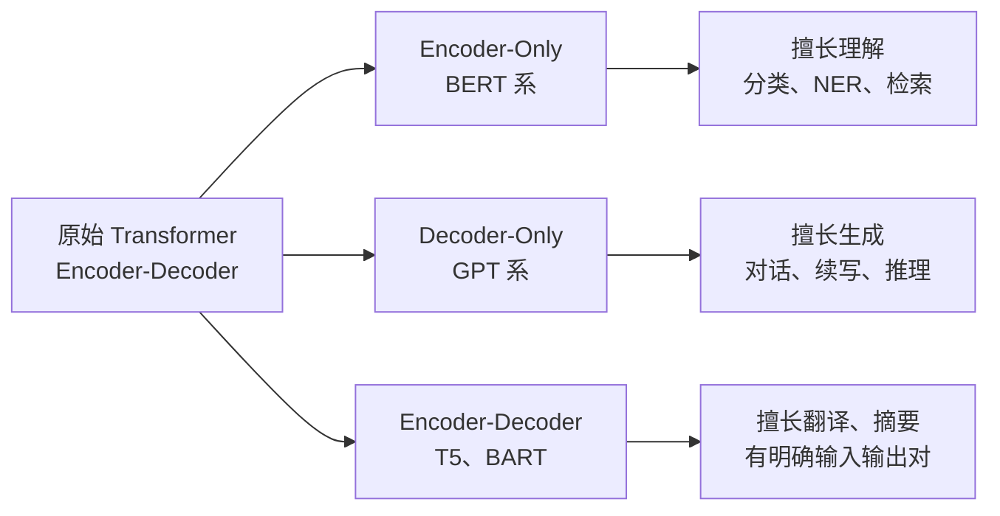
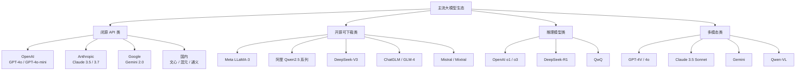

# 第 01 篇：大模型基础

> 一句话导读：这篇带你从"模型为什么这样长"讲到"现在市面上有哪些主流玩家"。读完你不只是认识 Transformer 的几个零件名字，而是能讲清楚 Q/K/V 在算什么、RoPE 为什么能编码位置、MoE 的路由怎么决策、KV Cache 为什么能省一个数量级的算力——也就是"被人深问也能答得上来"的那个程度。

**前置阅读**：无（本篇是系列起点）

**适合读者**：刚开始接触大模型应用开发的工程师；用过 ChatGPT 但说不清"它为什么会这样答"的同学；想搞清楚原理而不是只记结论的人。

**篇幅说明**：本篇比系列其它入门篇略长（约 1.2 万字），因为要把基础原理讲透，后续篇章很多概念都建立在这之上。可以分两次读，每章相对独立。

---

## 一、为什么咱们得先聊聊"基础"

很多同学一上来就问："我接个 OpenAI API 不就行了？为什么还要懂模型本身？"

实际项目里，下面这几类问题答不上来，工程化基本要踩坑：

- 同一个模型，输入 1 万字和 10 万字，**为什么后者贵了不止 10 倍**？（KV Cache 与上下文成本）
- 为什么 GPT-4o 输出有时会"前面挺好、中间开始走神"？（Lost in the Middle 与位置编码外推）
- DeepSeek-R1 和 Qwen2.5 都说自己强，到底差在哪？（架构、训练目标、生态）
- 内网部署该选 7B 还是 70B？显存怎么估？（参数量与精度）
- 为什么 RoPE 能让一个训练时只看过 4K 的模型，部署时撑到 32K？（位置编码的外推机制）

这篇文档的目标不是带你推导论文，而是把**做应用最该懂的那些"零件"讲透**——不只是知道它叫什么、用在哪，还要知道它**为什么这么设计**、**内部到底在算什么**、**工程上意味着什么**。

---

## 二、Transformer 的几个关键零件

Transformer 的本质是一个**序列到序列**的函数：输入一个 token 序列，输出每个位置上"下一个 token 应该是什么"的概率分布。它能赢，靠的不是某个魔法零件，而是几个零件配合得很好——下面一个个拆开看。

### 2.1 注意力机制：模型怎么"看自己说过什么"

#### 2.1.1 自注意力到底在算什么

教科书上"加权求和"的说法太轻飘飘了。展开讲：

模型拿到一段输入 $X \in \mathbb{R}^{N \times d}$（N 个 token，每个 token 是 d 维向量），先用三个**学出来的**矩阵 $W_Q, W_K, W_V$（都是 $d \times d_k$）把 X 投影成三份：

$$Q = XW_Q, \quad K = XW_K, \quad V = XW_V$$

这三份分别叫 **Query（查询）、Key（被查）、Value（内容）**。一个非常贴切的类比是**搜索引擎**：

- **Q（查询）**：当前位置的 token 在"问"什么——比如一个代词"它"会发出一个查询，意图是"我指代的那个东西在哪"
- **K（键）**：每个位置都挂出一个"标签"，告诉别人"我是谁、我有什么特征"——比如前文出现的名词会挂出"我是个名词、我是单数、我是动物"这种 K
- **V（值）**：每个位置真正要被取走的"内容"——一旦匹配上，就把这个 V 加权求和带走

注意力的核心运算：

$$\text{Attention}(Q, K, V) = \text{softmax}\left(\frac{QK^\top}{\sqrt{d_k}}\right) V$$

逐项拆解：

- $QK^\top$：每个查询 Q 对每个 K 做点积，点积越大说明"这个查询和这个键相关性越强"。结果是 $N \times N$ 的**注意力分数矩阵**
- $\div \sqrt{d_k}$：这是个常被忽略的关键细节。点积的方差会随维度 $d_k$ 增大而增大，方差太大会让 softmax 进入**饱和区**（最大值的 softmax 接近 1，其它接近 0），梯度几乎为零没法训练。除以 $\sqrt{d_k}$ 把方差拉回 1 附近，是个数值稳定性技巧
- $\text{softmax}(\cdot)$：把每一行（一个 token 对所有位置的关注）归一化成概率分布，加起来等于 1
- 最后乘 V：每个位置按照"我对哪些位置感兴趣"的权重，把这些位置的 V 加权求和带走

> 重点：所谓"自"注意力，就是 Q、K、V **都来自同一个输入序列**。如果 Q 来自一个序列、K/V 来自另一个序列，那叫**交叉注意力（Cross-Attention）**，Encoder-Decoder 架构里用来"让 Decoder 看 Encoder"。

#### 2.1.2 因果掩码：为什么生成模型不会"看到未来"

GPT 这类生成模型在预测第 t 个 token 时，**只能看到前 t-1 个 token**，否则训练时直接抄答案没意义。实现方式是给 $QK^\top$ 矩阵加一个**下三角掩码**：

```
mask = [[0,   -inf, -inf, -inf],
        [0,    0,   -inf, -inf],
        [0,    0,    0,   -inf],
        [0,    0,    0,    0  ]]
```

`-inf` 经过 softmax 之后变成 0，相当于这些位置完全看不到。这就是 **Decoder-Only / Causal Attention** 的本质——架构上没什么特别，就是注意力多了个三角掩码。

BERT 这类 Encoder 就**不加掩码**，每个 token 都能看到所有 token，所以适合做"理解类"任务。

#### 2.1.3 多头：为什么要切成 N 份再拼起来

单头注意力的问题是：一个 token 只能用**一种方式**和别人计算相似度。但语言里相似度的"维度"很多——语法关系、语义关联、长程指代、共现频率，单头很难全学到。

**多头注意力（Multi-Head Attention, MHA）** 的做法是把 d 维向量切成 h 份（每份 $d/h$ 维），每份独立做一遍上述注意力计算，最后拼起来再过一个线性层。每个头可以学到不同侧面：

- 论文 *A Mathematical Framework for Transformer Circuits* 里观察到，有的头专门做"上一个相同 token"的复制（induction head）
- 有的头专门做语法依存（主谓宾对齐）
- 有的头关注长程指代

> 提示：**多头不是把模型变大 N 倍，而是把同样的参数预算切成 N 份用**。比如 d=4096、h=32，每个头只在 128 维的子空间里算，反而能学到更细粒度的模式。

#### 2.1.4 MHA / MQA / GQA：省显存的演化

KV Cache（后面会细讲）的显存占用是 $O(\text{layer} \times \text{head} \times \text{seq\_len} \times d_k)$，**头数越多越吃显存**。但又不能为了省显存就少用头，于是就有了"Q 用多头、K/V 共享"的折中方案：

| 变种 | 全称 | K/V 头数 | KV Cache 大小 | 代表模型 |
|---|---|---|---|---|
| MHA | Multi-Head Attention | 与 Q 头数相同 | 1× | GPT-2、LLaMA-1 |
| MQA | Multi-Query Attention | 只有 1 个，全部 Q 头共享 | 1/h（极致压缩） | PaLM、Falcon |
| GQA | Grouped Query Attention | 分 g 组，组内共享 | 1/(h/g)（折中） | LLaMA-2/3、Qwen2、Mistral |

GQA 的工程意义在于：实测 g=8 左右时，**显存比 MHA 省 4~8 倍，效果几乎不掉**，所以现在新模型几乎都用 GQA。

#### 2.1.5 Flash Attention：不改变数学结果的 IO 优化

朴素的注意力计算有个硬伤——中间矩阵 $QK^\top$ 是 $N \times N$，序列长 8K 时这就是 64M 个数，一层就要消耗几百 MB 显存，而且要在 HBM（高带宽显存）和 SRAM（片上缓存）之间反复读写。

**Flash Attention** 的核心思路是：

1. 把 Q/K/V 切成小块（tile），一块一块地装进 SRAM 算
2. 用一个**在线 softmax 算法（online softmax）**，可以一边读数据一边累加 softmax 分母，不用先把整个 $QK^\top$ 算出来再做 softmax
3. 整个过程中 $N \times N$ 的中间矩阵**根本不落显存**，只在 SRAM 里转一下

数学结果**完全等价**，但 IO 量降了一个数量级，速度快 2~4 倍，显存省 5~10 倍。Flash Attention v2/v3 还做了进一步的并行优化。

> 重点：Flash Attention 是个**纯工程优化**，不改变模型行为。但它让"长上下文训练"在工程上变得可能——没有它，训练 32K 上下文的成本要爆炸。

### 2.2 位置编码：模型怎么知道"谁先谁后"

注意力机制有个被忽视的特性——**它对输入顺序无感**。把 "我打你" 和 "你打我" 的 token 顺序换一下，注意力分数矩阵的元素会被同步重排，但本质值不变。这显然不行，所以必须额外注入位置信息。

#### 2.2.1 绝对位置编码：最早的做法

原始 Transformer 论文用的是 sin/cos 函数：

$$PE_{(pos, 2i)} = \sin(pos / 10000^{2i/d}), \quad PE_{(pos, 2i+1)} = \cos(pos / 10000^{2i/d})$$

每个位置 pos 生成一个 d 维向量，**直接加到 token embedding 上**作为输入。优点是不用学，缺点是：

- **外推性差**：训练时见过的最长是 512，部署时给到 1024 直接崩。因为 1024 这个位置的编码模型从没见过
- **信息混淆**：位置和语义都在同一个向量里，模型要自己拆开

BERT、GPT-2 用过这套，但很快就被淘汰了。

#### 2.2.2 RoPE：当前的主流，理解它能解决很多疑惑

**RoPE（Rotary Position Embedding，旋转位置编码）** 是 2021 年苏剑林提出的，现在 LLaMA、Qwen、DeepSeek、Mistral 全在用。它的妙处需要花点篇幅讲清楚。

**核心想法**：与其把位置信息**加**到 embedding 上，不如把位置信息**乘**进 Q 和 K 里——具体来说，**按位置旋转 Q 和 K 向量**。

把 d 维向量两两一组看作复数 $z = x_1 + i x_2$，对位置 m 的 token，把它旋转角度 $m\theta$：

$$z' = e^{im\theta} \cdot z$$

或者写成矩阵形式（每两个维度一组）：

$$\begin{pmatrix} q'_1 \\ q'_2 \end{pmatrix} = \begin{pmatrix} \cos m\theta & -\sin m\theta \\ \sin m\theta & \cos m\theta \end{pmatrix} \begin{pmatrix} q_1 \\ q_2 \end{pmatrix}$$

不同维度对用不同的 $\theta_i = 10000^{-2i/d}$（高维转得慢、低维转得快），相当于一个"位置时钟"，每个维度对都是一根指针，组合起来唯一编码每个位置。

**为什么这玩意能 work？** 关键性质是——两个旋转过的向量做点积时：

$$\langle R_m q, R_n k \rangle = \langle q, R_{n-m} k \rangle$$

也就是说，**旋转后 Q 和 K 的内积只依赖相对位置 (n-m)，而和绝对位置无关**。这正是注意力想要的——"两个 token 离得多远"比"它们各自在第几个位置"更有意义。

**为什么外推性好？** 因为旋转角度是连续函数，没见过的位置 m=10000 也能对应到一个合法的旋转角，不会"超出训练分布"。但实际外推到训练长度的 4 倍以上时，高频部分（旋转得快的那些维度）会因为旋转角周期已经绕了好几圈而开始混淆——这就引出了 NTK / YaRN / Position Interpolation 这些**外推增强**方案，核心思路都是**调整 $\theta$ 的取值**让旋转周期变长。

> 重点：你听到"这个模型支持 128K 上下文"——大概率指的是它用了 RoPE 加某种外推方案（YaRN、PI、NTK-aware）+ 在长上下文数据上做了一些后训练。**单靠 RoPE 不调整也能撑 2~4 倍训练长度，再长就要专门的工程**。

#### 2.2.3 ALiBi：另一条技术路线

**ALiBi（Attention with Linear Biases）** 不学位置向量，而是直接在注意力分数上加一个**线性递减的偏置**：

$$\text{score}(i, j) = \frac{q_i \cdot k_j}{\sqrt{d_k}} - m \cdot |i - j|$$

距离越远扣分越多，相当于一种"近的 token 我多看，远的 token 我少看"的归纳偏置。BLOOM、MPT 用过，外推性号称很好，但因为 RoPE 已经成事实标准，新模型用得不多。

### 2.3 归一化与激活函数：训练稳定性的"暗线"

#### 2.3.1 LayerNorm vs RMSNorm

LayerNorm 的公式：

$$\text{LN}(x) = \gamma \cdot \frac{x - \mu}{\sigma} + \beta$$

其中 $\mu, \sigma$ 是 x 的均值和标准差，$\gamma, \beta$ 是可学参数。它做了两件事：**去均值 + 除标准差**。

RMSNorm 的公式：

$$\text{RMSNorm}(x) = \gamma \cdot \frac{x}{\sqrt{\frac{1}{d}\sum x_i^2}}$$

**没有去均值这一步**。实测发现去均值这一步对效果几乎没贡献，但能省 7~10% 的计算量，所以 LLaMA 系全切到了 RMSNorm。这是一个典型的"工程驱动论文"的优化。

#### 2.3.2 Pre-Norm vs Post-Norm：放在哪一步很重要

Norm 放在残差连接的**前面**还是**后面**，对训练稳定性影响巨大：

```
Post-Norm:  x → Sublayer → +x → Norm → 输出
Pre-Norm:   x → Norm → Sublayer → +x → 输出
```

原始 Transformer 用 Post-Norm，但深层（>20 层）训练极不稳定，需要精细的 warmup。后来发现 Pre-Norm 训练稳定得多，几乎所有现代模型（GPT-2 之后）都改用了 Pre-Norm。代价是 Pre-Norm 的最终效果略差一点点，但能稳定训练 100 层以上的模型，这个 trade-off 完全值得。

#### 2.3.3 SwiGLU：为什么新模型都在用

激活函数的演化路径：ReLU → GELU → SwiGLU。

SwiGLU 的核心是**门控**——不只是非线性变换，还多了一路 sigmoid 门来控制信息流：

$$\text{SwiGLU}(x) = (xW_1) \otimes \text{Swish}(xW_2)$$

其中 $\otimes$ 是逐元素相乘，相当于 $xW_2$ 学出来一个"门"，决定 $xW_1$ 的哪些部分要透传、哪些要抑制。代价是参数量比 ReLU 多 1/3（多一个矩阵），所以为了保持总参数预算一致，FFN 的中间维度通常从 4d 降到 8d/3。

实测在等参数量下，SwiGLU 比 GELU 稳定优 1~2%，这就是为什么所有新模型都换了它。

### 2.4 KV Cache：长对话越聊越"贵"的根本原因

#### 2.4.1 为什么可以缓存 K、V 但缓存不了 Q

自回归生成的过程：模型已经吐出了 $t_1, t_2, ..., t_{n-1}$，现在要预测 $t_n$。这个预测需要：

- 当前位置的 $Q_n$（只算这一个位置）
- 前面所有位置的 $K_1, ..., K_{n-1}$ 和 $V_1, ..., V_{n-1}$（算注意力）

朴素实现每步都把 1 到 n 整段重算一遍 K/V，复杂度是 $O(n^2)$。但仔细看——**前面那些位置的 K、V 在生成第 1 步时就算出来了，后面每一步它们的值不变**（因为 K、V 只依赖于输入 token 本身，不依赖于"现在生成到第几步"）。

所以可以把它们缓存住，每步只算新增位置的 K、V，复杂度降到 $O(n)$。

> 重点：**Q 不能缓存**，因为每一步要预测的位置不一样，Q 是当前要查的那个查询，每步都得新算。**K、V 能缓存**，因为它们是"被查询的内容池"，已经存在的内容池不会变。

#### 2.4.2 KV Cache 的显存账

每层每个头的 K 和 V 各占 $\text{seq\_len} \times d_{head}$ 个数。整个模型的 KV Cache：

$$\text{KV Cache 大小} = 2 \times \text{layers} \times \text{heads}_{kv} \times \text{seq\_len} \times d_{head} \times \text{字节}$$

举个具体例子：LLaMA-2-7B，32 层、32 头、$d_{head}=128$、FP16：

- 1K 上下文：$2 \times 32 \times 32 \times 1024 \times 128 \times 2 \approx 0.5$ GB
- 32K 上下文：$\approx 16$ GB（已经超过模型本身的 14GB 权重）
- 128K 上下文：$\approx 64$ GB（比模型本身大 4 倍多）

这就是为什么"长上下文很贵"——**贵在显存，不是算力**。

#### 2.4.3 围绕 KV Cache 的工程优化

- **PagedAttention**（vLLM）：把 KV Cache 切成固定大小的 block，像操作系统的虚拟内存那样管理。解决了 batch 推理时不同请求长度差异大导致的显存碎片问题，吞吐能提 2~4 倍
- **Prefix Caching**：相同的 system prompt 或对话历史，KV 只算一次，多个请求共用
- **Chunked Prefill**：把超长的 prompt 拆成多块，和 decode 阶段交错调度，避免一个长请求阻塞所有人
- **量化**：KV Cache 也能量化到 INT8/INT4，进一步省显存

详细工程细节见 [第 09 篇：推理与部署](./09-inference-and-deployment.md)。

### 2.5 Tokenizer：模型眼里没有"汉字"，只有 Token

#### 2.5.1 为什么不用单字符或单词

- **单字符**：序列太长，算力浪费
- **单词**：词表无限大（"running"、"runner"、"runs" 都是不同词），且无法处理新词

子词（subword）算法是个折中：常见词整体保留，少见词拆成多个常用片段。

#### 2.5.2 BPE：原理简述

**BPE（Byte Pair Encoding）** 算法的核心循环：

1. 初始词表是所有单个字符（或字节）
2. 在语料中找出现频率最高的相邻字符对，比如 "es" 出现了 5000 次
3. 把这对合并成一个新 token "es"，加入词表
4. 重复 2-3，直到词表达到目标大小（比如 50000）

最终一段话被切成什么样，由训练时的语料决定。GPT 系列用的是字节级 BPE（byte-level BPE），词表里的每一项其实是 UTF-8 字节序列，所以理论上能编码任何文本，但中文常常一个字被切成 2~3 个 token。

#### 2.5.3 主流算法对比

| 算法 | 代表 | 中文友好度 | 备注 |
|---|---|---|---|
| BPE | GPT 系、LLaMA | 一般，1 中文 ≈ 1.5~2 token | 字节级 BPE，扩词表后能改善 |
| WordPiece | BERT | 一般 | 选合并对的标准是似然最大化而非频率 |
| SentencePiece | Qwen、ChatGLM | 较好，1 中文 ≈ 1 token | 直接处理 Unicode，不依赖预分词 |
| Unigram | mT5 | 较好 | 概率模型，从大词表逐步缩减 |

**踩坑预警**：

- 同一段中文，不同模型的 token 数差很多（GPT-3.5 大约 1 中文 ≈ 2 token，Qwen 接近 1:1）
- 计费按 token 算，**直接换模型不换提示词，成本可能差几倍**
- 计算 token 数请用模型对应的 tokenizer，不要拿字符数估
- Tokenizer 还会影响数学和代码能力——GPT-4 之前数字按多位切（"123" 是一个 token，"1234" 是另一个 token），导致算术拉胯。后来改成"每位一个 token"才好转

---

## 三、Decoder-Only 为什么赢了

### 3.1 三种架构的本质区别

历史上 Transformer 有三种用法：



**图 1：Transformer 的三种主要用法**

差别**只在注意力掩码**：

- **Encoder-Only**：双向注意力，每个位置看全部位置。训练目标是 MLM（掩码语言模型，Masked Language Model）——随机遮住 15% 的 token，让模型还原
- **Decoder-Only**：因果注意力，每个位置只看前面。训练目标是 CLM（因果语言模型，Causal Language Model）——预测下一个 token
- **Encoder-Decoder**：Encoder 用双向，Decoder 用因果 + 交叉注意力（看 Encoder 输出）

### 3.2 Decoder-Only 赢在哪

到了 2023 年以后，**Decoder-Only 几乎一统江湖**，原因可以拆三层讲：

**第一层：训练目标更通用**

CLM 训练时不需要专门构造遮挡，原始文本随便切成"前半 → 后半"就是一条样本。互联网上海量的文本天然适配 CLM，数据准备成本最低。

**第二层：上下文学习的涌现**

In-Context Learning（看几个例子就会做新任务）这种能力，**在 Decoder-Only 架构上涌现得最自然**。原因猜测是：CLM 训练时模型反复在做"看上文猜下文"，本身就是一种隐式的元学习。Encoder-Only 的 MLM 训练目标和这种能力关系不大。

**第三层：架构统一带来的工程红利**

同一个模型既能理解又能生成——你写一个分类任务可以让它直接输出类别名，不用像 BERT 那样还要训一个分类头。这种"prompt 即接口"的范式让大模型应用爆炸式发展。

### 3.3 但 Encoder-Only 没死

在搜索、向量检索场景，BERT 类模型（包括所有的 Embedding 模型）依然是主力：

- **效率**：双向注意力一次过，不用一个 token 一个 token 生成
- **效果**：理解类任务上 BERT 类的语义表征质量更高
- **成本**：Embedding 模型通常只有几百 M 参数，部署成本远低于生成模型

详见 [第 04 篇：RAG 上篇](./04-rag-part1-fundamentals.md)。

### 3.4 MoE：Decoder-Only 的"省钱版"

#### 3.4.1 MoE 的核心思想

普通 Transformer 的 FFN 是一个大矩阵：所有 token 都过同一组参数。**MoE（Mixture of Experts）** 把这一个大 FFN 换成 N 个小 FFN（叫"专家"），每个 token 只过其中 K 个（K 通常是 1 或 2）：

```
普通 FFN:    x → 一个大 MLP → 输出
MoE FFN:    x → 路由器决定走哪 K 个专家 → 这 K 个专家的输出加权和
```

DeepSeek-V3 有 671B 总参数，但每次推理只激活 37B（K=8 / N=256）——**算力像 37B，知识容量像 671B**，这是 MoE 最大的卖点。

#### 3.4.2 路由器是怎么决策的

最常见的 Top-K 路由：

1. 对每个 token 的隐藏状态 $x$，过一个小的线性层得到 N 个分数：$s = xW_{\text{router}}$
2. 取分数最高的 K 个专家，做 softmax 归一化得到权重
3. token 只送进这 K 个专家，输出按权重加权求和

#### 3.4.3 负载均衡：MoE 训练的最大难题

理想情况下每个专家被均匀使用，但实际训练中很容易**塌缩**——少数几个专家被疯狂激活，其它专家几乎不工作（因为路由器一开始随机偏向某些专家，被偏向的专家学得好，路由器又更偏向它们，正反馈循环）。

解决方案：

- **辅助损失（Auxiliary Loss）**：加一个惩罚项，惩罚专家使用率方差太大
- **容量限制（Expert Capacity）**：每个专家最多接受 C 个 token，超出的 token 被丢弃或路由到第二选择
- **DeepSeek 的无辅助损失负载均衡**：通过给每个专家加一个动态偏置，路由频次少的专家偏置加大，自动趋于均衡

#### 3.4.4 MoE 的代价

- **训练复杂度高**：分布式训练时专家分散在不同 GPU 上，token 路由会引起跨 GPU 的 all-to-all 通信，对网络带宽要求高
- **推理 batch 不友好**：不同 token 走不同专家，batch 内难以高效并行（需要专门的 MoE 推理引擎，比如 vLLM 的 MoE 优化）
- **小规模没必要**：参数量 < 10B 用 MoE 收益不大，因为路由开销占比变高

| 维度 | 稠密模型（Dense） | 稀疏模型（MoE） | 如何选 |
|---|---|---|---|
| 总参数 | 全部激活 | 部分激活 | 看显存预算 |
| 推理算力 | 与参数线性 | 远低于总参数 | 大规模服务选 MoE |
| 推理显存 | 与参数线性 | **接近总参数**（专家都要在显存里） | 显存吃紧选 Dense |
| 训练难度 | 中 | 高，要解决负载均衡 | 团队没经验慎用 |
| 代表模型 | LLaMA-3、Qwen2.5 | DeepSeek-V3、Mixtral 8x22B | 闭源 GPT-4 据传也是 MoE |

> 提示：常见误解是"MoE 因为只激活一部分专家所以省显存"——**不对**。所有专家都得在显存里待命，路由器不知道哪个 token 会走哪条路。MoE 省的是**算力**，不是显存。

---

## 四、参数量、精度与显存：怎么估"我能不能跑得动"

### 4.1 显存的几个组成部分

很多人以为"7B 模型 × 2 字节 = 14GB 就够了"，结果上线 OOM。实际推理时显存包含：

| 组成 | 大小估算 | 占比（典型） |
|---|---|---|
| 模型权重 | 参数量 × 字节 | 60~70% |
| KV Cache | 2 × layers × heads × seq × $d_{head}$ × 字节 | 20~30% |
| 激活值 | batch × seq × hidden × 几倍 | 5~10% |
| 框架 / CUDA 上下文 | 0.5~2 GB 固定 | 5% |

公式版：

$$\text{显存} \approx \text{权重} \times 1.2 + \text{KV Cache(seq)} + \text{激活} + 1\text{GB}$$

### 4.2 精度对显存和效果的影响

| 精度 | 每参数字节 | 7B 模型权重 | 适用场景 | 效果损失 |
|---|---|---|---|---|
| FP32 | 4 | 28 GB | 训练（很少推理用） | 基准 |
| FP16 | 2 | 14 GB | 推理默认 | 几乎无 |
| BF16 | 2 | 14 GB | 训练首选（动态范围大） | 几乎无 |
| INT8 | 1 | 7 GB | 量化推理 | 1~3% 下降 |
| INT4 | 0.5 | 3.5 GB | 端侧 / 显存紧 | 3~10% 下降 |

**FP16 vs BF16 的本质差异**：

- FP16：5 位指数 + 10 位尾数。精度高，但动态范围小（最大约 6.5 万），训练时容易出现梯度上溢/下溢
- BF16：8 位指数 + 7 位尾数。精度低一些，但动态范围和 FP32 一样大，**训练稳定性好得多**，所以现在新模型训练几乎都用 BF16

### 4.3 量化的几条主流路线

- **GPTQ**：基于二阶信息（Hessian）的逐层量化，对单条样本敏感度低
- **AWQ**：观察到不同权重对效果影响差异大，保护重要权重不量化
- **BnB（bitsandbytes）**：训练友好的 8-bit/4-bit 实现，QLoRA 微调常用
- **GGUF（llama.cpp）**：端侧部署的事实标准，支持 2~8 bit 多种精度

详细内容见 [第 09 篇：推理与部署](./09-inference-and-deployment.md)。

### 4.4 一个具体的"够不够跑"判断流程

假设你有一张 24GB 4090，想跑 Qwen2.5-14B，要不要量化？

1. 权重显存：14B × 2 字节（FP16） = 28 GB → **超了，必须量化**
2. INT8 量化后：14B × 1 = 14 GB
3. KV Cache（8K 上下文，48 层、8 KV 头、$d_{head}=128$）：$2 \times 48 \times 8 \times 8192 \times 128 \times 1 \approx 0.8$ GB（INT8）
4. 激活 + 框架：≈ 2 GB
5. 总计：≈ 17 GB，**够用**

如果想跑 32K 上下文：KV Cache 涨到 3.2GB，总计 ≈ 19GB，还能跑。再长就要 INT4 + KV 量化组合拳了。

---

## 五、主流模型生态版图

把 2024-2025 年市面上能拿来做应用的模型分成几类：



**图 2：2024-2025 主流大模型生态分布**

### 5.1 闭源 vs 开源：选型的几个维度

**表 1：闭源 API 与开源自部署对比**

| 维度 | 闭源 API（GPT-4o 等） | 开源自部署（Qwen / LLaMA 等） | 如何选 |
|---|---|---|---|
| 上手成本 | 申请 Key 即用 | 需要 GPU + 部署运维 | POC 阶段先用闭源 |
| 单次成本 | 按 token 计费 | 摊销硬件成本 | 调用量大且稳定，自部署更划算 |
| 数据安全 | 数据过厂商 | 完全私有 | 涉密 / 合规场景必选开源 |
| 定制能力 | 只能调 prompt | 可微调、可改架构 | 强定制需求选开源 |
| 模型上限 | 通常更强 | 紧追闭源 | 极致效果还是闭源略胜 |
| 可控性 | 厂商可能下线版本 | 自己永远可用 | 长期项目优先开源 |

### 5.2 推理模型（Reasoning Model）的训练范式

2024 年下半年起出现的 **o1、DeepSeek-R1** 这类模型，特点是：

- 输出前先有一段（很长的）"思考过程"，再给最终答案
- 这段思考是模型自己生成的 CoT，不是 prompt 工程喊出来的
- 在数学、代码、复杂推理上效果显著提升

**它们和普通模型的本质差别在训练目标**：

普通模型（指令微调）：奖励"回答好不好"
推理模型（强化学习）：奖励"最终答案对不对"——过程怎么想随你

DeepSeek-R1 的论文揭示了一个有趣事实：当只用结果正确性做奖励时，模型会**自发地学会**"反思""自我检查""换个角度"——也就是出现了所谓"aha moment"。这种能力是 RL 自己涌现出来的，不是人工示教的。

代价是：

- **首 token 延迟（TTFT）极高**：可能要思考几千 token 才开始正式回答
- **token 消耗大**：账单可能是普通模型的 5~10 倍
- **不适合简单任务**：让 o1 做客服会很可笑

详细聊见 [第 13 篇：多模态与前沿](./13-multimodal-and-frontier.md)。

---

## 六、几个绕不开的概念，讲清原理

### 6.1 Scaling Law：模型变大到底能变多好

**Scaling Law** 不是一句"越大越好"，而是一组**幂律关系**。OpenAI 2020 年的论文给出了：

$$L(N, D, C) \propto N^{-\alpha_N} + D^{-\alpha_D} + C^{-\alpha_C}$$

其中 L 是损失（loss），N 是参数量，D 是数据量，C 是计算量，$\alpha$ 是各自的幂指数（实测大约 0.07~0.1）。

**关键含义**：

1. **三者要同步放大**才有效率。只放大模型不放大数据，效果撞墙
2. **幂律意味着边际效益递减**——参数翻 10 倍，loss 只降 20~30%
3. 给定算力预算 C，存在**最优的 N、D 比例**——这是 Chinchilla 论文的贡献：原本 GPT-3 用 1750 亿参数训了 3000 亿 token，Chinchilla 证明 700 亿参数 + 1.4 万亿 token 效果更好，**算力同样的前提下，数据要喂得更多**

**涌现能力（Emergent Abilities）**：某些能力（CoT、In-Context Learning）只有模型大到一定规模才会"突然出现"，小模型怎么练都练不出来。2023 年有研究质疑"涌现"是不是评测指标的"假象"——比如准确率这种 0/1 指标看起来是"突然有了"，但 log-likelihood 看其实是平滑提升。结论目前没有定论。

### 6.2 困惑度（Perplexity, PPL）

PPL 衡量模型对一段文本"有多惊讶"：

$$\text{PPL}(W) = \exp\left(-\frac{1}{N}\sum_{i=1}^N \log P(w_i | w_{<i})\right)$$

直观理解：PPL = K 意味着模型在每一步平均"在 K 个候选 token 之间纠结"。PPL 越低说明模型对这段文本越熟悉。

**用途**：

- 训练时看 loss 曲线（loss 就是 log(PPL)）判断是否收敛
- 微调后做"困惑度回归测试"——在通用语料上 PPL 是否上涨太多（灾难性遗忘的信号）

应用层基本不用直接看 PPL，但是看 [第 11 篇：评测](./11-evaluation-and-observability.md) 里很多评测指标和它有关。

### 6.3 自回归生成的解码策略（速览）

模型每步输出的是**整个词表上的概率分布**，怎么从中选下一个 token，叫**解码策略**：

- **贪心（Greedy）**：永远选概率最高的。问题：容易陷入循环（"的的的的..."）
- **Beam Search**：每步保留 top-k 个候选序列。问题：计算代价高，且生成偏"安全"缺乏创造力
- **Top-K 采样**：从概率最高的 K 个里随机采。简单有效
- **Top-P / Nucleus 采样**：从累积概率达 P 的最小集合里采。比 Top-K 更自适应
- **Temperature**：在 softmax 之前先除以 T。T 越大分布越平、越随机；T 越小越确定

详细解码策略和工程实现见 [第 09 篇：推理与部署](./09-inference-and-deployment.md)。

---

## 七、踩坑提醒

### 坑 1：把字符数当 Token 数估算成本

- **现象**：上线前估算月费 5000 元，实际跑出来 1.2 万。
- **原因**：直接拿汉字字数 ÷ 某个系数估算，没考虑英文 / 标点 / 特殊字符的差异，更没考虑 system prompt、对话历史、工具调用 schema 这些"隐形 token"。中文在 GPT 系列上常被切成 2~3 个 token（字节级 BPE 把一个中文字符按 UTF-8 三字节拆），而英文一个单词通常只占 1~1.5 个 token。
- **规避方法**：上线前用模型对应的 tokenizer（OpenAI 的 `tiktoken`、Hugging Face 的 `AutoTokenizer`）跑一批真实样本压测；监控里加上 token 用量分布；在网关层做 [Token 监控](./11-evaluation-and-observability.md)。

### 坑 2：直接把 GPT-4 的 prompt 搬到开源模型

- **现象**：同一份 prompt，GPT-4 答得很好，换到 LLaMA-3-70B 就开始胡言乱语，甚至格式都跑偏。
- **原因**：每个模型的"调教方式"不同——指令数据、Chat 模板、System Prompt 处理方式都不一样。LLaMA / Qwen 的 chat template（`<|im_start|>` 这类特殊 token 包裹角色）跟 GPT 不兼容，直接拼 raw prompt 会让模型解析错乱。更深层的原因是不同模型对齐时用的人类偏好数据不一样，对"温和""详细""结构化"的偏好程度也不同。
- **规避方法**：换模型必须**重新跑 Prompt 评测**；使用框架的统一 chat template 转换（LangChain 的 `ChatPromptTemplate`、HF 的 `apply_chat_template`）；至少留一组金标问题做回归测试。

### 坑 3：以为"上下文窗口越大越好"

- **现象**：买了 128K 上下文版本，把整本说明书塞进去，结果回答还不如塞 4K 关键段落的版本。
- **原因**：两个层面的问题——**Lost in the Middle** 是注意力分布问题，长序列里中部 token 拿到的注意力权重显著低于头尾（首因效应 + 近因效应）；**RoPE 外推损失**是位置编码问题，超出训练长度后高频维度的旋转角已经绕了好几圈，相对位置信息开始失真；再加上 KV Cache 撑爆显存导致速度断崖。
- **规避方法**：能用 RAG 解决就别硬塞长上下文；必须长上下文时把关键信息放头尾；用 Prefix Caching 缓解开销；做评测时**专门验证中部信息检索准确率**（"大海捞针"测试）。详见 [第 03 篇：上下文与记忆](./03-context-and-memory.md)。

### 坑 4：盲目追求最新最大的模型

- **现象**：项目里默认用 GPT-4o / Claude 3.7 Sonnet 这种最强模型，账单爆炸。
- **原因**：很多任务（分类、抽取、简单改写）小模型完全够用，便宜 10 倍。Scaling Law 告诉我们更大的模型是"边际效益递减"的——分类准确率从 92% 涨到 94% 你愿意付 10 倍价格吗？
- **规避方法**：建立**模型分级路由**机制（GPT-4o-mini / Qwen2.5-7B 处理简单任务，大模型兜底）；用 LLM-as-Judge 抽样评测降级是否影响质量。详见 [第 11 篇：评测与可观测](./11-evaluation-and-observability.md)。

### 坑 5：忽视量化对长文本和低频任务的影响

- **现象**：用 INT4 量化版本短对话很正常，处理长文档摘要时质量明显下降。
- **原因**：量化误差在长上下文里**会累积**——每一层都引入小误差，深层网络几十层之后误差被放大；长上下文里 KV Cache 也被量化，attention 计算精度下降更明显；对**低频但重要**的输出（专业术语、特定格式）更敏感，因为这些 token 在训练分布上本来就稀疏，量化误差容易把它们挤出 top-k。
- **规避方法**：长文档场景至少用 INT8 而不是 INT4；保留权重量化但不量化 KV Cache；在你的真实任务上做 A/B 测试（不要只看公开 benchmark），尤其覆盖长样本和专业领域样本。

---

## 八、选型建议与实践要点

如果你刚启动一个大模型应用项目，建议按下面顺序决策：

1. **先用闭源 API 做 POC**：1~2 周内验证业务可行性，别一上来就建集群
2. **明确数据敏感度**：如果数据出不了内网，直接锁定开源 + 私有化
3. **量级估算**：日调用 < 10 万次，闭源 API 通常更划算；> 100 万次 / 长期稳定，开始算自部署的账
4. **建立评测集**：哪怕只有 50 条金标，也比"凭感觉"强
5. **做模型分级**：简单任务用便宜模型，复杂任务用强模型，留一条降级链路

> 参考数值：截至 2025 年中，闭源 API 单价大致在 1~30 元 / 百万 token 区间（输入 / 输出有差），实际以厂商定价为准。

---

## 九、一段示例代码：用 tokenizer 估算 token 数

```python
# 用 tiktoken 准确估算 OpenAI 系列模型的 token 数
# 安装：pip install tiktoken
import tiktoken

# 不同模型对应不同的编码器
# gpt-4 / gpt-3.5-turbo 用 cl100k_base
# gpt-4o / gpt-4o-mini 用 o200k_base
encoder = tiktoken.encoding_for_model("gpt-4o-mini")

text = "大模型应用开发，关键是把 token 用量算清楚。"
tokens = encoder.encode(text)
print(f"字符数: {len(text)}, token 数: {len(tokens)}")
# 输出：字符数: 24, token 数: 14（参考数值，版本不同会有差异）
# 可以打印每个 token 的可读形式，看模型是怎么切的
for tid in tokens:
    print(tid, repr(encoder.decode([tid])))

# 估算一段对话的总 token 数（含 system / user）
messages = [
    {"role": "system", "content": "你是一个简洁的助手。"},
    {"role": "user", "content": "用一句话解释 RAG 是什么。"},
]
total = sum(len(encoder.encode(m["content"])) for m in messages)
# 注意：实际计费还会加上每条消息的固定开销 token（约 3~4 个）
# 真正精确的 OpenAI 计费规则要参考官方 cookbook 的 num_tokens_from_messages 函数
print(f"对话总 token 数（粗略）: {total}")
```

工程化场景里，更推荐在网关 / 中间件层统一计数，避免每个调用方各算各的：

```go
// Go 网关统一拦截 LLM 调用并记录 token 用量（简化示例）
// 详细的可观测方案见第 11 篇
func TokenAccountingMiddleware(next http.Handler) http.Handler {
    return http.HandlerFunc(func(w http.ResponseWriter, r *http.Request) {
        // 1. 解析请求体，提取 model / messages 字段
        //    注意：流式请求需要用 SSE 解析器边收边算
        // 2. 用对应 tokenizer 计算输入 token（建议在网关本地缓存 tokenizer 实例）
        // 3. 调下游 LLM 服务，对响应做透传或缓冲
        // 4. 解析响应，累加输出 token；流式场景在最后一帧（stop）时汇总
        // 5. 落库 + 上报监控（统一口径，方便后续算成本）
        next.ServeHTTP(w, r)
    })
}
```

---

## 十、延伸阅读

- 系列内：
  - 下一篇：[第 02 篇：Prompt 工程](./02-prompt-engineering.md)
  - 工程化视角：[第 09 篇：推理与部署](./09-inference-and-deployment.md)
  - 想自己练模型先看：[第 10 篇：训练与微调（方法论）](./10-training-and-finetune.md)
- 外部参考（注明发表时间，实际以官方为准）：
  - 论文《Attention Is All You Need》（Vaswani et al., 2017）—— Transformer 原始论文
  - 论文《RoFormer: Enhanced Transformer with Rotary Position Embedding》（Su et al., 2021）—— RoPE 提出
  - 论文《Scaling Laws for Neural Language Models》（Kaplan et al., 2020）
  - 论文《Training Compute-Optimal Large Language Models》（Hoffmann et al., 2022）—— Chinchilla
  - 论文《FlashAttention: Fast and Memory-Efficient Exact Attention with IO-Awareness》（Dao et al., 2022）
  - 论文《GQA: Training Generalized Multi-Query Transformer Models》（Ainslie et al., 2023）
  - 论文《DeepSeek-V3 Technical Report》（DeepSeek, 2024）—— MoE 路由的最新实践
  - 论文《DeepSeek-R1》（DeepSeek, 2025）—— 推理模型的 RL 训练范式
  - Hugging Face 官方教程 `Transformers` 系列文档（最后访问 2025）
  - OpenAI Tokenizer 官方页面（用于直观感受 token 划分）
  - 苏剑林博客《让研究人员绞尽脑汁的 Transformer 位置编码》系列（中文 RoPE 最好的科普）

---

## 附：本篇覆盖的知识点清单

来自原清单第 1.1 / 1.3 节，外加少量 1.2 节相关概念（详细微调内容见第 10 篇）：

- [x] Transformer 架构 / Self-Attention（含 Q/K/V 推导、$\sqrt{d_k}$ 缩放、因果掩码） / Multi-Head Attention（含子空间学习）
- [x] Encoder-Decoder / Decoder-Only / Encoder-Only（差别只在掩码，训练目标 CLM vs MLM）
- [x] MoE 混合专家（Top-K 路由、负载均衡、辅助损失、显存陷阱）
- [x] Position Embedding / RoPE（旋转矩阵推导、相对位置性质、外推机制） / ALiBi
- [x] LayerNorm vs RMSNorm（去均值代价对比）/ Pre-Norm vs Post-Norm / 激活函数（GELU、SwiGLU 门控、ReLU）
- [x] KV Cache（为什么 K/V 可缓存而 Q 不可、显存账具体计算、PagedAttention 等优化思路）
- [x] Flash Attention（在线 softmax + 分块 + IO 感知，纯工程优化的典范）
- [x] GQA / MQA（K/V 共享省 KV Cache 的折中演化）
- [x] Tokenizer（BPE 训练流程、字节级 BPE、SentencePiece、跨语言 token 数差异）
- [x] Embedding 与词向量基础（应用细节见第 04 篇）
- [x] 自回归生成机制（含解码策略概览）
- [x] Scaling Law（幂律形式 + Chinchilla 修正） / 涌现能力（包括对"涌现"是否真实的争议）
- [x] 模型参数量与精度（FP32/FP16/BF16/INT8/INT4，BF16 vs FP16 的本质差异、量化路线）
- [x] 困惑度（Perplexity）公式与用途
- [x] 主流闭源 / 开源 / 推理 / 多模态模型生态
- [x] 推理模型的 RL 训练范式与 aha moment
- [x] 开源 vs 闭源选型
