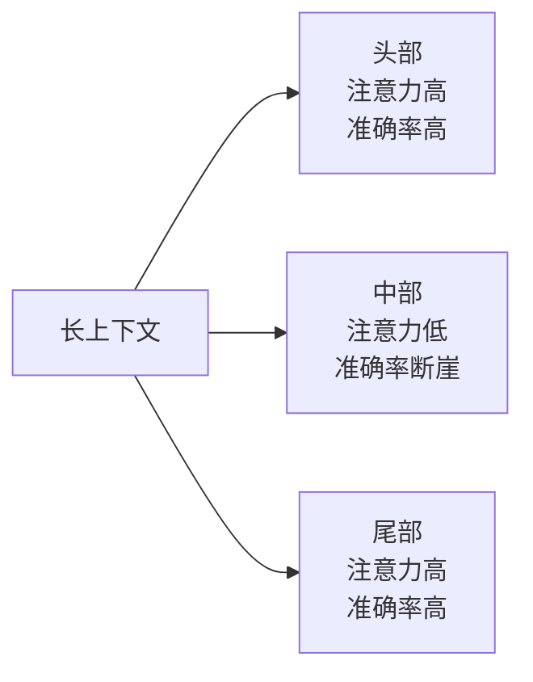
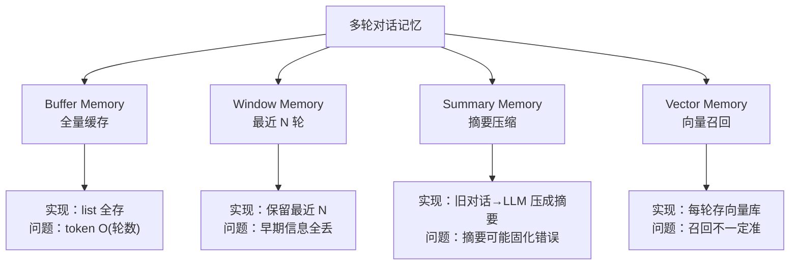

# 第 03 篇：上下文与记忆

> 一句话导读：这篇讲清楚"上下文窗口"和"记忆"是两件不同的事——为什么长上下文模型还需要 RAG、为什么 Lost in the Middle 是注意力机制的结构性问题、为什么 Summary Memory 会"固化错误"。读完你能设计出一个不会随着会话变长就失控的对话系统。

**前置阅读**：[第 01 篇：大模型基础](./01-llm-basics.md)（注意力 / KV Cache / RoPE 外推这几节会反复用到）、[第 02 篇：Prompt 工程](./02-prompt-engineering.md)

**适合读者**：做过多轮对话产品的工程师；用 GPT-4 128K 时被账单和效果同时教育过的同学；想理解"为什么对话越长越笨"的根本原因的人。

**篇幅说明**：约 1.1 万字。

---

## 一、为什么这事儿不简单：从一段"会爆炸"的代码说起

很多人第一次做对话型应用，会写出这种代码：

```python
history = []
def chat(user_input):
    history.append({"role": "user", "content": user_input})
    resp = llm.invoke(history)
    history.append({"role": "assistant", "content": resp})
    return resp
```

跑两天就会发现一连串问题：

- 聊到第 30 轮，token 飙到几万，**贵且慢**——每多聊一句，前面所有内容都要重新发给模型
- 聊到第 50 轮，模型开始"忘记"前面的设定（即便没超窗）——这是 Lost in the Middle 在作祟
- 隔天再聊，**完全不记得**昨天讨论的事——history 变量是进程内存，重启就没
- 突然某次回答开始"瞎编"，发现是之前某条上下文里有错误信息被一直带着——上下文污染

这些问题归根到底是两件事没分清：**上下文窗口（Context Window）** 和 **记忆（Memory）**。这是两件根本不同的事：

| 概念 | 是什么 | 类比 | 生命周期 |
|---|---|---|---|
| 上下文窗口 | 模型一次能看的最大 token 数 | 人脑的"工作记忆"（瞬时） | 单次请求 |
| 记忆 | 跨多次请求 / 多次会话留存的信息 | 人的"长时记忆"（笔记本） | 跨请求、可持久化 |

把这两个概念混在一起，是绝大多数对话产品翻车的根源。

---

## 二、上下文窗口：模型的"工作记忆"

### 2.1 窗口大小不是免费的——成本结构拆解

主流模型现在动辄 128K、200K、1M token 上下文。但实际用起来你会发现"长上下文很贵"，贵在三个地方：

**成本 1：输入 token 计费**

输入 token 都是要钱的，而且**每多聊一轮，整个历史都要重新送进去**——因为 API 是无状态的，模型每次"看不到"上一次的状态。所以会话越长，单次调用的输入 token 越多，费用是**关于轮数的二次曲线**而不是线性。

**成本 2：首 token 延迟（TTFT）暴涨**

模型生成第一个 token 之前，要先对全部输入做一次 **prefill**——把所有 token 过一遍 Transformer 的所有层，算出每层的 K、V 缓存。这一步的计算量是 $O(N^2)$（注意力的复杂度），所以：

- 4K 上下文的 TTFT 大概几百 ms
- 32K 上下文的 TTFT 大概 2~3 秒
- 128K 上下文的 TTFT 可能 10~20 秒

后续每生成一个 token（decode 阶段）只是 $O(N)$，因为 K/V 已经缓存好了。但 prefill 这一下就够用户失去耐心。

**成本 3：KV Cache 显存爆炸**

回顾第 01 篇的公式：KV Cache 显存正比于上下文长度。Qwen2.5-7B 在 128K 上下文下 KV Cache 接近 30GB，比模型本身的权重（14GB FP16）还多两倍。这是为什么自部署长上下文模型 GPU 成本特别高——**贵在显存不在算力**。

### 2.2 Lost in the Middle：注意力的结构性问题

#### 2.2.1 现象

Liu et al. 2023 那篇著名论文做了个实验：在长上下文里塞 N 个文档，关键信息放在不同位置，然后问模型问题。结果是经典的 **U 型曲线**：



**图 1：Lost in the Middle 现象（U 型注意力分布）**

实测数据：把同一份关键信息放在 75 篇文档的中部（第 38 篇），准确率比放在头部低 20+ 个百分点。

#### 2.2.2 原因 

为什么会这样？这不是 bug，是几个机制叠加的结果：

**原因 1：训练数据的位置偏好**

预训练数据的来源大多是文章——文章的关键信息天然在开头（标题、引言）和结尾（总结、结论），中间是论证细节。模型见多了这种模式，就**习得**了"开头和结尾的信息更重要"的偏好。这是数据驱动的天然偏置。

**原因 2：因果注意力的累积**

回顾第 01 篇——Decoder-Only 的因果掩码让每个位置只能看前面。这意味着：

- **末尾位置**能看到所有前文，注意力能"挑选"任何位置的信息
- **开头位置**只能看到自己（甚至只是 system 部分），但因为它是后续位置必看的"上文"，反而被反复"使用"
- **中间位置**两头不靠——前面被开头压制（开头作为系统设定优先级高），后面又被末尾的 query 压制（用户问题离它远，注意力衰减）

**原因 3：RoPE 在长距离的衰减**

RoPE 的旋转矩阵在距离非常远时，相对位置信号会因为高频维度旋转过多周期而**失真**。中部信息距离 query（在末尾）有几万 token，相对位置编码的精度下降，模型越来越难"精准定位"中部的某条信息。

**原因 4：训练分布外的长度**

很多模型训练时见过的最长样本只有 8K、16K，部署时跑到 128K 是**外推**。中部位置在训练时压根没充分见过，行为不稳定是必然的。这也是为什么"做了长上下文 SFT"的模型 Lost in the Middle 现象明显减轻——专门训过的位置自然好。

> 重点：Lost in the Middle 不是"调一调 prompt 就能解决"的问题，是注意力机制的**结构性局限**。要么把关键信息往两头放，要么用 RAG 替代长上下文，别硬怼。

### 2.3 上下文压缩与截断：每种策略的适用边界

token 预算有限时，常见处理：

**表 1：上下文压缩策略对比**

| 策略 | 做法 | 优点 | 缺点 | 适用场景 |
|---|---|---|---|---|
| 硬截断 | 直接保留最近 N 条 | 简单 | 丢早期信息，可能丢 system | 闲聊、不重要信息 |
| 滑窗 | 保留最近 K token，超过删最旧 | 简单 | 同上 | 客服、FAQ |
| 摘要 | 把老对话用 LLM 压成摘要 | 保留要点 | 信息有损、再生成开销 | 长对话助手 |
| 向量召回 | 老对话存向量库，按当前 query 相关性召回 | 信息保真、检索精准 | 复杂、需基建、可能召回旧的错误 | 长期助手、知识助手 |
| LLMLingua / LongLLMLingua | 用小模型压缩 prompt 中冗余 token | 压缩比 2~10× | 实现复杂、对效果有微损 | 高频长 prompt |

#### 2.3.1 LLMLingua 的原理

**LLMLingua** 是微软提出的 prompt 压缩方案，原理简单优雅：

1. 用一个**小模型**（比如 LLaMA-7B）对 prompt 中每个 token 计算困惑度（PPL）
2. PPL 高的 token = 信息密度低 / 模型本来就能猜到 = 可以删
3. PPL 低的 token = 信息密度高 = 必须留
4. 按预算保留 top-K 低 PPL 的 token，其余删除

效果：在保持下游任务效果不变的前提下，prompt 长度能压到原来的 1/3~1/5。代价是要在调用 LLM 之前先跑一遍小模型，多一次延迟。LongLLMLingua 是它的长上下文版本，做了一些针对性优化。

### 2.4 Context Engineering：给上下文"排版"

2024 年开始流行的概念。本质是把"上下文窗口"当成一块"屏幕"来排版——什么放头、什么放尾、什么放中间，都有讲究。

#### 2.4.1 几个排版原则

**原则 1：System Prompt 要稳定**

只有稳定的前缀才能命中 **Prefix Caching**（详见第 09 篇）——大部分推理引擎会把"完全相同的前缀"对应的 KV Cache 复用，省掉 prefill 阶段的算力。System 一旦动态变化，缓存就失效。

实践做法：
- system 和"会话级"信息（用户画像、模型设定）固定在最前
- 动态信息（RAG 召回的知识、工具结果）放后面

**原则 2：重要指令"双端夹击"**

不要把关键约束（"必须 JSON 输出"、"不要回答政治问题"）只放在 system 里。再放一份在 user 内容的最后。这是利用 U 型注意力——头尾都强化一遍，模型最听话。

**原则 3：动态内容按相关性排序**

RAG 召回 5 个文档片段，**最相关的放最后**（靠近 query）——而不是最前。直觉是反的，但实测有效，原因是末尾位置的注意力对靠近自己的内容更强。

**原则 4：历史对话做分级**

不要把全部历史以同等优先级保留。常见做法：

```
[system: 稳定指令]
[长期记忆: 摘要 / 事实]
[早期对话: 摘要]
[最近 5~10 轮对话: 原文]
[当前 user 输入]
```

详细 Prefix Caching 工程见 [第 09 篇：推理与部署](./09-inference-and-deployment.md)。

---

## 三、记忆机制：跨请求的"长期脑"

### 3.1 四种基础记忆模式与原理



**图 2：四种基础记忆模式与各自局限**

#### 3.1.1 Buffer Memory：最简单也最容易爆

每轮把 user / assistant 全存进 list，每次调用整个 list 发出去。

- **优点**：无信息损失
- **致命问题**：token 占用是 O(轮数 × 每轮长度)，必爆

适用：POC 阶段，或者明确知道会话不会超过 5~10 轮的简单场景。

#### 3.1.2 Window Memory：滑窗

保留最近 N 轮（比如 10 轮），更早的丢弃。

- **优点**：token 可控，实现简单
- **问题**：早期重要信息直接丢失。比如用户在第 1 轮说"我对花生过敏"，到第 30 轮已经被滑出窗口，模型推荐花生酱了

适用：客服、单一任务的工单对话——这种场景早期信息确实不重要。

#### 3.1.3 Summary Memory：摘要

最常见做法是 **滚动摘要（Rolling Summary）**：

```
当对话超过窗口时：
1. 把最旧的 K 条对话和当前摘要拼一起
2. 让 LLM 重新生成一个新摘要（覆盖旧摘要）
3. 删掉那 K 条对话
4. 保留新摘要 + 剩余对话
```

- **优点**：早期信息以"压缩形式"保留
- **问题 1：信息有损**——摘要无法保留所有细节
- **问题 2：错误固化**——如果某轮对话里有错误事实（用户口误、模型幻觉），被摘要保留下来后会反复影响后续对话，且很难回溯定位
- **问题 3：成本叠加**——每次摘要都是一次 LLM 调用，长会话累计开销不小

适用：长对话助手（陪伴、教练类），且有完善的错误检测机制。

#### 3.1.4 Vector Memory：向量召回

把每轮对话或抽取的"关键事实"存进向量库，下次调用时根据当前 query 召回最相关的几条。

- **优点**：信息无损保留 + 按需检索
- **问题 1：召回质量依赖 embedding 模型**——召不准就等于没记
- **问题 2：召回的可能是过期信息**——比如用户半年前说"我喜欢 iOS"，现在已经换 Android 了，但向量库里那条还在
- **问题 3：基建成本**——要维护向量库、embedding 服务、召回 pipeline

适用：长期助手、用户画像类产品。

### 3.2 Entity Memory 与 Knowledge Graph Memory

更进一步，把对话中的"实体"抽出来单独存：

#### 3.2.1 Entity Memory

把"用户提过的人、地点、偏好"存成结构化属性：

```json
{
  "user_id": "u1",
  "entities": {
    "宠物": {"type": "猫", "name": "咪咪", "age": 3},
    "饮食偏好": {"避免": ["花生", "海鲜"], "喜欢": ["川菜"]}
  }
}
```

每轮对话用 LLM 抽取实体并合并到这个结构里。下次对话时把相关 entity 注入 prompt。

#### 3.2.2 Knowledge Graph Memory

更进一步，把实体之间的**关系**也存下来：

```
(用户 u1) --[拥有]--> (宠物 咪咪)
(咪咪) --[品种]--> (英短)
(咪咪) --[年龄]--> (3 岁)
(用户 u1) --[避免食物]--> (花生)
```

适合需要**关系推理**的场景：家庭关系助手、人物关系分析。

商业方案：Mem0、Zep、Letta（前 MemGPT）。

### 3.3 短期 vs 长期记忆：分层设计

工程上一般这样分层：

| 层级 | 存什么 | 存在哪 | 访问方式 | 生命周期 |
|---|---|---|---|---|
| 工作记忆 | 当前对话窗口 | Prompt 里 | 每次调用直接拼 | 单次请求 |
| 短期记忆 | 当前会话历史 | Redis / 内存 | 按 session_id 取 | 几小时到几天 |
| 长期记忆 | 用户画像、关键事实、偏好 | 数据库 + 向量库 | 按 user_id + query 检索 | 永久（带遗忘） |

#### 3.3.1 遗忘机制：很多人忽略但很关键

用户上周说"我想戒咖啡"，这周来问咖啡推荐，AI 还在念"你不是要戒吗"——体验就崩了。常见做法：

**做法 1：时间衰减权重**

每条记忆有时间戳，召回时按 $\text{相关性} \times e^{-\lambda \Delta t}$ 排序。$\lambda$ 控制衰减速度——情感类记忆衰减快，事实类记忆衰减慢。

**做法 2：显式 forget 接口**

提供给用户一个"清除记忆"按钮，让他们能主动删除。这也是 GDPR 等合规要求。

**做法 3：矛盾检测与覆盖**

新事实和旧事实矛盾时，自动用新覆盖旧。比如：

```
旧记忆：用户喜欢咖啡
新对话：我决定戒咖啡了
→ 检测到矛盾 → 旧记忆标记为"过期"，新记忆生效
```

实现上要靠 LLM 做语义判断，靠正则匹配是不够的。

**做法 4：访问频次衰减**

很久没被召回的记忆自动降权或归档。Mem0 的设计里有这个机制。

---

## 四、Mem0 等记忆框架

**Mem0** 是近一两年比较火的开源记忆框架，它做的几件事其实就是上面提到的机制的工程化封装：

1. **自动事实抽取**：每轮对话过完，用 LLM 抽出 0~N 条事实
2. **矛盾检测与合并**：新抽出的事实和已有记忆比对，矛盾就 update / delete
3. **召回时按相关性 + 时间衰减加权**
4. **多用户隔离**：用 user_id 做 namespace

伪代码示例（参考其官方文档，实际接口以版本为准）：

```python
# 概念示例：Mem0 风格的用法
from mem0 import Memory

m = Memory()

# 写入：底层会自动 LLM 抽取关键事实
# 比如这一句会被抽成 {"type": "allergy", "value": "peanut"}
m.add("我对花生过敏", user_id="u1")

# 后续对话："我决定开始尝试坚果"
# Mem0 会检测到和已有记忆潜在矛盾（花生 ⊂ 坚果）
# 触发 LLM 判断是否要更新或保留两条
m.add("我决定开始尝试坚果", user_id="u1")

# 查询：相关记忆作为上下文注入
context = m.search("推荐午饭吃什么", user_id="u1")
# context 大致返回：["该用户对花生过敏（最近想尝试坚果，需谨慎）"]
```

**对比表 2：常见记忆方案对比**

| 方案 | 上手难度 | 长期能力 | 多用户 | 适用 |
|---|---|---|---|---|
| 自己写 Buffer/Window | 低 | 弱 | 自己实现 | POC、客服 |
| LangChain Memory | 中 | 中 | 自己接 | 框架统一 |
| Mem0 / Zep | 中 | 强 | 内置 | 个人助理、长期陪伴 |
| Letta（前 MemGPT） | 中 | 强（含分级） | 内置 | 类操作系统设计 |
| 自研 KG + 向量库 | 高 | 强 | 内置 | 强定制、大规模 |

> 提示：选记忆框架的核心问题不是"哪个最强"，而是"我的产品**真的需要**长期记忆吗"。客服、单次任务工具完全不需要——硬上长期记忆只会增加复杂度和事故面。

---

## 五、上下文污染：被忽略但常见的坑

**上下文污染（Context Contamination）** 指上下文里混入了错误 / 矛盾 / 已过期信息，导致模型后续回答持续出错。这是个比看起来更普遍、更难治的问题。

### 5.1 污染的几种来源

**来源 1：用户口误被反复引用**

用户在第 3 轮说"我下单号是 12435"（其实是 12345），模型确认了"好的，您的订单 12435..."，从此 history 里这个错号就被锁定了。后面用户问"我的订单怎么样"，模型还在用错号。

**来源 2：RAG 召回了过期文档**

知识库里有 2022 版的产品手册和 2024 版的，召回时两者都进了 prompt，模型按"最新看到的"答，实际是按"最相关的"答——可能是旧版。

**来源 3：摘要把错误事实"固化"**

如上文 Summary Memory 一节所述。

**来源 4：工具失败被当作事实**

ReAct Agent 调用 API 失败返回 `{"error": "..."}`，但 prompt 没区分"成功结果"和"失败信息"，模型把 error 文本当成观察结果继续推理。

**来源 5：模型自身幻觉**

模型某次回答里编了个不存在的 API 名字，下一轮用户跟着问"这个 API 怎么用"，模型为了一致性又编出更详细的"用法"。

### 5.2 缓解策略

**策略 1：所有内容打时间戳和来源**

历史对话、检索结果都要带 metadata（来源、时间、置信度）。注入 prompt 时格式化体现：

```
[2024-08-12 用户原话] 我对花生过敏
[2024-09-01 知识库片段，置信度 0.92] 阿司匹林禁忌：...
```

让模型在权衡时有依据。

**策略 2：关键事实写入长期记忆前做 review**

不要每句用户的话都直接抽事实。LLM 多过一道："这条信息是用户事实陈述、推测、还是开玩笑？" 只有"明确的事实陈述"才入库。

**策略 3：模型回复支持引用片段**

让模型生成带引用的回答（"根据您之前提到的 [事实 #3]，..."）。出问题能追溯到具体哪条记忆引发的。RAG 场景这是基本要求。

**策略 4：定期"会话复位"**

提供"清空对话上下文"按钮。用户也欢迎这个功能——他们也不想被 AI"记得太多"。

**策略 5：工具失败显式标注**

```
Observation: [TOOL_FAILED] search_weather 调用失败：API timeout
```

让模型清楚知道这是失败，而不是继续基于失败结果"硬答"。

---

## 六、踩坑提醒

### 坑 1：把全部历史塞进 Prompt 直到 OOM

- **现象**：上线一周后，部分会话开始报"context length exceeded"，用户体验崩了。
- **原因**：用了最朴素的 Buffer Memory，没有截断或摘要机制；用户喜欢长篇输入，几十轮就爆。底层原因是没区分"上下文"和"记忆"——把"记忆"问题用"无脑全塞 Prompt"来解决，结果两个问题都没解决好。
- **规避方法**：默认上 Window Memory（最近 10~20 轮）+ Summary Memory（更早的压成摘要）；上线前用极端长会话压测；监控每次调用的 token 数 P99，提前预警；预留 20% token 余量给输出。

### 坑 2：长上下文模型替代不了 RAG

- **现象**：把整本 200 页产品手册塞进 200K 上下文，问"第 138 页的 X 接口怎么用"，回答不准。
- **原因**：三个机制叠加——Lost in the Middle 让中部信息注意力低；RoPE 在长距离衰减导致定位精度下降；prefill 慢和 KV Cache 大让用户和钱包都受不了。
- **规避方法**：长文档用 RAG（[第 04 篇：RAG 上篇](./04-rag-part1-fundamentals.md)）；长上下文留给"必须看完整篇"的场景（合同审阅、长篇代码理解）；做评测时**专门跑大海捞针测试**——把关键信息分别放在长上下文的 0%、25%、50%、75%、100% 位置，看准确率曲线。

### 坑 3：跨会话"记忆"被错配到别人

- **现象**：用户 A 的偏好被泄露给用户 B（"上次你提过你对花生过敏..."但这是 A 提过的）。
- **原因**：记忆框架的多用户隔离配置错了；user_id 体系没设计好——比如用 IP 当 user_id，结果同一办公室多人混了；或者测试只跑过单用户场景没发现。
- **规避方法**：所有记忆操作必须强制带 user_id 且接口层校验非空；多租户场景用独立的 collection / namespace；上线前**专门做跨用户串问测试**（A 用户写入"我叫小明"，切到 B 用户问"我叫什么"，必须回答"不知道"）；定期审计记忆库里的数据，看有没有错配。

### 坑 4：Summary Memory 把错误事实"固化"

- **现象**：早期某轮对话里模型幻觉了一句"你是阿里员工"，后续被摘要保留，之后每次都把用户当阿里员工答。
- **原因**：摘要环节没有事实校验；用户输入的事实和模型生成的内容混为一谈；摘要是 LLM 生成的，但没做"幻觉过滤"。
- **规避方法**：摘要时**只信用户输入**（明确区分 user / assistant 来源，只摘 user 提供的事实）；关键事实写入长期记忆前用模型 review 一次（"这条信息是用户主动陈述还是模型推测？"）；提供用户侧的"修正记忆"入口；定期对长期记忆做抽样审计。

### 坑 5：相信"上下文越大越省事"，结果费用爆炸

- **现象**：选了最大上下文版本，每轮把全部历史 + 全部知识塞进去，月费比预期高 10 倍。
- **原因**：长上下文输入 token 计费，每多聊一轮历史就多几千 token，几十万次调用累计就是天文数字；Prefix Caching 没用上（system 不稳定 / 历史在变化导致缓存命中率低）。
- **规避方法**：短上下文 + RAG / 摘要的组合通常比长上下文便宜 10 倍；System 保持稳定让 Prefix Cache 命中；监控每次调用的输入/输出 token 比，输入占比超过 95% 说明在浪费钱。详见 [第 09 篇：推理与部署](./09-inference-and-deployment.md) 的 Prefix Caching 部分。

---

## 七、选型建议与实践要点

按场景给个建议：

1. **客服 / 工单助手**：Window Memory 即可，每个工单独立 session，不需要长期记忆
2. **企业知识助手**：短期 Window + 长期 RAG 文档库，对话本身不存（员工对话不该被存）
3. **个人 AI 陪伴 / 助理**：完整 Memory 栈（Window + Summary + Entity + Vector），上 Mem0 或自研
4. **长文档分析**：RAG + 长上下文混合（先 RAG 召回最相关的几页，再放进 64K 窗口里精读）
5. **代码助手**：短期 Window 即可，但要把"项目结构索引"作为可检索资源（用 RAG 而非 Memory）

> 参考数值：闭源模型 128K 上下文输入费用约是 4K 的 32 倍（输入 token 线性），实际以厂商定价为准。

---

## 八、一段示例代码：Window + Summary 混合记忆

```python
# 示例：实现一个"窗口 + 摘要"的轻量记忆
# 思路：保留最近 K 轮原文，更早的内容压成滚动摘要
# 注意：这是教学示例，生产环境建议用成熟方案（LangChain
#       ConversationSummaryBufferMemory 或 Mem0），并把
#       summary 持久化到数据库
from openai import OpenAI

class HybridMemory:
    """窗口 + 摘要混合记忆。

    保留最近 window_size 轮原文，更早的对话压缩到 self.summary
    字段里。每次调用 build_messages 拼出实际发给 LLM 的消息列表。
    """

    def __init__(self, llm, window_size=10):
        self.llm = llm
        # 最近 K 轮（每轮 user+assistant 两条，所以是 2K 条）
        self.window = []
        # 滚动摘要（更早对话的浓缩）
        self.summary = ""
        self.window_size = window_size

    def add(self, role, content):
        """新增一条对话。当窗口溢出时把最旧一组挤进摘要。"""
        self.window.append({"role": role, "content": content})
        # 窗口里每轮有 user + assistant 两条，所以 *2
        if len(self.window) > self.window_size * 2:
            # 取最旧的一组（一轮 = user + assistant）
            old = self.window[:2]
            self.window = self.window[2:]
            # 用 LLM 把"旧摘要 + 新一轮"重新压成更短的摘要
            self._update_summary(old)

    def _update_summary(self, old_msgs):
        """把旧消息融合进 self.summary。

        关键点：摘要时只信任 user 内容（避免模型幻觉被固化）。
        """
        user_facts = [m["content"] for m in old_msgs if m["role"] == "user"]
        prompt = (
            f"已有摘要：{self.summary}\n"
            f"用户新提到的事实：{user_facts}\n"
            f"请合并成不超过 200 字的摘要，只保留用户明确陈述的事实，"
            f"不要保留模型的推测或评价。"
        )
        self.summary = self.llm.invoke(prompt)

    def build_messages(self, user_input):
        """拼出实际发送给 LLM 的消息列表。"""
        msgs = []
        if self.summary:
            msgs.append({
                "role": "system",
                "content": (
                    f"以下是更早对话的摘要（仅供参考，事实以用户当下"
                    f"输入为准）：{self.summary}"
                ),
            })
        msgs.extend(self.window)
        msgs.append({"role": "user", "content": user_input})
        return msgs
```

---

## 九、延伸阅读

- 系列内：
  - [第 04 篇：RAG 上篇](./04-rag-part1-fundamentals.md)（用检索代替"塞长上下文"）
  - [第 09 篇：推理与部署](./09-inference-and-deployment.md)（Prefix Caching 与上下文成本）
  - [第 11 篇：评测与可观测](./11-evaluation-and-observability.md)（Token 用量监控、长上下文评测）
- 外部参考（注明发表时间）：
  - 论文《Lost in the Middle: How Language Models Use Long Contexts》（Liu et al., 2023）
  - 论文《LLMLingua: Compressing Prompts for Accelerated Inference of Large Language Models》（Jiang et al., 2023）
  - 论文《MemGPT: Towards LLMs as Operating Systems》（Packer et al., 2023）
  - 论文《YaRN: Efficient Context Window Extension of Large Language Models》（Peng et al., 2023）
  - Mem0 官方文档（参考资料，最后访问 2025）
  - Anthropic 关于 Long Context 的工程博客（最后访问 2025）

---

## 附：本篇覆盖的知识点清单

来自原清单第 5 章，每条扩展了原理或机制：

- [x] 上下文窗口（Context Window）：成本结构（输入计费 / TTFT / KV Cache 显存）
- [x] 长上下文模型与成本三因素
- [x] 上下文压缩 / 截断策略（含 LLMLingua 原理）
- [x] Lost in the Middle：U 型注意力分布、四个成因
- [x] Context Engineering：四条排版原则（system 稳定、双端夹击、相关性排序、历史分级）
- [x] 上下文检索与动态注入（与第 04 篇互引）
- [x] 指令与上下文优先级处理
- [x] 上下文污染：五种来源、五条缓解策略
- [x] 对话历史摘要（Rolling Summary）及其错误固化问题
- [x] Buffer / Window / Summary / Vector / Entity / Knowledge Graph Memory（每种含原理与局限）
- [x] 短期 vs 长期记忆 / 持久化 / 检索 / 更新与遗忘（含四种遗忘机制）
- [x] Mem0 框架（事实抽取 / 矛盾检测 / 召回加权 / 多租户）
- [x] 用户画像记忆 / Letta(MemGPT) 概念
