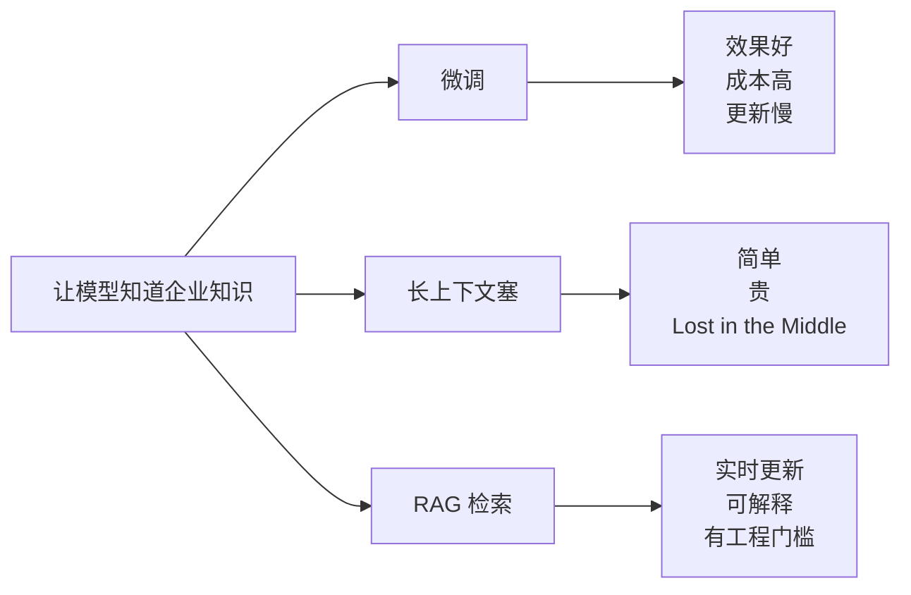
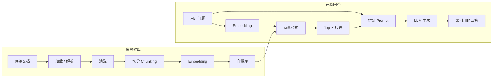
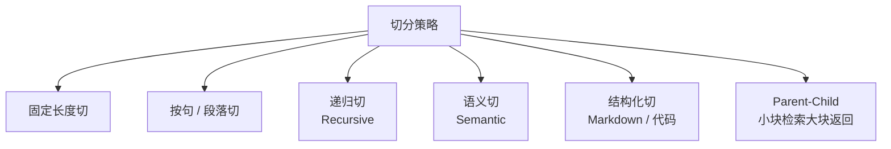
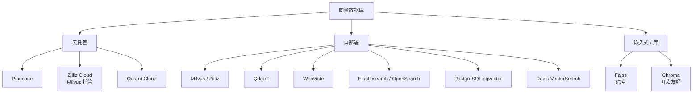

# 第 04 篇：RAG 上篇

> 一句话导读：这篇带你把 RAG 从零搭起来——但不只是"哪步用什么工具"。我们要讲清楚：Embedding 把文字映射到的那个高维空间到底长什么样、为什么不同 Embedding 模型不能混用、HNSW 凭什么比暴力搜索快上千倍、chunk size 调一调为什么效果差那么多。读完你能跑通一条最小可用的 RAG 链路，并且**理解每一步背后的几何/算法直觉**。

**前置阅读**：[第 01 篇：大模型基础](./01-llm-basics.md)（特别是 Embedding 那一节）、[第 02 篇：Prompt 工程](./02-prompt-engineering.md)

**适合读者**：第一次做企业知识库 / 文档问答的工程师；用过 LangChain `VectorStore` 但不知道为什么效果不稳的同学；想知道"为什么 chunk size 改个 100 召回率就变了 10 个点"的人。

**篇幅说明**：约 1.2 万字，会有较多几何直觉和算法原理。

---

## 一、为什么要 RAG，不能直接微调吗

把外部知识"塞给"模型，理论上有三条路：



**图 1：把外部知识接入大模型的三条路**

为什么 RAG 在大多数企业场景里赢？关键不是"它最先进"，而是它**契合企业知识的真实形态**：

- **企业知识天然是变化的**：政策季度更新、产品手册周更、合同每天新增。微调每次都要重训，长上下文每次都要全塞，只有 RAG 能做到"改一份文档重切重入库就好"
- **企业要可溯源**：财报问答给个数字是不够的，必须能告诉用户"这条数据来自第几页第几行"。微调把知识揉进了权重，没法引用；长上下文虽然能引用但成本高；RAG 天然带原文片段
- **企业有权限隔离需求**：A 部门不能看 B 部门的，不同角色看到不同信息。微调一个模型给所有人用根本做不到，RAG 用元数据过滤就解决
- **成本可控**：单次只检索几个相关片段（几千 token），而不是把整本知识库（百万 token）塞进上下文

**RAG（Retrieval-Augmented Generation）** 直译"检索增强生成"，本质是**"先查再答"**——把"找信息"和"组织语言"这两件事解耦：检索系统负责前者（确定性可控），LLM 负责后者（自然流畅）。这种解耦让两边各自能用最擅长的工具。

---

## 二、最小 RAG 链路全景

一次完整 RAG 通常长这样：



**图 2：最小 RAG 链路**

每一步都有讲究，下面我们把每一步背后的"为什么"讲透。

---

## 三、文档加载与解析

### 3.1 各种格式的本质难点

| 格式 | 推荐工具 | 本质难点 |
|---|---|---|
| PDF | PyMuPDF / pdfplumber / Unstructured | PDF 是"打印格式"不是"结构化数据"——文字是按坐标定位的，没有"段落"这个概念，需要算法重建逻辑结构 |
| Word | python-docx / Unstructured | XML 结构清晰，但样式与内容混合；表格嵌套表格、文本框等元素易丢 |
| HTML | BeautifulSoup / readability-lxml | 主体内容混在导航栏、广告、评论之间，需要"正文抽取"算法（Readability）剥离干扰 |
| Markdown | mistune / markdown-it-py | 结构最干净，但代码块要保留原样、表格要保留行列 |
| Excel / CSV | pandas | 单元格是结构化的，但列名、合并单元格、嵌套表头让"扁平化"变难 |
| 扫描件 | PaddleOCR / Tesseract / 商业 OCR | OCR 错误率天然存在；版面识别（哪是标题、哪是表）是难点 |
| 通用 | Apache Tika | 一站式但精度有限，适合 batch 预处理 |

### 3.2 PDF 解析为什么这么难

很多人第一次解析 PDF 都会被坑：复制粘贴看着字是对的，但解析出来发现：

- 段落之间空行没了
- 双栏排版被按"先左栏所有内容、再右栏"或者"逐行左右拼接"——总有一种是错的
- 表格被打散成"每个单元格独立的一行"
- 页眉页脚混进正文
- 中文字符变成 `???`

这是因为**PDF 的设计目标就不是为了让机器读**——它是一种"打印描述语言"，每个字符的存储是 `(字符, x 坐标, y 坐标, 字体)`。**段落、表格、列、章节这些逻辑概念在 PDF 文件里不存在**。解析器要做的是：

1. 拿到所有"字符 + 坐标"
2. 按 y 坐标聚类成"行"
3. 按 x 坐标判断是单栏还是双栏
4. 行间距大于阈值的判断为段落分隔
5. 用启发式规则识别表格（密集排列的小块文字）
6. 识别页眉页脚（每页都重复出现的内容）

每一步都可能错。这就是为什么 PDF 解析没有"完美方案"，只有"针对你这类文档调过参的方案"。

### 3.3 文档智能：版面 + OCR + 表格

光"提文字"不够，企业文档大量信息在**表格、图、流程图**里。这时候要"文档智能"方案：

- **版面分析（Layout Analysis）**：用 CV 模型把页面图像识别成"标题/正文/表格/图/页眉/页脚"等区块
- **表格抽取**：识别表格结构后保留行列关系（输出 HTML 表或 Markdown 表）
- **图片抽取**：图独立保存，配文字描述（caption），后续可走 VLM 生成更详细的描述
- **公式 / 代码**：单独处理，避免被切碎；公式可以用 LaTeX 表示

> 注意：开源方案精度有限，财报 / 合同等高价值场景建议上**商业文档智能 API**（合合、PaddleX 商业版、各云厂商 OCR）；自部署可看 unstructured-io、PaddleOCR、MinerU 等。

---

## 四、切分（Chunking）：RAG 效果的"第一道分水岭"

### 4.1 为什么 Chunking 这么重要

很多人觉得切分就是"按字数切一刀"，没什么讲究。但实际上**chunk 的边界决定了检索能召回什么**：

- chunk 太大 → 一个 chunk 里塞了多个主题，向量是这些主题的"平均"，召回时各个主题都不够准
- chunk 太小 → 单个 chunk 缺乏上下文（比如只有"它是 0.5%"，不知道是利率还是浓度）；同时检索结果会更碎，需要召回更多 chunk 才够答题
- chunk 跨越主题边界 → 比如把"产品 A 的价格"和"产品 B 的价格"切到一个 chunk 里，向量同时受两个主题污染

**Embedding 是对 chunk 整体语义做"压缩"**——chunk 内容越聚焦，压缩出来的向量信号越强。这是 chunking 影响巨大的根本原因。

### 4.2 几种常见切法



**图 3：常见切分策略**

**对比表 1：切分策略对比**

| 策略 | 思路 | 优点 | 缺点 | 何时用 |
|---|---|---|---|---|
| 固定长度 | 每 N 字 / token 切一刀 | 简单 | 必然切碎语义（句子中间被切） | 临时 demo |
| 按句 / 段落 | 按标点 / 换行 | 语义自然 | 块大小不均（一段可能很短或很长） | 普通文档 |
| 递归切（默认推荐） | 优先按段，再按句，再按字符——尽量大但不超阈值 | 平衡均衡与语义 | 参数要调 | 多数场景的起点 |
| Markdown 结构化 | 按 #/##/### 切 | 保留层级结构 | 仅适用结构化文档 | 技术文档 |
| 代码切 | 按函数 / 类切 | 保留代码语义单元 | 需要 AST 解析 | 代码搜索 |
| 语义切（Semantic） | 用 Embedding 计算相邻句的相似度，相似度断崖处切 | 切出"主题块" | 慢、成本高 | 高质量场景 |
| Parent-Child | 检索小块、返回父块 | 检索精度+上下文兼顾 | 索引复杂 | 长文档问答 |

### 4.3 递归切的工作机制

LangChain 的 `RecursiveCharacterTextSplitter` 是默认推荐，但很多人不知道它怎么工作的：

```python
# 简化伪代码
separators = ["\n\n", "\n", "。", "！", "？", "，", " ", ""]
chunk_size = 500

def split(text, separators):
    sep = separators[0]
    pieces = text.split(sep)
    chunks = []
    buffer = ""
    for p in pieces:
        if len(buffer) + len(p) <= chunk_size:
            buffer += sep + p
        else:
            if buffer:
                chunks.append(buffer)
            if len(p) > chunk_size:
                # 当前段还是太大，递归用下一级分隔符切
                chunks.extend(split(p, separators[1:]))
                buffer = ""
            else:
                buffer = p
    if buffer:
        chunks.append(buffer)
    return chunks
```

核心思想：**优先用大分隔符（段落 `\n\n`），段落太大就降级用句号、再降级用逗号、最后无奈用字符**。这样切出来的 chunk 既能控制大小，又最大限度保留语义边界。

### 4.4 Chunk Size 与 Overlap 怎么调

**Chunk Size 的选择逻辑**：

- **下界**：要包含一个完整的"知识单元"。技术文档大概 200 token 起，合同条款 300 token 起
- **上界**：受 Embedding 模型最大输入长度限制（很多模型 512 token，bge-m3 支持 8192）
- **甜点**：中文场景 300~800 token / 500~1500 字符；英文 400~1000 token

**Overlap 的作用**：

防止"关键信息恰好被切到边界两侧导致检索丢"。比如这句：

> "...因此 GMV 同比增长 23%。这一数据..."

如果 chunk 边界刚好切在"23%"和"。"之间，前一个 chunk 有数字但没解释，后一个 chunk 有解释但没数字，问"GMV 增长多少"两个 chunk 都不完美。Overlap 让边界附近的内容**两个 chunk 都包含**，避免这种情况。

经验值：

- **Overlap**：10%~20% chunk size（500 char chunk 配 50~100 char overlap）
- **太大** Overlap：浪费空间、向量库变大
- **太小** Overlap：边界丢失风险

### 4.5 Parent-Child / 小块检索大块返回

进阶套路：

- **建库时切两层**：粗粒度"父块"（一节，2000 字符）+ 细粒度"子块"（一段，300 字符）
- **检索时用子块向量**（精度高——小 chunk 主题集中）
- **返回时给 LLM 父块**（上下文完整——避免"只看到一句话答不全"）

这个思路解决了"小 chunk 召回准但上下文不够，大 chunk 上下文够但召回不准"的两难。LangChain 的 `ParentDocumentRetriever`、LlamaIndex 的 `HierarchicalNodeParser` 都是这个思路。

---

## 五、Embedding：把文字变成向量（这一节是 RAG 的核心几何直觉）

### 5.1 Embedding 在做什么——几何直觉

回顾第 01 篇：Embedding 是把每个 token / 句子映射到一个 $d$ 维向量空间里的一个点。但**这个空间长什么样**？

最重要的事实：**语义相似的内容在这个空间里位置相近**。

- "猫"和"狗"距离近（都是宠物）
- "猫"和"汽车"距离远
- "巴黎是法国的首都"和"法国的首都是巴黎"距离非常近（同义改写）
- "我喜欢苹果"和"I like apples"距离也很近（多语言模型的跨语言对齐）

更关键的是这个空间有**线性结构**：经典例子 "国王 - 男 + 女 ≈ 女王"。这种代数关系是 Word2Vec 时代发现的，现代 Embedding 模型继承了这个性质。

#### 5.1.1 那这个空间是怎么"长出来"的

主流 Embedding 模型用**对比学习（Contrastive Learning）** 训练：

1. 构造大量"正例对"（语义相同的句子对）和"负例对"（语义无关的句子对）
2. 训练目标：正例对的向量距离要小，负例对的距离要大
3. 数据来源：自然语言推理（NLI）数据集、问答对、翻译对、点击日志、自监督生成

正例的几个常见来源：
- 同一篇文档的不同段（弱监督）
- 翻译对（同一句话的不同语言版本）
- 用户搜索 query 和点击的文档（监督信号最强）
- 改写对（用 LLM 生成同义改写）

经过几亿对对比训练后，模型学会了"什么样的内容应该靠近"。这就是 Embedding 模型的"语感"来源。

#### 5.1.2 维度的物理含义

很多人困惑："1024 维向量到底是什么意思？" 直觉解释：

- **每个维度可以理解为一个"语义轴"**——不一定是人类可解释的轴（不是"颜色轴"、"大小轴"），但是模型在训练中自动学出来的某种区分维度
- **维度越多，能表达的细微差异越多**——就像高分辨率图片能显示更多细节
- **但维度有边际效益递减**——从 768 升到 1536 提升明显，从 1536 升到 3072 收益就小了
- **维度越高，索引和存储成本越高**——线性正相关

### 5.2 主流 Embedding 模型

**对比表 2：主流 Embedding 模型**

| 模型 | 厂商 | 维度 | 中文 | 开源 | 备注 |
|---|---|---|---|---|---|
| text-embedding-3-small/large | OpenAI | 1536 / 3072（可降维） | 一般 | 否 | 收费但稳；支持 Matryoshka 降维 |
| BGE 系列（bge-large-zh-v1.5、bge-m3） | 智源 | 1024 等 | 优秀 | 是 | 中文首选；bge-m3 同时输出稠密+稀疏+ColBERT |
| M3E | MokaAI | 768 | 优秀 | 是 | 开源中文 |
| Cohere Embed v3 | Cohere | 1024 | 一般 | 否 | 多语言强 |
| Sentence-BERT | 学界 | 768 | 一般 | 是 | 早期方案 |
| Word2Vec / GloVe | 历史 | 100~300 | - | 是 | 词级，不再推荐 |

> 重点：**中文场景 BGE 系列是默认起点**（bge-large-zh-v1.5 通用、bge-m3 多语言+稀疏稠密混合）。

### 5.3 稠密 vs 稀疏 vs 混合 Embedding

#### 5.3.1 稠密向量（Dense）

传统 Embedding 模型的输出。典型形态：1024 维的浮点数向量，每个维度都有非零值。

- **擅长**：捕捉语义相似（同义改写、跨语言、上下文）
- **短板**：精确字符匹配（版本号 V3.2.1 vs V3.2.2 在向量空间里非常近）

#### 5.3.2 稀疏向量（Sparse）

形态：一个超高维向量（词表大小，比如 30 万维），但绝大多数维度是 0，只有词出现的位置有非零权重。

经典代表：**BM25**——它本身不是 Embedding，但可以理解为"基于词频统计的稀疏向量"，每个维度对应一个词，值是该词在 query 和 doc 里的 TF-IDF 风格权重。

更现代的：**SPLADE**——用 BERT 学出来的稀疏向量，能做"词扩展"（query 里没出现的词也可能有权重）。

- **擅长**：精确关键词匹配、专有名词、缩写、数字、版本号
- **短板**：同义词、改写、跨语言

#### 5.3.3 Hybrid 混合

稠密 + 稀疏一起用，融合两路结果。bge-m3 这类新模型一次吐出三种向量（稠密、稀疏、ColBERT），同一段文本一次 forward 出全套。详细融合方法见第 05 篇。

### 5.4 维度选择与 Matryoshka

**维度大** = 表达能力强，但**索引慢、占空间**。常见 768~1536，多数场景够用。

**Matryoshka Embedding（俄罗斯套娃式 Embedding）** 是 2024 年流行的新技术——训练时让向量的"前 k 维"也能独立表达完整语义。这意味着：

- 你可以拿 1536 维向量截取前 256 维做"粗排"（速度快 6 倍）
- 拿完整 1536 维做"精排"
- 同一个模型同一个向量，前缀截断后还能用

OpenAI 的 text-embedding-3 系列和 nomic-embed-text 都支持 Matryoshka。这是工程优化的好工具。

### 5.5 Embedding 微调

通用 Embedding 模型在领域文本上效果一般会下降——因为预训练数据里这类内容少。比如：

- 法律：法律术语向量空间分布和通用文本不同
- 医疗：药品名、诊断代码完全是新词
- 内部业务：产品代号、内部缩写没见过

**领域微调**用 1 万~10 万对"query-相关 doc"对做对比学习训练，能把召回率提升 10~20 个点。详见 [第 10 篇：训练与微调](./10-training-and-finetune.md)。

---

## 六、向量数据库选型

### 6.1 主流选项



**图 4：向量库版图**

**对比表 3：常见向量库选型**

| 方案 | 规模上限 | 复杂度 | 元数据过滤 | 备注 | 如何选 |
|---|---|---|---|---|---|
| Faiss | 单机大量级 | 低（库） | 弱 | 纯计算，无服务，无持久化 | 离线 / 内嵌 |
| Chroma | 中小 | 极低 | 中 | 开发友好，单进程 | 本地 demo |
| pgvector | 中 | 低 | 强（SQL） | 数据库统一栈 | 已经用 PG 的团队 |
| Qdrant | 中大 | 中 | 强 | Rust 实现，性能好 | 中等规模 |
| Milvus / Zilliz | 海量 | 高 | 强 | 分布式、生态好 | 大规模 / 多租户 |
| Weaviate | 中大 | 中 | 强（GraphQL） | 内置混合检索 | 想要混合搜索 |
| Elasticsearch | 大 | 中 | 极强 | 已有 ES 栈、混合检索 | 关键词 + 向量统一 |

### 6.2 索引算法：HNSW / IVF / PQ / Flat 的原理

这一节非常值得讲透——理解这些算法你才知道为什么向量检索能在毫秒级里从亿级数据里找到 Top-K。

#### 6.2.1 Flat（暴力搜索）

最朴素：query 和库里每个向量都算一次距离，排序取 Top-K。

- **复杂度**：$O(N \cdot d)$（N 是库大小，d 是维度）
- **优点**：100% 精确
- **缺点**：N 大于 10 万就慢得受不了
- **适用**：数据量 < 1 万；或者作为 ANN 算法的"召回质量基线"

#### 6.2.2 HNSW（Hierarchical Navigable Small World）

**最常用的 ANN 算法**。核心思想：把向量组织成一个**多层的图**——

- 底层（第 0 层）：所有向量都在，每个点连接它的近邻
- 中层（第 1, 2, ... 层）：抽样一部分点，连接更稀疏
- 顶层：只有几个点，作为"高速公路入口"

```
顶层：    ●─────────────●
           \           /
中层：   ●──●─────●──●──●
          \  \   /  /
底层：●─●─●──●─●─●─●─●─●─●（全量节点）
```

**搜索流程**：

1. 从顶层入口点开始，贪心地走向"离 query 更近的邻居"
2. 走到该层的局部最优后，下到下一层
3. 在更密的邻居图里继续贪心
4. 直到底层，做精细搜索

**为什么快**：每层都是"贪心一跳就大幅靠近 query"，几十跳就能从亿级数据里定位到目标区域，复杂度是 $O(\log N)$ 级别。

**代价**：

- 索引构建慢（要建多层图）
- 内存占用大（每个点要存 K 个邻居指针）——通常是原始向量大小的 1.5~2 倍
- 索引一旦建好不太好动态更新（删除尤其麻烦）

**关键参数**：

- `M`：每个节点的邻居数（典型 16~64）。M 大召回好但索引大
- `ef_construction`：建索引时搜索的候选数量。大则索引质量高但建索引慢
- `ef_search`：查询时搜索的候选数量。大则召回高但查询慢

#### 6.2.3 IVF（Inverted File Index）

聚类索引。核心思想：先把库里所有向量做 KMeans 聚类（比如分 1024 个簇），查询时：

1. 找到 query 离哪些簇最近（取 nprobe 个，比如 10 个）
2. 只在这 nprobe 个簇内做暴力搜索

**为什么快**：原本要扫 1 亿个向量，现在只扫这 10 个簇内的（每簇 10 万个，总共 100 万）——快 100 倍。

**代价**：

- 召回率受 nprobe 影响——nprobe 太小会漏召回（query 真正相关的内容在没被选中的簇里）
- 聚类质量影响整个索引性能

**适用**：超大规模（亿级以上），常和 PQ 结合压缩内存。

#### 6.2.4 PQ（Product Quantization）

**向量压缩算法**。核心思想：把 1024 维向量切成 8 段（每段 128 维），每段独立做 KMeans 聚类（256 个簇），把每段表示成一个 8 bit 的簇 id。

原本一个向量：1024 × 4 byte = 4096 byte
压缩后：8 × 1 byte = 8 byte（**压缩 512 倍**）

**为什么能 work**：每段 128 维，256 个簇，相当于在每段上量化损失只是"找最近的代表向量"。多段独立量化的乘积空间能表达 $256^8 \approx 1.8 \times 10^{19}$ 种组合，表达能力还够。

**代价**：精度有损，需要更高 nprobe / 重排序补偿。

**适用**：超大规模（亿级以上）+ 内存吃紧。Faiss 的 `IVF_PQ` 是经典组合。

#### 6.2.5 选型建议

> 提示：99% 团队用 HNSW 就够。要做亿级以上规模再考虑 IVF + PQ。10 万以下数据 Flat 都能跑得飞快。

---

## 七、检索：Top-K 与相似度

### 7.1 三种相似度度量的物理含义

#### 7.1.1 余弦相似度（Cosine Similarity）

公式：$\cos(A, B) = \frac{A \cdot B}{\|A\| \cdot \|B\|}$

物理含义：**只看两个向量的方向夹角，不看长度**。范围 [-1, 1]，越接近 1 越相似。

为什么文本检索常用余弦：Embedding 向量的"方向"承载语义信息，"长度"承载的是某种"强度"或者"频次"信息（不太重要）。一个出现 5 次的词和出现 10 次的词，意思一样但向量长度不同——余弦让我们忽略这种无关差异。

#### 7.1.2 点积（Dot Product / Inner Product）

公式：$A \cdot B = \sum_i A_i B_i$

物理含义：**同时考虑方向和长度**。

什么时候用点积：当 Embedding 模型在训练时**没有归一化向量到单位长度**，长度本身也有意义（比如 OpenAI 的 Embedding，长度反映了"显著性"）。

**重要事实**：如果向量都已经 L2 normalize 到长度 1，**点积和余弦相似度数值完全相等**。所以工程上常见做法：建库时统一做一次 L2 normalize，之后用点积（计算更快，少一次除法）。

#### 7.1.3 欧氏距离（L2 Distance）

公式：$\text{L2}(A, B) = \sqrt{\sum_i (A_i - B_i)^2}$

物理含义：**两点在空间里的物理直线距离**。范围 [0, ∞)，越小越相似（注意是反的）。

什么时候用 L2：图像 Embedding 偏好 L2；文本 Embedding 较少用。

**重要事实**：如果向量都已经 L2 normalize，L2 距离和余弦相似度有简单关系：$\text{L2}^2 = 2(1 - \cos)$，单调对应。结果排序完全一样。

### 7.2 选错相似度的代价

```python
# 反例：BGE 模型用了 L2，效果断崖
# BGE 官方推荐 cosine（向量都已 normalize）
# 但很多人默认用 Faiss 的 L2 索引

# 正确做法
import faiss
index = faiss.IndexFlatIP(dim)  # IP = Inner Product
faiss.normalize_L2(vectors)     # 统一归一化
index.add(vectors)
```

> 注意：每次更换 Embedding 模型，**对照官方文档**确认推荐相似度——OpenAI 推荐 cosine，BGE 推荐 cosine，部分 sentence-BERT 老模型推荐 L2。看错了能差 10 个点召回率。

### 7.3 Top-K 取多少

经验：

- **POC**：K=3~5 看效果
- **生产**：K=10~20 配合 Rerank（详见 [第 05 篇：RAG 下篇](./05-rag-part2-advanced.md)）
- **K 太小**：漏召回——相关内容排名 8 但你只取了 5
- **K 太大**：噪声多 + 上下文撑爆 + Lost in the Middle

### 7.4 ANN：精度换速度的工程妥协

**近似最近邻（Approximate Nearest Neighbor, ANN）**：不追求绝对精确，放弃极小一部分准确率（比如真实 Top-10 漏掉 1~2 个）换取百倍以上的速度。

衡量 ANN 质量的指标是 **Recall@K**：算法返回的 Top-K 中有多少和暴力搜索的真实 Top-K 重合。生产 HNSW 调好后通常能到 **0.95~0.99**——意味着只丢失 1~5% 的极端 case 但快了上千倍。

生产几乎都用 ANN，不用暴力 KNN——除非数据量极小（< 1 万）。

---

## 八、一段最小可跑示例

```python
# 用 LangChain + Chroma + bge 做一个最小 RAG
# 安装：pip install langchain langchain-community chromadb sentence-transformers
from langchain_community.document_loaders import TextLoader
from langchain.text_splitter import RecursiveCharacterTextSplitter
from langchain_community.embeddings import HuggingFaceEmbeddings
from langchain_community.vectorstores import Chroma

# 1. 加载文档（这里以单文件为例，生产场景应批量加载并带 metadata）
docs = TextLoader("knowledge.md", encoding="utf-8").load()

# 2. 切分（递归切，500 字符 + 50 字符重叠）
#    优先级：段落 > 句号 > 逗号 > 字符
splitter = RecursiveCharacterTextSplitter(
    chunk_size=500,
    chunk_overlap=50,
    separators=["\n\n", "\n", "。", "！", "？", "，", " ", ""],
)
chunks = splitter.split_documents(docs)

# 3. Embedding 模型（这里用本地的 bge-small，国内下载慢可换镜像）
#    BGE 默认用 cosine，向量已 normalize
embed = HuggingFaceEmbeddings(model_name="BAAI/bge-small-zh-v1.5")

# 4. 入库（Chroma 默认 HNSW 索引，距离度量默认 L2，这里用 cosine 更稳）
vs = Chroma.from_documents(
    chunks,
    embed,
    collection_name="kb",
    collection_metadata={"hnsw:space": "cosine"},
)

# 5. 检索
results = vs.similarity_search("RAG 怎么调 chunk size?", k=3)
for r in results:
    print(r.page_content[:100])

# 6. 接到 LLM 生成（伪代码）
# context = "\n\n".join(f"[{i+1}] {r.page_content}" for i, r in enumerate(results))
# prompt = f"参考资料:\n{context}\n\n问题: {q}\n请基于资料回答，并用 [n] 标注引用..."
# answer = llm.invoke(prompt)
```

---

## 九、踩坑提醒

### 坑 1：直接拿 PDF 文本就开始切，结果表格全乱

- **现象**：知识库里有大量表格内容，问 "X 产品价格"，模型答得驴唇不对马嘴。
- **原因**：直接用基础 PDF 解析器（如 PyPDF2）会把表格按字符坐标"逐行从左到右拼接"，结果三列表格变成"列1值 列2值 列3值"挤在一行，列名和值都对不上；切分时表格被截断成两半。底层原因是 PDF 没有"表格"这个概念，纯靠解析器启发式重建。
- **规避方法**：优先用 Unstructured / pdfplumber / PaddleX 等带表格识别的方案；表格在切分时**作为整体保留**，必要时转成 Markdown 表格再入库；做评测时**单独跑表格类问题**，看准确率是不是显著低于普通段落。

### 坑 2：Embedding 用错相似度

- **现象**：换了一个新 Embedding 模型，召回效果断崖下降。
- **原因**：原模型用 cosine，新模型官方推荐 dot product；或者向量没 L2 normalize 但用了余弦（实际等价于使用了带长度信息的距离）。
- **规避方法**：每次更换 Embedding 模型，**对照官方文档**确认相似度度量；统一在写入前做 L2 normalize；评测集回归——用一组黄金问题对比新旧召回率。

### 坑 3：chunk size 一刀切到底

- **现象**：技术文档（短）和合同（长）用同一个 chunk_size=512，技术文档查询效果好，合同问题答不全。
- **原因**：不同类型文档的"知识颗粒度"不同——技术文档一段就讲一个 API、合同一条款讲一个权利义务。一刀切必然有一类吃亏。底层是因为 Embedding 是对 chunk 整体做语义压缩，chunk 主题混杂时压缩信号弱。
- **规避方法**：按文档类型分别配 chunk size 与切分策略；技术文档用 Markdown 结构化切，合同用语义 / 段落切；用 Parent-Child 兼顾精度与上下文；用评测集对每种文档类型独立调参。

### 坑 4：知识库更新了，但旧向量没删

- **现象**：用户反馈"为什么还在引用上个月已经下线的政策"。
- **原因**：文档版本更新后，新版本入库了，但旧版本向量没清理；或者用 doc_id 去重时主键设计错了——比如 doc_id 用文件名，文件名变了就当成新文档而不是更新。
- **规避方法**：所有 chunk 必须带 `doc_id` + `version` 元数据；更新时**先按 doc_id 删除旧版本再入新版本**；离线定期跑一致性校验（向量库 chunk 数 vs 文档系统中文档数）；考虑给 chunk 加 `is_active` 标志做软删除便于回滚。

### 坑 5：忘了做权限隔离

- **现象**：测试时发现 A 部门员工能搜到 B 部门的机密文档片段。
- **原因**：所有文档都进了同一个 collection，没用元数据做过滤；检索时也没传用户权限。这是企业 RAG 最常见的合规事故。
- **规避方法**：入库时给每个 chunk 打 `tenant_id` / `dept` / `acl` 等元数据；检索时**强制带过滤条件**（接口层校验非空）；多租户场景考虑物理隔离（不同 collection 甚至不同库）；上线前**专门做跨租户串问测试**。

### 坑 6：索引参数默认值在大数据下崩溃

- **现象**：HNSW 在 100 万向量下查询飞快，扩到 1000 万后召回率掉到 0.7。
- **原因**：HNSW 的默认参数（M=16, ef_search=10）是为中等规模优化的，规模大了之后图的连通性不够。
- **规避方法**：数据量增长后重新调 M 和 ef_search；监控 Recall@K 指标——和暴力搜索的结果对比一组 sample；考虑分片或者切到 IVF + PQ。

---

## 十、选型建议与实践要点

新搭一个 RAG 系统的推荐起点：

1. **解析**：Unstructured（开源）或商业文档智能（高价值场景）
2. **切分**：RecursiveCharacterTextSplitter，chunk_size=500、overlap=50
3. **Embedding**：中文 BGE-small/large；多语言 bge-m3 或 OpenAI
4. **向量库**：本地 demo 用 Chroma；中等规模 Qdrant；大规模 Milvus；已有 PG 用 pgvector
5. **检索**：相似度按官方推荐；K=10 起步，配 Rerank
6. **必备元数据**：doc_id、version、tenant、created_at、source_url

下篇我们聊"召回不准时怎么办"——混合检索、Rerank、Query 改写、HyDE、GraphRAG。

---

## 十一、延伸阅读

- 系列内：
  - [第 05 篇：RAG 下篇 / 进阶调优](./05-rag-part2-advanced.md)
  - [第 03 篇：上下文与记忆](./03-context-and-memory.md)（Vector Memory 用到同样组件）
  - [第 11 篇：评测与可观测](./11-evaluation-and-observability.md)（RAG 评测体系）
- 外部参考（注明发表时间）：
  - 论文《Efficient and robust approximate nearest neighbor search using HNSW》（Malkov & Yashunin, 2018）
  - 论文《Product Quantization for Nearest Neighbor Search》（Jegou et al., 2011）
  - 论文《Matryoshka Representation Learning》（Kusupati et al., 2022）
  - 论文《BGE: BAAI General Embedding》系列论文
  - LangChain 官方文档 RAG 章节（最后访问 2025）
  - LlamaIndex `Hierarchical Node Parser` 文档
  - 智源 BGE 模型卡片（Hugging Face）

---

## 附：本篇覆盖的知识点清单

来自原清单第 3.1 / 3.2 / 3.3 / 3.4 节，每条扩展了原理：

- [x] 文档加载（PDF、Word、HTML、Markdown）/ Apache Tika / OCR / 表格抽取 / 图片抽取（含 PDF 解析的根本难点）
- [x] 文档智能：版面分析、表格抽取、公式识别
- [x] 固定长度 / 句子 / 段落 / 递归 / 语义 / 滑窗 / Markdown / 代码切分（含递归切的工作机制）
- [x] Chunk Size 与 Overlap 调优 / Parent-Child / 小块检索大块返回（含 Embedding 压缩信号原理）
- [x] Embedding 几何直觉：对比学习、维度物理含义、Matryoshka
- [x] Word2Vec / GloVe / Sentence-BERT / OpenAI Embedding / BGE / M3E / Cohere
- [x] 多语言 / 稀疏 / 稠密 / 混合 Embedding（每种的擅长与短板）
- [x] Embedding 维度选择 / Embedding 微调（细节见第 10 篇）
- [x] Milvus / Faiss / Qdrant / Weaviate / Chroma / Pinecone / Elasticsearch / pgvector / Redis
- [x] HNSW（多层图原理 + 参数）/ IVF（聚类原理）/ PQ（向量压缩原理）/ Flat
- [x] ANN 近似最近邻 / Recall@K 评估
- [x] 向量数据库性能与扩展性 / 选型
- [x] 相似度度量（余弦、欧氏、点积）的物理含义与等价关系
- [x] Top-K 选择策略
