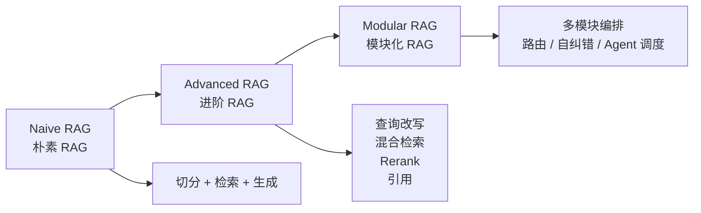
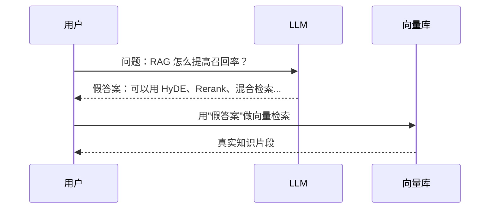
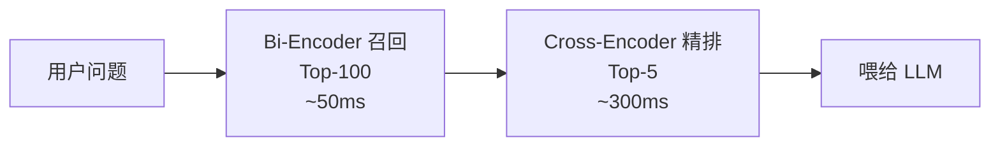
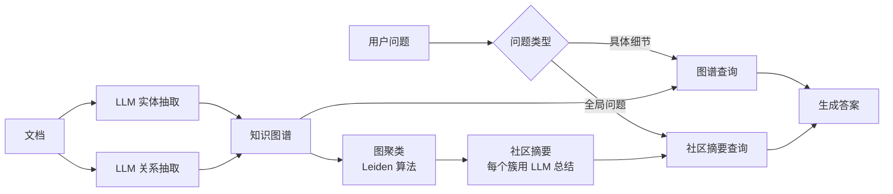

# 第 05 篇：RAG 下篇

> 一句话导读：上篇咱们把 RAG 跑通了，但生产里"跑通"和"好用"差着十条街。这篇要把每个进阶套路的"为什么"讲透——BM25 凭什么对关键词有效、RRF 为什么不需要分数归一化、Cross-Encoder 比 Bi-Encoder 准在哪、HyDE 凭什么能涨召回、Self-RAG 是怎么"自己决定要不要检索"的。读完你不仅会用这些技术，还能根据具体瓶颈选对武器。

**前置阅读**：[第 04 篇：RAG 上篇](./04-rag-part1-fundamentals.md)、[第 02 篇：Prompt 工程](./02-prompt-engineering.md)

**适合读者**：RAG 系统已经上线但召回率 / 准确率不达标的工程师；问 "检索看着挺像，模型还是答非所问" 的同学；想在堆技术之前知道"哪个最值得堆"的人。

**篇幅说明**：约 1.2 万字，含较多算法原理和决策逻辑拆解。

---

## 一、为什么基础 RAG 总是"差一口气"

最简版 RAG（向量召回 → Top-K → 拼 Prompt）在真实业务里常见的问题：

- 用户问"我们公司去年第三季度财报里 GMV 增长了多少"，召回了"第三季度财报"片段，但偏偏没有 GMV 数字
- 关键词类问题（"V3.2.1 版本下"）召回不准，向量觉得"V3.2.1"和"V3.1.x"差不多
- 多跳问题（"A 公司收购的 B 公司的 CEO 是谁"）单次检索拿不全
- 用户问得很口语化（"这玩意儿咋用啊"），向量直接懵
- 模型答了一堆，但**根本不是基于检索片段**——纯幻觉

这些问题的根因是 **基础 RAG 把所有任务都用同一套机制处理**——向量相似度。但实际上，"找信息"是一个有多种子问题的复杂任务：

- 关键词精确匹配（V3.2.1） → 适合 BM25
- 语义改写匹配（"咋用啊"=>"使用方法"） → 适合向量
- 多跳推理 → 适合分解后多次检索
- 模糊问题 → 适合先生成假答案再用假答案查

**进阶 RAG 的本质就是：识别瓶颈 → 用对应的专门工具补强**。下面我们就按这个思路展开。

---

## 二、RAG 进阶架构地图

业界把 RAG 演进路线大致分成三代：



**图 1：RAG 演进三代**

进阶 RAG 的几条主线：**查询侧优化、检索侧优化、生成侧优化、自纠错与编排**。下面分别拆。

---

## 三、查询侧优化：用户问的不一定是模型该查的

### 3.1 用户 Query 和文档语言的"鸿沟"

文档是写出来给人看的——风格正式、信息密集、用专业术语。
用户 Query 是当场敲出来的——口语化、模糊、可能省略关键约束。

举例：

| 用户问 | 知识库实际写法 |
|---|---|
| "这玩意儿咋用啊" | "产品 X 使用说明" |
| "去年的销售数据" | "2024 年度营收报告" |
| "电脑卡死了怎么办" | "系统无响应故障排查指南" |

向量虽然能跨越部分鸿沟（能识别"咋用 ≈ 使用"），但口语化和缩写多的场景仍然失效。**查询侧优化的本质就是：把用户 query 改造成更接近文档语言的形式**。

### 3.2 Query Rewriting / Expansion / Decomposition

| 技术 | 做什么 | 例子 | 适合场景 |
|---|---|---|---|
| Query Rewriting（改写） | 把口语 / 模糊问句改成检索友好 | "这玩意儿咋用" → "产品 X 的使用方法" | 口语化输入 |
| Query Expansion（扩展） | 加同义词 / 相关词 | "GMV" → "GMV、商品交易总额、成交额" | 缩写、专业术语 |
| Query Decomposition（分解） | 多跳问题拆成多个子问题 | "A 收购的 B 的 CEO 是谁" → ["A 收购了哪家公司", "B 的 CEO 是谁"] | 多跳问题 |

实现上一般让 LLM 来改写 / 扩展 / 拆分，再分别检索后合并结果。代价是多一次 LLM 调用，约 0.5~1 秒延迟。

### 3.3 HyDE（Hypothetical Document Embeddings）：假答案凭什么涨召回

#### 3.3.1 思路

用户问题往往比知识文档"短得多 + 风格不同"，向量距离反而远。让 LLM **先生成一个假设的答案**（不一定对），用这个"假答案"去检索，召回会更准。



**图 2：HyDE 工作流**

#### 3.3.2 为什么能 work

直觉：**Embedding 向量的相似性主要靠"内容/风格匹配"**。

- "RAG 怎么提高召回率？"——一句话，疑问句，约 15 字
- 知识库实际内容："提升 RAG 召回率有几种方法：(1) 混合检索结合 BM25... (2) Rerank..."——一段话，陈述句，几百字

这两段在向量空间里的距离其实**比较远**——结构、长度、风格都不同。即使语义相关，向量距离不一定最近。

但是 LLM 生成的"假答案"长这样：

> "提高 RAG 召回率的方法包括：使用混合检索、添加 Rerank 模型、查询改写、调整 chunk size 等。其中混合检索是最常用..."

它看起来**就像知识库里的一段**——同样的风格、长度、专业术语。所以它和真实文档的向量距离非常近，能精准召回。

**核心洞察**：HyDE 不是用"对的答案"做检索，是用"和文档同分布的内容"做检索。哪怕假答案是错的，只要它"看起来像知识库的一段"就够了。

#### 3.3.3 代价与适用

> 注意：HyDE 多一次 LLM 调用，**慢且贵**，用在召回质量瓶颈明显的场景；闲聊场景不必上。

适合：
- 用户 query 普遍很短（< 20 字）
- 用户输入风格和文档风格差异大
- 已经做了 Rewriting 还没解决问题

### 3.4 Multi-Query / Self-Query / Query Routing

#### 3.4.1 Multi-Query

让 LLM 把同一个问题改写成 N 个不同表述，分别检索后合并：

```
原 query: "RAG 怎么提高召回率？"
改写 1: "如何优化 RAG 系统的检索效果？"
改写 2: "提升知识库召回精度的方法"
改写 3: "RAG 召回不准怎么办"
```

每个改写各自走向量检索，结果用 RRF 合并（见下文）。这能减少"单次检索因为措辞不巧合漏召回"的情况。

#### 3.4.2 Self-Query

让 LLM 把自然语言问题转成"语义检索 + 元数据过滤"两部分：

```
用户问："今年三季度的财务报告"
↓ LLM 解析
{
  "semantic_query": "财务报告",
  "filter": {
    "year": 2025,
    "quarter": "Q3"
  }
}
```

这能解决纯向量检索"时效性、版本"这类**精确约束**捕捉不到的问题。LangChain 的 `SelfQueryRetriever` 是经典实现。

#### 3.4.3 Query Routing

先判断问题类型，路由到不同知识库 / 不同检索策略。比如：

- 代码问题 → 代码搜索引擎
- 政策问题 → 政策知识库
- 闲聊 → 不检索，直接 LLM 答

实现一般是用 LLM 做意图分类，或者用一个轻量分类器（甚至关键词匹配）做路由。

---

## 四、检索侧优化：召回更全、排序更准

### 4.1 BM25 凭什么对关键词有效

BM25 是关键词检索的"事实标准"算法，1990 年代提出，到现在都没有被完全取代。它的核心公式（简化版）：

$$\text{score}(q, d) = \sum_{t \in q} \text{IDF}(t) \cdot \frac{f(t, d) \cdot (k_1 + 1)}{f(t, d) + k_1 \cdot (1 - b + b \cdot \frac{|d|}{\text{avgdl}})}$$

不需要记公式，理解三个直觉就够：

**直觉 1：IDF（逆文档频率）惩罚常见词**

- "的"、"是"、"that" 这种词出现在所有文档里，IDF 很小，几乎不贡献分数
- "GMV"、"V3.2.1"、"碳达峰"这种稀有词 IDF 大，匹配上贡献很大

这就是为什么 BM25 对**专有名词、缩写、版本号**特别敏感——这些词 IDF 极高，命中一次得分爆炸。

**直觉 2：词频饱和**

公式里的 $\frac{f}{f + k_1}$ 部分让"出现次数"的边际收益递减——出现 1 次大幅加分，出现 10 次和 5 次差不多。

为什么这样设计：避免"刷词"——一篇垃圾文档把"减肥"重复 100 次，正常算法可能误判为相关。BM25 的饱和让重复刷词没用。

**直觉 3：长度归一化**

公式里的 $\frac{|d|}{\text{avgdl}}$ 部分惩罚过长的文档——长文档天然包含更多词，匹配概率高，要除掉这种偏置。

#### 4.1.1 BM25 vs 向量：擅长什么

| 维度 | BM25（稀疏） | 向量（稠密） |
|---|---|---|
| 同义改写 | 失败 | 成功 |
| 跨语言 | 失败 | 部分成功 |
| 专有名词、版本号 | 强 | 弱 |
| 数字、代码、ID | 强 | 弱 |
| 长尾低频词 | 强 | 弱（训练数据少） |
| 上下文歧义消解 | 弱 | 强 |
| 计算成本 | 极低 | 中等 |

正因为**两者擅长完全互补**，混合检索是必选项。

### 4.2 混合检索（Hybrid Search）

光向量不够，**关键词信号必须保留**。混合检索 = 向量召回 + BM25 召回，再融合。

#### 4.2.1 融合方法对比

**方法 1：加权求和**

$$\text{score} = \alpha \cdot \text{score}_\text{dense} + (1-\alpha) \cdot \text{score}_\text{bm25}$$

问题：BM25 分数范围 0~30+，余弦 0~1，不归一化加权会让一边完全压过另一边。要先做 min-max 或 softmax 归一化，但归一化对极端值敏感。

**方法 2：RRF（Reciprocal Rank Fusion）—— 最推荐**

只看排名，不看具体分数：

$$\text{RRF}(d) = \sum_{i \in \text{retrievers}} \frac{1}{k + \text{rank}_i(d)}$$

其中 $k$ 是平滑常数（典型值 60），$\text{rank}_i(d)$ 是文档 $d$ 在第 $i$ 路检索结果里的排名（从 1 开始）。

**为什么 RRF 优雅**：

1. **不需要分数归一化**——只用排名信息，BM25 0~30 vs 余弦 0~1 完全不影响
2. **天然对每路的极端值不敏感**——某路给一个文档打了超高分但其他路没给高分，最终也不会爆
3. **k 控制"长尾贡献"**：k 越大，排名靠后的文档贡献越接近排名靠前的（更民主）；k 越小，越偏向各路 Top-1（更精英）

```python
# RRF 融合示例（极简）
def rrf(rank_lists, k=60):
    """
    rank_lists 是多路召回的有序文档 id 列表
    例如 [["doc1","doc2","doc3"], ["doc2","doc4","doc1"]]
    """
    scores = {}
    for ranks in rank_lists:
        for i, doc_id in enumerate(ranks):
            # 排名从 0 开始，公式里 +1 让排名从 1 开始
            scores[doc_id] = scores.get(doc_id, 0) + 1 / (k + i + 1)
    return sorted(scores.items(), key=lambda x: -x[1])
```

> 工程经验：用 RRF 几乎不会出错，调试也简单（直接看每路的 Top-K 列表就能 debug）。这是为什么 Elasticsearch、Weaviate、Milvus 都把 RRF 作为默认混合方法。

### 4.3 Rerank：召回 100 条，精排选 5 条

#### 4.3.1 为什么需要两阶段

向量召回的"粗"——是因为 Bi-Encoder 把 query 和文档**独立编码成向量**，两个向量之间只能算简单的距离/点积。但语义匹配的精细判断常常需要"看 query 和文档**交互**之后才能得出"——比如：

- query 里"不要苹果"和文档里"提到苹果但是是反例" 是匹配还是不匹配？
- query 里"红色的车"和文档里"红色的房子，车子是蓝色"是部分匹配还是不匹配？

这种**交互式判断**需要一个能同时看到 query 和文档的模型——这就是 Cross-Encoder。

#### 4.3.2 Bi-Encoder vs Cross-Encoder

```
Bi-Encoder（用于召回）:
    query  --[Encoder]--> q_vec
    doc    --[Encoder]--> d_vec  （独立编码，可预先算好）
    score = sim(q_vec, d_vec)    （只算向量距离）

Cross-Encoder（用于精排）:
    [query, doc] --[Encoder]--> 得到一个交互后的表示 --> score
    （query 和 doc 必须一起送进模型，每次都要现算）
```

**关键区别**：

| 维度 | Bi-Encoder | Cross-Encoder |
|---|---|---|
| 模型结构 | 双塔，独立编码 | 单塔，拼接编码 |
| 文档可预先索引 | 是 | 否 |
| 单次评分耗时 | < 1 ms | 10~100 ms |
| 能处理的规模 | 亿级 | 几十~几百 |
| 准确率 | 中 | 高 |
| 工程模式 | 召回 | 精排 |

**工程组合**：先用 Bi-Encoder 召回 100 条（快），再用 Cross-Encoder Rerank 选 Top-5（准）。一次查询总耗时 = 100ms 召回 + 100 × 50ms = 5 秒... 等等这太慢了？

实际上 Cross-Encoder 可以做 batch：100 个 (query, doc) 对一次性送进 GPU，总时间约 200~500ms。这就是为什么生产可行。



**图 3：召回 + 精排两阶段**

| Reranker | 类型 | 备注 |
|---|---|---|
| bge-reranker-large / v2-m3 | 开源中文友好 | 中文项目首选 |
| Cohere Rerank v3 | 闭源 API | 多语言强，按调用计费 |
| jina-reranker | 开源 | 多语言 |
| ColBERT / ColBERTv2 | 学术 | 介于 Bi 和 Cross 之间——文档预编码成多向量，查询时做"延迟交互"，性能/精度折中 |

> 重点：**Rerank 是 ROI 最高的优化之一**。同样的召回链路，加一个 Reranker 准确率能提升 10~20 个百分点（参考数据，实际看业务）。

### 4.4 MMR：避免召回都是"重复同一句话"

#### 4.4.1 问题与公式

向量检索的"相似度"高度敏感——Top-5 经常是同一段话的微小变体（比如同一份合同的 5 个版本，或者一个事实在文档里被反复提及）。这浪费了上下文窗口，没增加新信息。

**MMR（Maximal Marginal Relevance）** 在选择候选时同时考虑两个目标：

$$\text{MMR} = \arg\max_{d_i \in R \setminus S} \left[ \lambda \cdot \text{sim}(d_i, q) - (1-\lambda) \cdot \max_{d_j \in S} \text{sim}(d_i, d_j) \right]$$

其中 $R$ 是候选集，$S$ 是已选集，$\lambda$ 控制相关性 vs 多样性的权重。

直觉：每选一个候选，**既要它和 query 相关（前一项）**，**又要它和已选的不重复（后一项的"惩罚项"）**。

工程经验：$\lambda$ 取 0.5~0.7。完全相关性 ($\lambda=1$) 退化为普通 Top-K；完全多样性 ($\lambda=0$) 会选出一堆不相关的东西。

### 4.5 Contextual Retrieval（Anthropic 2024）

每个 chunk 入库前，让 LLM 根据**整篇文档**生成一段"这个 chunk 在讲什么、和上下文关系如何"，把这段说明拼到 chunk 前面再做 Embedding 和 BM25。

举例：

```
原 chunk: "公司收入增长 23%，主要来自海外市场。"

加 context 后:
"[这是 2024 年 Q3 财报的财务概览段，前文讨论了整体业绩]
公司收入增长 23%，主要来自海外市场。"
```

#### 4.5.1 为什么有效

回顾第 04 篇：chunk 切分会把段落和上下文割裂。"公司收入增长 23%" 这句话单独看，向量空间里和"任何一家公司业绩增长"都很近，没法精准定位。加上"2024 Q3 财报""财务概览"这些上下文锚点后，向量瞬间精准。

#### 4.5.2 代价

- 建库时多一次 LLM 调用——每个 chunk 一次。10 万 chunk × 0.001 美元/次 = 100 美元（一次性）
- 用 Prefix Caching 优化：把"整篇文档"放在 prompt 前缀，不同 chunk 共享前缀缓存，能省 80%+ 成本（Anthropic 原文重点强调这个工程优化）
- 文档更新时要同步更新 context 描述

Anthropic 官方数据：Contextual Retrieval 在他们的评测集上把召回失败率降低了 35%，配合 Rerank 降低了 67%。这是 2024 年最实用的 RAG 改进之一。

---

## 五、生成侧优化：让 LLM "好好用"检索结果

### 5.1 引用与溯源

让模型回答时**强制带引用**（如 `[1]`、`[2]`），并把每条引用对应的原文片段一起返回给前端。优点：

- 用户能验证（可解释性）
- 出问题能定位到原始资料
- 模型"造假"的成本变高——它要是编一个事实，对应的引用就指向不存在的内容，容易被发现

#### 5.1.1 Prompt 实践

```
参考资料：
[1] ... 原文 ...
[2] ... 原文 ...

回答规则：
- 只基于参考资料回答
- 必须用 [n] 标注引用来源
- 资料里没有相关信息，回答"暂无相关资料"
- 不要把多个资料的内容混淆引用
```

#### 5.1.2 Citation 校验

光让模型"声称"引用还不够——模型可能引错或乱标。生产级做法：

1. 拿到模型答案后，正则提取所有 `[n]` 标记
2. 对每个标记，检查"该引用对应的资料里是否真的支持这句话"——可以用一个小模型做 NLI 蕴含判断，或者用关键词重叠
3. 不通过的标记标红或者剔除

### 5.2 Self-RAG 与 CRAG

更进阶的范式（来自学术界）：让模型**主动判断检索的必要性和质量**。

#### 5.2.1 Self-RAG（Self-Reflective RAG）

核心是让模型在生成过程中输出几个"反思 token"：

- `[Retrieve]` / `[No Retrieve]`：当前 query 是否需要检索（闲聊就不要）
- `[Relevant]` / `[Irrelevant]`：召回的片段是否相关
- `[Supported]` / `[Partially Supported]` / `[No Support]`：生成内容是否有引用支持
- `[Useful]` / `[Useless]`：这次回答是否有用

这些 token 是通过专门微调出来的（训练时让模型预测下一个反思 token）。Inference 时根据反思 token 决策——如果模型自己判断"不需要检索"，就跳过；如果"召回的不相关"，就重检索；如果"没引用支持"，就重生成。

工程上实现这一套需要：
- 微调一个支持 reflection token 的模型（开源 selfrag-llama2-7b 等）
- 或者用 Prompt 工程模拟（让模型按照固定格式输出 `<reflection>...</reflection>`）

#### 5.2.2 CRAG（Corrective RAG）

更工程化的版本。流程：

1. 检索得到初版结果
2. 用一个**评估器**（小模型或 LLM）打分：correct / ambiguous / incorrect
3. 根据打分分支：
   - **correct**：直接生成
   - **ambiguous**：用召回结果 + 网络搜索补充
   - **incorrect**：放弃召回结果，转走网络搜索 / Query Rewriting 重检索

CRAG 的好处是**对检索质量敏感**——遇到知识库覆盖不到的问题能自动 fallback 到外部源，避免硬答幻觉。

#### 5.2.3 工程化形态

工程上一般用 Agent 编排实现这两套——把"检索"、"评估"、"重写"、"网搜"作为不同节点，根据上一步输出选下一步。LangGraph、LlamaIndex Workflow 都支持这种 DAG 式编排。详见 [第 06 篇：Agent 上篇](./06-agent-part1-foundations.md)。

### 5.3 RAG Fusion

把"多 query 改写 → 各自检索 → RRF 融合"打包成一个完整 pipeline，叫 RAG Fusion。其实就是 Multi-Query + Hybrid + RRF 的组合套餐。代价是 N 倍检索，收益是召回率显著提升（20~30%）。

### 5.4 长文档 RAG：RAPTOR

#### 5.4.1 问题

普通 chunk RAG 适合"具体细节问题"（"X 接口的参数是什么"），但不适合"总览类问题"（"这份 200 页的报告主要讲了什么"）。后者需要的不是某个段落，而是**全局摘要**。

#### 5.4.2 RAPTOR 思路

把文档构建成一棵"摘要树"：

```
            根：全文摘要
           /      |      \
        节1摘要  节2摘要   节3摘要
        / \      / \       / \
      段A  段B  段C 段D    段E 段F  ←底层是原始 chunk
```

构建过程：
1. 把文档切成 chunk（叶节点）
2. 用聚类算法（Gaussian Mixture Model 等）把相似 chunk 分组
3. 每组用 LLM 生成摘要 → 父节点
4. 递归往上聚类、摘要，直到树根

检索时同时召回**所有层**——具体问题命中底层 chunk，总览问题命中上层摘要。

代价：建库时每层都要 LLM 摘要，成本不低；适合**重要文档**而非"全量自动建库"。

---

## 六、GraphRAG 与多模态 RAG

### 6.1 GraphRAG

#### 6.1.1 解决什么问题

传统 RAG 在"关系推理"任务上很弱：

- "X 公司投资过哪些做芯片的公司" —— 这需要先知道 X 投资了哪些公司，再筛选哪些是做芯片的
- "和小明同部门的人都做过哪些项目" —— 涉及多跳关系

普通 chunk RAG 拿不到这种结构化关系——它只能找文本相似的片段。GraphRAG 把文档转成知识图谱（实体 + 关系），用图数据结构来支持关系推理。

#### 6.1.2 微软 GraphRAG 的工作流程



**图 4：微软 GraphRAG 流程**

关键的几步：

**步骤 1：实体和关系抽取**

让 LLM 读每段文档，抽取出 `(实体A, 关系, 实体B)` 三元组：
```
("阿里", "投资", "蚂蚁集团")
("蚂蚁集团", "总部位于", "杭州")
("阿里", "创始人", "马云")
```

这一步耗 LLM 调用最多——每个 chunk 都要一次。

**步骤 2：建图与社区检测**

把所有三元组建成一张图，用 Leiden 等社区检测算法把图分成若干"社区"（关联紧密的子图）。

**步骤 3：社区摘要**

对每个社区让 LLM 生成一个摘要——这个摘要描述了"这个社区的核心实体和它们的关系"。

**步骤 4：分层检索**

- 局部问题（"阿里投资了谁"）：在图上做查询/遍历
- 全局问题（"AI 公司的整体投资格局"）：调用所有社区摘要做 map-reduce 风格的总结

#### 6.1.3 代价

- 建库阶段 LLM 调用极多——抽实体、抽关系、社区摘要，每个 chunk 多次。微软原文实验里建一个中等知识库花了几百美元
- 维护成本高——文档更新时图谱要同步更新，而图谱更新涉及多个 chunk 的实体/关系
- 不是所有领域都受益——开放域、主观文档（小说、博客）实体和关系不密集，效果一般

适合：金融（公司-投资-人物-行业）、医疗（药品-疾病-基因-试验）、法律（条款-判例-当事人）等**实体密度高的领域**。

代表实现：微软 GraphRAG（2024.07 开源）、LlamaIndex KnowledgeGraphIndex、Neo4j 集成方案。

### 6.2 多模态 RAG

文档里有图、表、公式时，单纯文字 RAG 不够。多模态 RAG 思路：

- **路线 A：图片转描述**——用 VLM（GPT-4V、Claude）为图片生成详细描述，描述入库走文字 RAG
- **路线 B：多模态 Embedding**——用 CLIP / Jina-CLIP / BGE-VL 把图片直接向量化，检索时图文混合向量
- **路线 C：分模态检索 + 合并**——文字走文字 RAG，图片走视觉 RAG，最后合并候选

详见 [第 13 篇：多模态与前沿](./13-multimodal-and-frontier.md)。

### 6.3 Agentic RAG

把 RAG 当成 Agent 的工具集合：检索是工具、改写是工具、网络搜索是工具，由 Agent 决定调用哪个、用几次、什么时候停。

和静态 pipeline 的区别：

- 静态 pipeline：固定步骤"改写 → 检索 → Rerank → 生成"
- Agentic：模型动态决定下一步——可能"先检索，发现不够再改写再检索，发现还是不够走网搜，最后综合答"

详见 [第 06 篇：Agent 上篇](./06-agent-part1-foundations.md)。

---

## 七、元数据：被低估的"瑞士军刀"

### 7.1 元数据为什么重要

很多团队优化 RAG 时一上来就堆复杂技术（HyDE、GraphRAG），但根本问题往往是**最基础的元数据没用**：

- 用户问"今年的政策"，召回了三年前的——没用 `date` 元数据过滤
- 用户问"产品 X"，召回了产品 Y 的内容——没用 `product` tag 过滤
- 跨租户串问——没用 `tenant_id` 过滤

**元数据过滤的成本几乎为零，收益经常是最大的**。在向量检索之前先把元数据不匹配的 chunk 过滤掉，相当于把"大海捞针"变成"小池捞针"。

### 7.2 元数据设计

每个 chunk 至少应该有：

| 字段 | 用途 |
|---|---|
| doc_id | 原始文档主键，用于版本管理 |
| version | 文档版本，更新时按 doc_id+version 替换 |
| source_url | 原文链接（用于引用） |
| section / page | 章节 / 页码 |
| created_at / updated_at | 时效过滤 |
| tenant_id / dept | 多租户 / 权限 |
| tags | 业务标签 |
| confidence | 抽取置信度（可选） |
| chunk_type | 是正文还是表格还是代码（影响后续处理） |

### 7.3 元数据过滤的两种实现

**方案 A：先过滤再向量检索（Pre-filter）**

向量库支持元数据条件下的检索（Milvus、Qdrant、Weaviate 都支持）：

```python
results = collection.search(
    vectors=[query_vec],
    filter='tenant_id == "A" and updated_at > "2025-01-01"',
    limit=10,
)
```

向量库内部先按元数据过滤候选集，再在过滤后的子集里做 ANN 检索。

**方案 B：先向量检索再过滤（Post-filter）**

一些库（早期 Faiss、pgvector）不支持原生过滤——只能先取 Top-100，再用元数据过滤剩下的。

> 重点：**优先用支持 Pre-filter 的库**。Post-filter 在过滤条件严格时（90% 数据被过滤）会出现"取了 100 条但符合条件的只有 2 条"的尴尬，需要扩大 K 重检索。

---

## 八、RAG 评测：有的放矢地优化

### 8.1 RAGAS 框架的核心指标

```
              问题质量
              /      \
       检索质量      生成质量
        /  \          /  \
  Precision  Recall  Faithful Relevant
```

| 指标 | 含义 | 怎么算 |
|---|---|---|
| Context Precision | 召回的片段里"真正有用"的比例 | LLM 判断每个 chunk 是否对答案有贡献 |
| Context Recall | 答案需要的信息有没有都召回到 | 把"标准答案"拆成事实，看每个事实是否能在召回片段里找到 |
| Faithfulness | 答案是否忠实于检索片段（幻觉检测） | LLM 把答案拆成 claim，看每个 claim 是否被片段支持 |
| Answer Relevancy | 答案是否真的回答了问题 | 看答案和问题的相关度（一般用反向生成 query 后比对） |

#### 8.1.1 这些指标都是 LLM-as-Judge

注意：RAGAS 这些指标的"判断"基本都是用 LLM 做的——这意味着：

- 指标本身有不确定性（LLM 评分会波动）
- 指标值受评判 LLM 影响（GPT-4 当评委 vs Qwen-7B 当评委结果不同）
- 指标值是"相对"的——0.85 vs 0.80 哪个更好不绝对

实践要点：固定一个评判 LLM 和评测集，关注**相对变化**而非绝对值；定期人工抽查校准。

### 8.2 评测工具

| 工具 | 重点 | 备注 |
|---|---|---|
| RAGAS | 全面的 RAG 指标 | 主流首选 |
| TruLens | 可观测 + 评测 | 与 LangChain 集成好 |
| DeepEval | 全面 LLM 评测 | RAG 是其中一部分 |
| LangSmith / LangFuse | Trace + 评测 | 工程化生产用 |

详细评测方法见 [第 11 篇：评测与可观测](./11-evaluation-and-observability.md)。

---

## 九、踩坑提醒

### 坑 1：上来就堆复杂技术，发现是元数据过滤没做对

- **现象**：用户问"今年的政策"，召回了三年前的旧政策；急忙上 HyDE、Rerank、Multi-Query，效果还是不稳定。
- **原因**：根本问题是**没做时间过滤**。基础元数据没用上，再多算法都白搭。底层是因为没去看 bad case 的"为什么错"——直接上算法是治标不治本。
- **规避方法**：优化前先看 Top-10 召回**为什么错**——错召回的源、时效、版本是什么；先保证基础元数据齐全且被检索时用上；再考虑高级算法。我自己的经验："看 50 条 bad case" 比 "上 5 个新算法"产出大。

### 坑 2：Hybrid 融合分数没归一化，BM25 完全压过向量（或反过来）

- **现象**：开了混合检索，结果跟纯 BM25 一模一样。
- **原因**：BM25 分数范围 0~30+，余弦 0~1，不归一化就加权，BM25 永远赢。这是数值范围不对齐的经典陷阱。
- **规避方法**：用 RRF（不需归一化）；或者把两路分数做 min-max / softmax 归一化再加权；用现成框架（Weaviate、Milvus 2.4+ 的 Hybrid）省心。

### 坑 3：换了 Embedding 模型，旧向量没重建

- **现象**：把 bge-base 升级到 bge-large 后效果反而变差。
- **原因**：旧向量是 base 生成的、新查询是 large 生成的，**两者不在同一向量空间**——base 和 large 用不同的训练数据和参数，向量空间的"语义轴"完全不同，跨空间比较毫无意义。
- **规避方法**：换 Embedding 必须**全量重建索引**；建库 / 检索两侧版本严格一致；CI 里加 Embedding 模型版本校验；考虑加 `embedding_version` 元数据字段，发现版本不一致就强制重建。

### 坑 4：Rerank 模型最大输入长度被忽略

- **现象**：上线 Cross-Encoder Rerank 后偶发性长片段返回错乱。
- **原因**：很多 reranker 最大输入 512 token，长 chunk 被截断，相似度评分失真——尾部信息全丢，等于在评估"半个 chunk"。
- **规避方法**：chunk 长度对齐 Reranker 限制；超长 chunk 评分前先压缩 / 截关键段；选支持长上下文的 reranker（bge-reranker-v2-m3 支持 8K）；监控 chunk 长度分布。

### 坑 5：GraphRAG 项目"看着先进，实则烧钱"

- **现象**：上 GraphRAG，每月 OpenAI 账单从几千变几万，效果提升不到 5%。
- **原因**：GraphRAG 建图阶段 LLM 调用量极大（每个 chunk 都要抽实体、关系、摘要）；不是所有领域都适合知识图谱（开放域 / 主观文档收益低）；社区摘要每次知识更新都要重算。
- **规避方法**：先用基础 RAG + Hybrid + Rerank 打到瓶颈再考虑 GraphRAG；用便宜模型（GPT-4o-mini / Qwen2.5-7B）做实体抽取；分阶段上线先试小知识库验证 ROI；评估"图谱密度"是否高——稀疏图谱不如不建。

### 坑 6：Self-RAG / CRAG 的判断模型本身不准

- **现象**：CRAG 的评估器把所有召回都判为 "ambiguous"，每次都触发网搜，延迟和成本都失控。
- **原因**：评估器没好好调，对 borderline case 输出不稳定；或者评估器和实际场景的"质量标准"不一致。
- **规避方法**：评估器用足够强的模型（不要 7B 以下）；构造一个评估器专用的小评测集（200 条左右）做调优；监控不同分支的触发率，异常分布要预警。

---

## 十、选型建议与实践要点

碰到效果问题，按这个**性价比顺序**逐项排查：

1. **先看 50 条 bad case**——元数据过滤、版本错配、权限串了，常常占 30% 以上的错误
2. **元数据过滤是否齐全且生效**（成本极低、收益常常最大）
3. **切分策略是否合理**（chunk size、Parent-Child）
4. **混合检索是否启用**（BM25 召回是否漏了）
5. **Rerank 是否到位**（最高 ROI 之一）
6. **Query 改写 / 扩展**（多跳 / 口语场景必备）
7. **Contextual Retrieval / HyDE**（有预算再上）
8. **GraphRAG / Self-RAG / 多模态**（特定场景）

> 参考数值：基础 RAG → 加 Hybrid → 加 Rerank，常见场景准确率累计提升 20~40 个百分点（参考数据，实际差异大，以业务评测集为准）。

---

## 十一、延伸阅读

- 系列内：
  - [第 04 篇：RAG 上篇](./04-rag-part1-fundamentals.md)
  - [第 06 篇：Agent 上篇](./06-agent-part1-foundations.md)（Agentic RAG）
  - [第 11 篇：评测与可观测](./11-evaluation-and-observability.md)（RAGAS 等评测细节）
  - [第 13 篇：多模态与前沿](./13-multimodal-and-frontier.md)（多模态 RAG）
- 外部参考（注明发表时间）：
  - 论文《Retrieval-Augmented Generation for Large Language Models: A Survey》（Gao et al., 2023）
  - 论文《Precise Zero-Shot Dense Retrieval without Relevance Labels》（HyDE, Gao et al., 2022）
  - 论文《Self-RAG: Learning to Retrieve, Generate, and Critique through Self-Reflection》（Asai et al., 2023）
  - 论文《Corrective Retrieval Augmented Generation》（Yan et al., 2024）
  - 论文《From Local to Global: A Graph RAG Approach to Query-Focused Summarization》（Microsoft GraphRAG, 2024）
  - 论文《RAPTOR: Recursive Abstractive Processing for Tree-Organized Retrieval》（Sarthi et al., 2024）
  - 论文《Reciprocal Rank Fusion outperforms Condorcet and individual Rank Learning Methods》（Cormack et al., 2009）
  - Anthropic 博客《Introducing Contextual Retrieval》（2024.09）

---

## 附：本篇覆盖的知识点清单

来自原清单第 3.5 / 3.6 / 3.7 / 3.8 节 + 9.3 节，每条扩展了原理或决策逻辑：

- [x] BM25 公式直觉（IDF / 词频饱和 / 长度归一化）
- [x] BM25 vs 向量擅长矩阵
- [x] Hybrid 检索 / RRF 数学原理 / 加权求和的归一化陷阱
- [x] Bi-Encoder vs Cross-Encoder 的根本区别（独立编码 vs 交互编码）
- [x] Rerank 工程模式（召回 100 + 精排 5）/ batch 推理优化
- [x] MMR 公式与多样性权衡
- [x] HyDE 工作原理（用"和文档同分布"的内容做检索）
- [x] Multi-Query / Self-Query / Query Routing
- [x] Contextual Retrieval（含 Prefix Caching 成本优化）
- [x] Naive RAG / Advanced RAG / Modular RAG 演进
- [x] Self-RAG 的反思 token 机制
- [x] CRAG 的评估器分支决策
- [x] GraphRAG 工作流（实体抽取 → 社区检测 → 分层检索）/ 适用领域
- [x] Agentic RAG / RAG Fusion / 多模态 RAG / RAPTOR（摘要树原理）
- [x] 元数据设计 / Pre-filter vs Post-filter 实现
- [x] 查询改写 / 扩展 / 分解 / 路由 / 意图识别 / 多跳查询
- [x] Context Precision / Context Recall / Faithfulness / Answer Relevancy / RAGAS（含 LLM-as-Judge 的局限）
