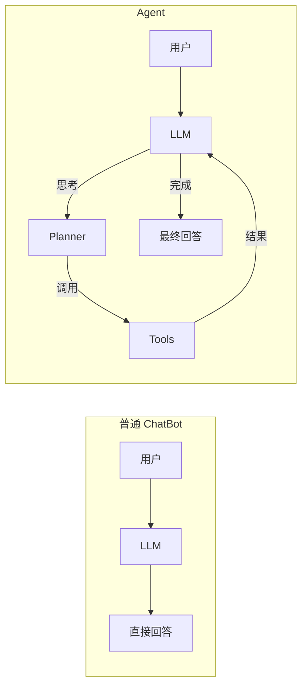
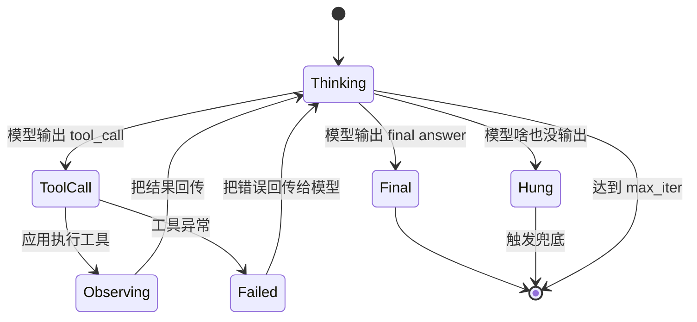
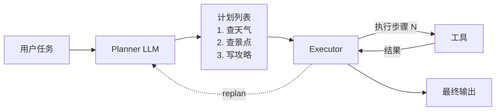
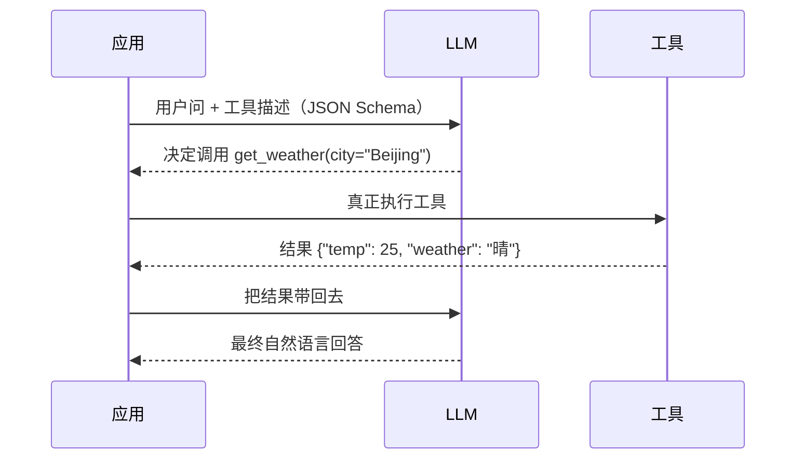
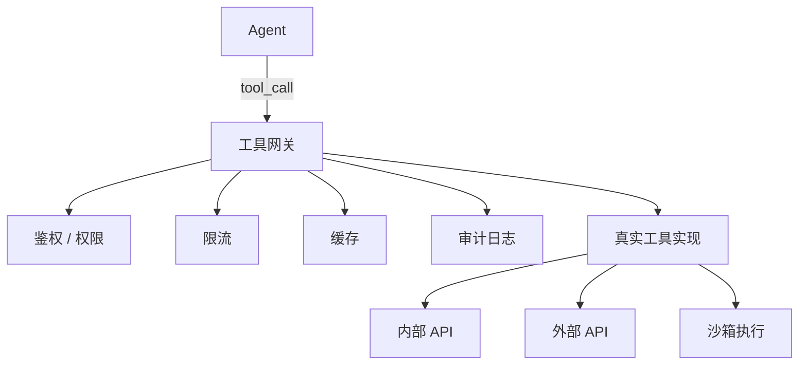

# 第 06 篇：Agent 上篇

> 一句话导读：这篇要讲透——Agent 到底比 ChatBot 多了什么；Function Calling 是怎么"教会"模型选工具的；ReAct 循环背后的真实状态机；为什么 Agent 容易上下文爆炸、容易死循环；HITL 不是"加个审批按钮"那么简单；以及沙箱面对的真实威胁模型。读完你能搭一个能"想 + 做"的单 Agent 系统，并且**理解每个工程决策背后的根因**。

**前置阅读**：[第 02 篇：Prompt 工程](./02-prompt-engineering.md)（特别是 ReAct 那一节）、[第 04 篇：RAG 上篇](./04-rag-part1-fundamentals.md)

**适合读者**：用 ChatCompletion 跑过流程、想升级到"能调工具的 AI"的工程师；做客服 / 助手类产品需要让模型"真正解决问题"的同学；线上 Agent 不稳定不知道从哪查的人。

**篇幅说明**：约 1.3 万字，含原理拆解 + 真实威胁模型分析。

---

## 一、Agent 到底是个啥

### 1.1 一句话定义和四个能力

很多人一听 Agent 就想到"一堆 AI 互相讨论"，其实最朴素的 Agent 就一句话：

> **能感知环境、能调用工具、能循环执行直到任务完成的 LLM 应用。**

四个核心能力：

| 能力 | 说人话 | 对应技术 |
|---|---|---|
| Planning（规划） | 先想再做，把大任务拆小 | CoT、Plan-and-Solve |
| Memory（记忆） | 记住前面发生过什么 | 短期 / 长期记忆 |
| Tool Use（工具使用） | 不只是聊天，能调外部能力 | Function Calling、MCP |
| Reflection（反思） | 干完了能审视、能改 | Reflexion、Self-Refine |

### 1.2 ChatBot vs Agent 的根本差别



**图 1：ChatBot 与 Agent 的差别**

ChatBot 的世界是**"一问一答"**——模型只能基于训练时见过的知识 + 当前 prompt 给出答案。
Agent 的世界是**"循环式"**——模型可以输出"我要做 X"的意图，应用代码真的去做 X，把结果再喂回模型，模型再决定下一步。

这个"循环"带来的能力跃迁巨大：

- **可以处理实时信息**——查最新天气、最新股价，不再受训练截止日期限制
- **可以处理私域信息**——查公司数据库、读用户文件
- **可以执行写动作**——发邮件、下订单、调 API
- **可以处理多步任务**——边走边看，不用一次想完所有步骤

但同时引入新麻烦：

- **状态爆炸**——每一步的结果都要喂回上下文，几步之后 context 撑爆
- **不确定性放大**——每一步模型决策都有概率犯错，多步之后错误累积
- **成本飙升**——一次任务调几次到几十次 LLM
- **延迟高**——每步串行走一次 LLM 推理

理解这些权衡，是后面所有工程决策的出发点。

---

## 二、Agent 范式：ReAct vs Plan-and-Execute

主流单 Agent 有两种基本范式，工程实现最常见。

### 2.1 ReAct：一个真实的状态机

每一步：先思考（Thought）→ 决定动作（Action）→ 观察结果（Observation）→ 继续思考……直到 Final Answer。

```
Thought: 用户问北京天气适不适合户外，我得查天气
Action: get_weather(city="Beijing")
Observation: 晴, 25°C
Thought: 天气挺好，可以推荐户外
Final Answer: 北京今天 25°C 晴天，适合户外活动。
```

#### 2.1.1 ReAct 的真实状态机

第 02 篇我们说过 ReAct 是"思考-行动-观察"循环，这里把它的状态机画清楚：



**图 2：ReAct 状态机**

每条状态转移都有工程考量：

- `Thinking → ToolCall`：模型决定调工具。这一步可能选错工具或参数错——参数校验失败要兜底
- `Observing → Thinking`：工具结果回传。结果太大要截断；结果含敏感信息要脱敏
- `ToolCall → Failed`：工具自己挂了。是把异常如实告诉模型让它换思路，还是重试？这是策略问题
- `Thinking → [*]（达到 max_iter）`：硬上限触发，必须有兜底回复

**没有这个状态机意识的实现会犯几类错**：

- 工具异常直接 throw，整个 Agent 崩溃，用户看到 500
- 没设 max_iter，模型死循环刷爆账单
- 工具结果太大直接喂回，几步后 context 爆

#### 2.1.2 ReAct 的特点

- **灵活**——每步都重新规划，环境有变化能立刻调整
- **适合步骤数不确定**——不知道要几步才能搞定的任务
- **容易陷入循环**——"想了一圈又转回来"，必须靠 max_iter 拦
- **token 贵**——每步都把整个历史送一次模型

### 2.2 Plan-and-Execute：先想完再做

先让 LLM **一次性出完整计划**，再按计划逐步执行（每步可以是简单工具，也可以是子 Agent）。



**图 3：Plan-and-Execute 流程**

#### 2.2.1 它如何减少 token

- **ReAct**：每一步都把"系统 prompt + 全部历史 + 工具描述"送一遍模型，N 步就是 N 次大上下文
- **Plan-and-Execute**：Planner 调 1 次（出计划）+ Executor 每步只送当前步骤需要的信息

举例：5 步的任务，ReAct 大概 5 次 8K token = 40K，Plan-and-Execute 可能只用 15K。token 节省一半以上。

#### 2.2.2 它的脆弱点：replan

Plan-and-Execute 的核心风险是**计划做错了，后面一直错下去**。比如计划第 2 步本应"查 A 部门的销售"，但 LLM 没想到 A 部门没销售数据，第 2 步必然失败，剩下 3 步都建立在错误前提上。

工程上必须加 **replan 机制**：

- 每步执行后让 Planner 看一眼结果，决定"按原计划继续 / 修改计划 / 重新规划"
- 这又把 token 优势打了折扣
- LangGraph 的 Plan-and-Execute 模板就内置了这个回路

### 2.3 两种范式的对比

**表 1：ReAct vs Plan-and-Execute**

| 维度 | ReAct | Plan-and-Execute | 如何选 |
|---|---|---|---|
| 灵活性 | 高 | 中 | 任务多变选 ReAct |
| 成本 | 高（每步都问 LLM） | 低（不带 replan）/ 中 | 预算紧选 Plan |
| 可干预 | 难 | 易（可让用户审批计划） | 高风险任务选 Plan |
| 错误恢复 | 自然适配 | 需要 replan 机制 | 不稳定环境选 ReAct |
| 适用场景 | 探索式、对话式 | 流程化、确定性任务 | - |

实际项目里**两者结合**最常见：先 Plan 出大框架，每个子步骤内部用 ReAct（或简单工具调用）。LangGraph 的 supervisor + worker 就是这种思路。

---

## 三、Function Calling：模型怎么"学会"调工具的

### 3.1 标准流程



**图 4：Function Calling 一次完整调用**

> 重点：**LLM 不会真正调用函数**，它只是"输出一个'我想调 X(args)'的结构化结果"，**真正执行是你的应用代码**。这是初学者最大的误区。

### 3.2 模型是怎么"会"调工具的

很多人没想过这个问题：明明工具是开发者临时定义的，模型为什么知道怎么填参数？

#### 3.2.1 训练阶段：教模型识别"工具调用 token"

OpenAI / Anthropic / 开源 Qwen 这些支持原生 Function Calling 的模型，在 SFT（监督微调）阶段都加了**工具调用专用训练数据**。这些数据长这样：

```
<system>你是助手，可以调用工具：get_weather(...)</system>
<user>北京天气怎样？</user>
<assistant>
  <tool_call>{"name": "get_weather", "arguments": {"city": "Beijing"}}</tool_call>
</assistant>
<tool>{"temp": 25, "weather": "晴"}</tool>
<assistant>北京今天 25°C 晴天。</assistant>
```

训练目标：让模型**根据工具描述自动决定**——什么时候输出 `<tool_call>`、参数怎么填、什么时候输出最终回答。

每家厂商有自己的特殊 token 标记工具调用。OpenAI 在协议层抽象成 `tool_calls` 字段，Qwen 用 `<tool_call>` 包裹，Llama 3.1 用特殊的 `<|python_tag|>` 等。这些 token 在 tokenizer 词表里就**保留了专门的位置**。

#### 3.2.2 推理阶段：约束解码保证格式

光训练还不够——模型偶尔还是会输出格式错乱的工具调用（漏引号、参数名拼错）。所以推理时常配合**约束解码（Constrained Decoding）**：

- 检测到模型开始输出工具调用的起始 token
- 把后续解码限制在"符合 JSON Schema 的 token"上
- 强制保证 `{`、`"`、参数名、值类型都合法

OpenAI 的 `strict: true` 模式、Anthropic 的 tool_use、vLLM 的 `guided_json` 都是这个机制。这就是为什么原生 Function Calling 比 Prompt 模拟的"伪 FC"稳定得多——后者全靠模型自觉。

#### 3.2.3 这意味着什么（工程含义）

- **工具描述写得越像训练分布越准**：训练数据里 description 都是简洁的英文短句，你写半页中文长文反而让模型懵
- **不同模型对工具描述的感知不同**：GPT-4 系列对中文 description 友好，部分开源模型只对英文敏感
- **新工具不用重训**：只要描述清晰，模型就能"举一反三"——这是 in-context learning 的延伸
- **工具数量越多越难选**：训练时见过的工具数量有限，工具列表给到几十个时选错率开始上升

### 3.3 工具描述（JSON Schema）

```python
# OpenAI / 大多数厂商通用的工具描述格式
tools = [
    {
        "type": "function",
        "function": {
            "name": "get_weather",
            "description": "查询指定城市的当前天气。注意：只支持中国主要城市。",
            "parameters": {
                "type": "object",
                "properties": {
                    "city": {
                        "type": "string",
                        "description": "城市名，如 'Beijing'、'Shanghai'",
                    },
                    "unit": {
                        "type": "string",
                        "enum": ["celsius", "fahrenheit"],
                        "description": "温度单位，默认 celsius",
                    },
                },
                "required": ["city"],
            },
        },
    }
]
```

**写好工具描述的几个要点**：

- `description` 写"**什么时候用 / 不该什么时候用**"，决定模型选不选它
- 参数枚举尽量给完，减少幻觉
- 复杂结构尽量扁平化（嵌套深模型容易填错）
- **工具名要有强语义**——`get_user_orders` 比 `query1` 强 10 倍

### 3.4 高级用法

| 特性 | 说明 |
|---|---|
| 并行调用（Parallel） | 一次返回多个工具调用，应用层并行执行 |
| 强制调用（tool_choice） | 强制 / 禁止某个工具，控制成本和路径 |
| 流式工具调用 | 工具参数也能流式返回（实现复杂） |
| 工具结果回传 | 必须按 `role=tool` + `tool_call_id` 回传 |
| Strict mode | 强制 schema 校验，避免模型乱填字段 |

### 3.5 工具调用错误处理

工具调用最常见的错（按踩坑频次）：

1. **参数填错**（类型 / 必填 / 取值范围）
2. **工具本身报错**（网络 / 超时 / 业务异常）
3. **工具返回数据格式不符合预期**（JSON 损坏）
4. **工具结果太大**（几 MB 的 JSON 塞进上下文）
5. **工具被滥用**（应该调一次的调了 N 次）

每条都得在应用层处理，不能甩给模型。

#### 3.5.1 把错误"喂回"模型的姿势

不要直接把堆栈信息丢给模型，那只会污染上下文。最佳实践是**结构化错误信息**：

```json
{
  "error": "tool_failed",
  "code": "ORDER_NOT_FOUND",
  "message": "未找到订单 ID 12345",
  "hint": "请确认订单号是否正确，或调用 list_orders 查看可用订单"
}
```

`hint` 字段告诉模型**下一步应该怎么办**——这能显著降低错误后的死循环概率。

---

## 四、Agent 上下文爆炸：被低估的核心问题

这一节单独拎出来讲——**这是单 Agent 系统最常见的隐性 Bug**。

### 4.1 为什么 Agent 容易上下文爆炸

ReAct 循环里每一步都要把**完整历史**喂回模型，包括：

- 系统 prompt（几百~几千 token）
- 工具描述列表（10 个工具大概 2K~5K token）
- 用户原始问题
- 第 1 步 Thought + Action + Observation
- 第 2 步 Thought + Action + Observation
- ...
- 第 N 步

`Observation` 是大头——工具返回 JSON 经常几 KB 到几十 KB。比如：

- 查数据库返回 100 条记录
- 读文件返回整篇文档
- 调网页搜索返回 10 个结果各几百字

5 步循环下来，上下文从 5K 涨到 50K，再几步就 100K+。这个增长是**雪球式的**，因为后续每步还要把前面的所有 Observation 都带上。

### 4.2 三种压制策略

**策略 1：工具结果裁剪**

最有效。在工具网关层强制：
- 列表类返回：`limit` 默认 10，超出截断 + 提示 "还有 N 条，请用 X 工具查看"
- 文本类返回：超过 N 字截断 + 提示
- JSON 类返回：只保留关键字段，去掉 metadata

**策略 2：滚动摘要**

每 K 步把更早的历史压缩成摘要：

```
[摘要] 第 1-3 步：用户问北京天气，调 get_weather 拿到 25°C 晴；调 get_air_quality 拿到 AQI 80；用户追问适不适合跑步，模型答适合。
第 4 步 Thought: ...
第 4 步 Action: ...
第 4 步 Observation: ...
```

代价：摘要本身要调一次 LLM；摘要可能丢关键细节。

**策略 3：外部存储 + 引用**

工具返回数据存到外部 KV（Redis / 对象存储），上下文里只放引用：

```
Observation: 查询返回 1542 条记录，已存储为 result_id=abc123。可用 read_result(id, offset, limit) 查看具体内容。
```

模型需要细节时再调 read_result。这能把"百 MB 数据"控制在"百字符引用"。

> 工程提醒：监控每个 Agent 任务的 max_context_used，超过阈值要告警——这往往是工具结果没裁剪的信号。

---

## 五、工具调用的工程化

POC 阶段一行 `tools=[...]` 就行，但生产环境完全是另一回事。

### 5.1 工具网关：把工具当 API 治理



**图 5：工具网关的标准架构**

工具网关至少要做：

| 能力 | 必要性 | 说明 |
|---|---|---|
| 工具注册 / 发现 | 必备 | 中心化管理，避免 Prompt 里硬编码 |
| 鉴权与权限 | 必备 | 不同 Agent / 用户能用的工具不同 |
| 限流 | 必备 | 防止模型死循环刷爆下游 |
| 熔断 | 必备 | 下游挂了快速失败 |
| 降级 | 推荐 | 主工具不可用时返回兜底 |
| 缓存 | 推荐 | 同样参数缓存结果 |
| 审计 | 必备 | 谁、什么时候、调了什么、结果是啥 |
| 幂等 | 推荐 | 写类工具特别重要 |
| 版本管理 | 推荐 | 工具升级灰度 |
| 结果裁剪 | 必备 | 防上下文爆炸 |

### 5.2 沙箱与 Code Interpreter

让模型执行任意代码（Code Interpreter）是利器，但**直接 exec()** 等于把服务器交出去。

#### 5.2.1 真实威胁是什么

很多人理解的"沙箱"只防"模型胡乱写 `rm -rf`"。实际威胁面要大得多：

- **数据泄漏**：模型执行 `cat /etc/passwd`、读 `~/.aws/credentials`、读环境变量
- **横向移动**：模型用沙箱内的网络访问内网 API、其他容器、数据库
- **资源耗尽**：fork 炸弹、死循环、申请超大内存——**单个任务把宿主机搞崩**
- **持久化攻击**：模型在 cron / systemd 里写定时任务，沙箱重启后还能再次激活
- **算力盗用**：用沙箱挖矿
- **指令注入扩散**：用户 RAG 文档里隐藏恶意指令，模型读到后在沙箱里执行

#### 5.2.2 沙箱方案对比

| 沙箱方案 | 隔离级别 | 备注 |
|---|---|---|
| Python `exec()` | 几乎无 | 千万别在生产用 |
| RestrictedPython | 弱 | 限制 builtins，仍易绕过（动态特性多） |
| Docker 容器 | 强 | 主流方案，每次任务起容器 |
| MicroVM（gVisor / Firecracker） | 极强 | 云厂商生产级方案 |
| WASM | 强 | 启动快、跨语言 |
| 远程隔离环境（E2B、Modal Sandbox） | 强 | 商业方案，省心 |

#### 5.2.3 沙箱必备的多层防御

光有容器不够，还要：

- **网络出口控制**：默认无网；要联网就只白名单几个域名（如 PyPI 镜像）
- **文件系统隔离**：只读宿主机，可写区域限制在 tmpfs；任务完结销毁
- **资源 quota**：CPU 限 1 核、内存限 512MB、执行时长限 60 秒
- **能力 drop**：去掉 CAP_SYS_ADMIN 等危险能力
- **seccomp / AppArmor**：限制系统调用
- **每任务一容器**：用完即销毁，不复用
- **执行日志全审计**：每个 stdin/stdout/stderr/文件读写都记录

> 重点：**任何允许模型执行任意代码的产品都必须有强沙箱**，并设置严格的网络出口、文件系统、CPU/内存限制。

### 5.3 Computer Use / Browser Use

让 Agent 操作浏览器（Browser Use）甚至整个桌面（Computer Use，Anthropic 2024）：

- **Browser Use**：Playwright / Puppeteer + 视觉模型，能填表单、点按钮
- **Computer Use**：截图给 VLM 模型，模型输出"在 (x, y) 点击"等动作

风险：

- 误操作（删错文件、转错账）
- 安全（钓鱼网站可能注入指令——这是新型 prompt injection）
- 准确率（VLM 判断 UI 还不够稳）

> 重点：高风险动作（付款、删除）**必须 Human-in-the-Loop**。

### 5.4 Human-in-the-Loop（HITL）：不只是加个审批按钮

#### 5.4.1 HITL 的三个层级

很多团队的 HITL 就是"重要操作弹个确认框"，太粗糙。完整 HITL 应该分三级：

**L1 - 通知型**：操作正常进行，结果通知人，人事后能撤销
- 适合：低风险写操作（发草稿邮件、创建 issue）
- 实现：操作完后推送通知，给"撤销"按钮

**L2 - 审批型**：操作前必须人工点头才能进行
- 适合：中风险写操作（发正式邮件、修改用户数据）
- 实现：操作前阻塞，完整展示参数 + 影响范围，人工 approve / reject

**L3 - 协作型**：人深度参与，模型只是"建议者"
- 适合：极高风险（财务、法务、医疗诊断）
- 实现：模型给方案，人改后才执行

#### 5.4.2 HITL 设计要点

```python
# 概念示例：危险操作前 HITL
def execute_action(action):
    if action.is_dangerous():           # 删除、付款、对外发邮件等
        approval = ask_human(action)
        if not approval:
            return "用户拒绝"
    return tool.run(action)
```

设计要点：

- **白名单制**：默认所有"写动作"都需要审批，逐步开白名单
- **完整上下文**：审批界面要展示——为什么调（给出 thought）、参数预览、潜在影响（"将向 N 个用户发送")、历史相似操作的成功率
- **审批超时策略**：默认拒绝（保守）/ 升级（紧急）
- **审批疲劳防御**：同类操作短时间多次审批用户会麻木点同意，这时要做"批量审批"或"信任建立期后降级"
- **审计**：每次审批留痕，包括拒绝原因，反哺模型优化

---

## 六、Agent 状态管理与终止条件

### 6.1 状态持久化

Agent 任务可能跨多次请求（甚至几小时），状态必须持久化：

- 当前步骤、历史 thoughts / actions / observations
- 长期记忆（详见 [第 03 篇](./03-context-and-memory.md)）
- 工具调用结果缓存

实现方式：Redis（短期）+ 数据库（长期）+ 事件溯源（可回放）。

LangGraph 的 Checkpointer 就是这个思路——每个状态节点结束都 checkpoint，断电重启能从 checkpoint 续跑，调试时也能"回到任意一步"。

### 6.2 终止条件

最容易踩的坑就是 **Agent 不停**。常见终止机制：

| 机制 | 说明 | 推荐值 |
|---|---|---|
| max_iterations | 硬上限，比如最多 10 步 | 5~15 |
| max_tokens / max_cost | 算钱的上限 | 单任务 < $1 |
| 任务完成判定 | 模型输出明确结束信号 | - |
| 工具调用模式 | N 步内没有新工具调用就停 | - |
| 重复检测 | 检测到重复调用同样工具同样参数就停 | 3 次 |
| 超时 | 时间上限 | 5 min |
| 兜底返回 | 触发上限时给用户兜底回复，而非报错 | - |

#### 6.2.1 重复检测的小技巧

模型死循环最常见的形式是"反复调同一个工具、参数都一样"——这通常说明模型已经进入了一个"我以为这次结果会变"的错误信念。

工程上简单暴力的检测：维护"最近 5 步的 (tool_name, args_hash) 列表"，如果出现 2 个完全相同的就强制中断，给模型一个明确反馈："你已经调过 X(...) 两次，结果都是 Y，请换个思路或返回最终答案"。

> 注意：**所有上限都要设置**，且应用层强制（不能只靠 Prompt 说"最多 5 步"）。模型对自己步数的感知很差。

---

## 七、典型 Agent 框架横向对比

**表 2：常见单 Agent / 编排框架**

| 框架 | 主语言 | 范式 | 特色 | 适用 |
|---|---|---|---|---|
| LangChain Agent | Python / JS | ReAct / Tools | 生态最大 | 通用 |
| LangGraph | Python | 状态机 | 显式图编排、可视化、checkpoint | 复杂流程 |
| LlamaIndex Agent | Python | ReAct | 与 RAG 深度集成 | 知识助手 |
| Semantic Kernel | C# / Python | Plugin + Planner | 微软栈 | 企业 .NET |
| AutoGen（单 Agent） | Python | 函数式 | 简洁 | 快速原型 |
| OpenAI Assistants API | API | 闭源托管 | 省心 | 不想自部署 |
| AutoGPT / BabyAGI | Python | 自主 Agent | 历史项目，研究为主 | 学习 |
| 各厂商官方 SDK + 自研 | 任意 | 自定义 | 自由度最高 | 强定制 |

> 提示：**LangGraph 是 2024 年以来比较推荐的工程化方案**，它把 Agent 显式建模成状态图，比朴素 ReAct 可控、比 Plan-and-Execute 灵活。

---

## 八、踩坑提醒

### 坑 1：Agent 死循环把账单刷爆

- **现象**：某次跑测试时 Agent 卡住，半小时后发现 OpenAI 账单多了几百刀。
- **原因**：模型反复调同一个工具但拿不到想要结果，又没有迭代上限；max_iterations 默认是 LangChain 的 15，但每步都几千 token；重复检测没做。底层是模型对"这次结果会变"的错误信念无法自我打破。
- **规避方法**：所有 Agent 必须设 **max_iterations**（比如 10）+ **max_token / max_cost** 双上限；同步在工具网关层做调用频次限制；上重复检测——同样 (tool, args) 出现第 2 次就强制反馈给模型；监控 Token 用量，超阈值告警。

### 坑 2：工具描述写得不清，模型乱调

- **现象**：明明用户问的是"查订单"，Agent 调了"创建订单"工具，制造了脏数据。
- **原因**：工具 description 不够明确，名字相似的工具（get_order / create_order）描述区分度不够；模型在训练时学的"工具选择"靠 description 中的语义信号，信号弱时随机性放大。
- **规避方法**：description 必写"什么时候**应该**用 / 什么时候**不应该**用"；写工具单元测试（同一组用户问句应该路由到哪个工具）；高风险工具加二次确认（参数预览 + HITL）；工具数量超过 20 个时考虑分组 / 路由（先选工具组再选具体工具）。

### 坑 3：工具返回的数据太大撑爆上下文

- **现象**：Agent 调了一次"查全表数据"工具，返回 50MB JSON，模型直接报上下文超限。
- **原因**：工具没做结果裁剪，把数据库 / API 原始结果直接塞回；雪球效应——下一步还要把这 50MB 再喂回。
- **规避方法**：工具层做结果摘要 / 分页（`limit`、`fields`、`summary`）；网关层强制截断结果（保留前 N 条 + 总数）；让模型显式分页（"先查列表，再查详情"）；超大结果走外部存储 + 引用 ID。

### 坑 4：让 Agent 操作真实环境却没沙箱

- **现象**：Code Interpreter 用 `exec()` 在主进程里跑，某次模型生成了 `rm -rf /`，幸亏权限不够。
- **原因**：图省事，没上隔离；没意识到威胁面包括"数据泄漏 / 横向移动 / 算力盗用"等多种。
- **规避方法**：任何代码执行都进沙箱（Docker / MicroVM / E2B 等托管）；沙箱无网络出口或仅白名单出口；CPU/内存/时长硬限制；操作日志全审计；每任务一容器用完销毁。

### 坑 5：忽略 Tool Calling 的 schema 严格度

- **现象**：模型偶尔输出 `{"city": "北京"}` 偶尔输出 `{"city_name": "北京"}`，应用反序列化报错。
- **原因**：纯 Prompt 风格的"伪 Function Calling"没用模型原生能力，schema 没法严格约束；约束解码没启用。
- **规避方法**：用模型原生 Function Calling / Tool Calling 接口（OpenAI、Anthropic、Qwen 等都支持）；启用 strict mode；保留兼容性兜底（解析失败时调降级 prompt）；Schema 用 Pydantic 校验，失败重试一次。

### 坑 6：工具异常被原样塞回，污染上下文

- **现象**：Agent 出错后越走越偏，看 trace 发现某一步的 Observation 是几 KB 的 Python stack trace。
- **原因**：工具 throw 异常时直接 `str(e)` 塞回——堆栈包含路径、内部变量名等无关信息，把后续模型决策带偏。
- **规避方法**：工具网关统一异常处理——只把 `error_code + 用户友好的 message + 下一步 hint` 喂回模型；详细堆栈记到日志即可；定义错误码表，让模型见过几次就知道怎么应对。

---

## 九、选型建议与实践要点

新搭一个 Agent 系统：

1. **先看是不是真需要 Agent**：很多场景一个 RAG + 结构化输出就够了，不要为 Agent 而 Agent
2. **从单 Agent 开始**：能用单 Agent 解决的不要上多 Agent（[第 07 篇](./07-agent-part2-multi-agent.md)）
3. **范式选 LangGraph 状态机**：可控性 / 可调试性优于纯 ReAct
4. **工具网关从第一天就建**：哪怕只有 3 个工具
5. **HITL 默认开启**：所有写类操作先进灰度审批
6. **可观测要全**：Trace 每次 Agent 步骤（详见 [第 11 篇](./11-evaluation-and-observability.md)）

> 参考数据：复杂 Agent 任务一次会话经常 5~20 次 LLM 调用、几万到十几万 token，**单次成本是普通 Chat 的几十倍**，预算要算清楚。

---

## 十、一段示例代码：最小可用 ReAct Agent

```python
# 用 OpenAI 原生 Function Calling 实现一个最小 ReAct Agent
# 演示：天气工具 + 计算器工具
from openai import OpenAI
import json

client = OpenAI()

# 工具实现（真实业务里会接入网关）
def get_weather(city: str) -> dict:
    # 这里写真实 API 调用，简化为 mock
    return {"city": city, "temp": 25, "weather": "晴"}

def calculator(expr: str) -> float:
    # 注意：生产环境绝不要直接 eval；这里仅演示
    return eval(expr)  # 仅 demo

TOOL_IMPLS = {"get_weather": get_weather, "calculator": calculator}

tools = [
    {"type": "function", "function": {
        "name": "get_weather",
        "description": "查指定城市当前天气",
        "parameters": {"type": "object", "properties": {
            "city": {"type": "string"}}, "required": ["city"]}}},
    {"type": "function", "function": {
        "name": "calculator",
        "description": "执行四则运算",
        "parameters": {"type": "object", "properties": {
            "expr": {"type": "string"}}, "required": ["expr"]}}},
]

def run_agent(user_input: str, max_iter: int = 5):
    messages = [
        {"role": "system", "content": "你是助手。需要时调用工具。"},
        {"role": "user", "content": user_input},
    ]
    # 重复检测：记录已调用的 (tool, args_hash)
    seen_calls = []
    for it in range(max_iter):
        resp = client.chat.completions.create(
            model="gpt-4o-mini", messages=messages, tools=tools)
        msg = resp.choices[0].message
        messages.append(msg)
        # 如果模型不再调工具，就是 final answer
        if not msg.tool_calls:
            return msg.content
        # 执行每个工具调用并把结果回传
        for tc in msg.tool_calls:
            call_sig = (tc.function.name, tc.function.arguments)
            if seen_calls.count(call_sig) >= 2:
                # 重复检测：相同调用第 3 次出现，强制反馈
                content = json.dumps({
                    "error": "duplicate_call",
                    "hint": "你已多次调用同一工具且参数相同，请换个思路或直接给出最终答案",
                })
            else:
                try:
                    args = json.loads(tc.function.arguments)
                    result = TOOL_IMPLS[tc.function.name](**args)
                    content = json.dumps(result, ensure_ascii=False)
                except Exception as e:
                    # 错误结构化喂回
                    content = json.dumps({
                        "error": "tool_failed",
                        "message": str(e)[:200],
                        "hint": "请检查参数或换个工具",
                    })
            seen_calls.append(call_sig)
            messages.append({
                "role": "tool",
                "tool_call_id": tc.id,
                "content": content,
            })
    # 兜底：达到 max_iter
    return "已达到最大迭代次数，未能完成任务，请简化问题或联系人工"

print(run_agent("北京今天适合户外吗？另外帮我算一下 23 * 17"))
```

这个示例比基础版多了：**重复检测、错误结构化喂回、兜底回复**——三个生产环境必备特性。

---

## 十一、延伸阅读

- 系列内：
  - [第 07 篇：Agent 下篇 / 多智能体与 MCP](./07-agent-part2-multi-agent.md)
  - [第 03 篇：上下文与记忆](./03-context-and-memory.md)（Agent 记忆）
  - [第 11 篇：评测与可观测](./11-evaluation-and-observability.md)（Agent Trace）
  - [第 12 篇：安全与合规](./12-safety-and-compliance.md)（沙箱与 HITL 安全细节）
- 外部参考（注明发表时间）：
  - 论文《ReAct: Synergizing Reasoning and Acting》（Yao et al., 2022）
  - 论文《Plan-and-Solve Prompting》（Wang et al., 2023）
  - 论文《Reflexion: Language Agents with Verbal Reinforcement Learning》（Shinn et al., 2023）
  - LangGraph 官方文档（最后访问 2025）
  - Anthropic《Building effective agents》博客（2024.12）
  - OpenAI Function Calling Guide（最后访问 2025）

---

## 附：本篇覆盖的知识点清单

来自原清单第 4.1 / 4.2 / 4.3 / 4.5 节，每条扩展了原理：

- [x] Agent 定义 / 组成 / Single Agent / Agent Loop
- [x] Planning / Memory / Tool Use / Reflection
- [x] ReAct 真实状态机（含错误处理路径）
- [x] Plan-and-Execute / replan 机制
- [x] AutoGPT / BabyAGI / Reflexion 概念
- [x] Function Calling 训练机制（SFT 数据形态、特殊 token、约束解码）
- [x] OpenAI Function Calling / Tool Calling 规范 / JSON Schema / 参数校验
- [x] 并行 / 强制 函数调用 / 结果回传 / 工具选择策略 / 错误结构化处理
- [x] Agent 上下文爆炸的三种压制策略（裁剪 / 摘要 / 外部引用）
- [x] 工具注册与发现 / 工具网关 / 权限 / 熔断 / 限流 / 降级 / 幂等 / 审计 / 版本管理 / 结果裁剪
- [x] 工具沙箱（Code Interpreter）的真实威胁模型 / 多层防御 / Computer Use / Browser Use
- [x] Human-in-the-Loop 三个层级 / 审批疲劳防御
- [x] Agent 状态管理与持久化（含 Checkpointer）/ 循环控制 / 重复检测 / 终止条件
- [x] 任务编排与工作流（基础概念，多 Agent 见第 07 篇）
