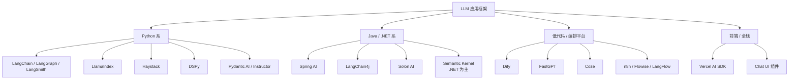
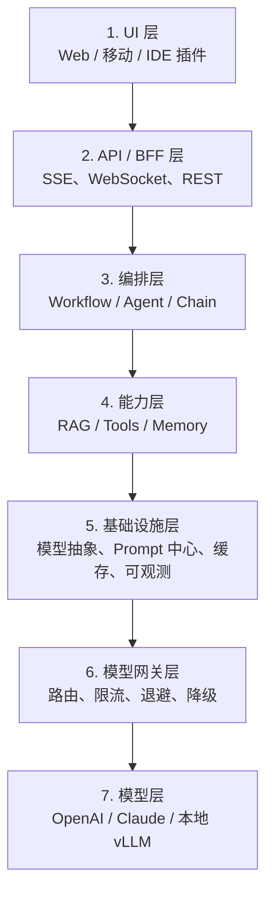
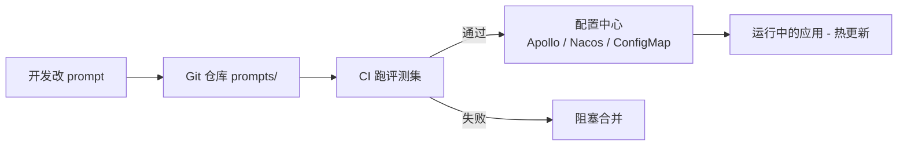
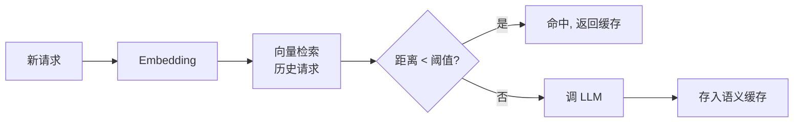
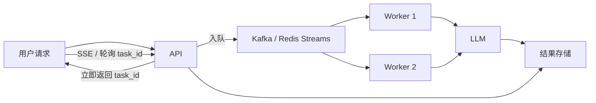
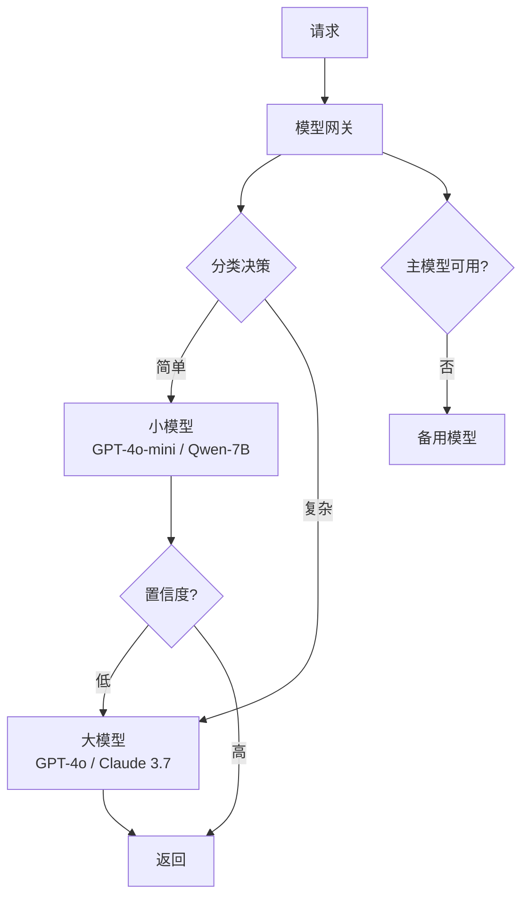
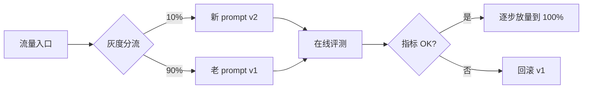
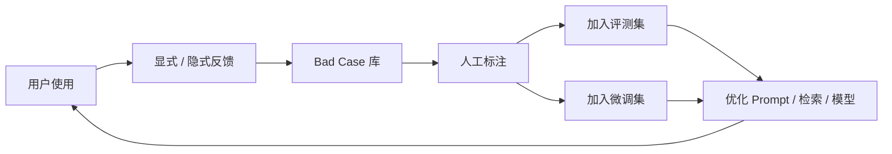
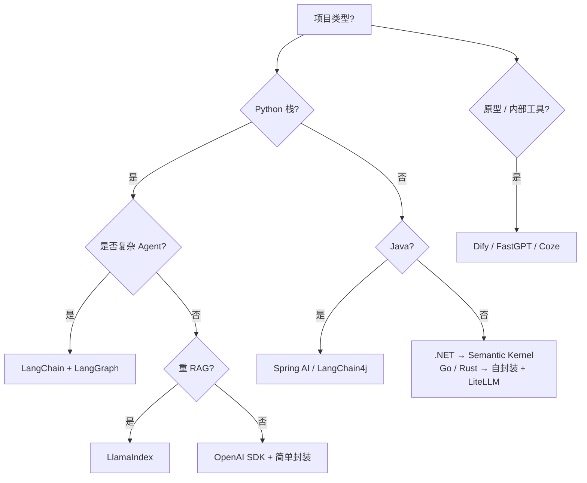

# 第 08 篇：应用框架与工程化

> 一句话导读：这篇要讲透——为什么 LangChain LCEL 用"管道"做核心抽象；流式输出的协议（SSE）和工程坑（Nginx buffering、tool call 流式拼接）；为什么 AI 网关不是"加个反向代理"，而是把"模型路由 + 缓存 + 限流退避 + 审计"打包；Prompt 中心从代码硬编码到 GitOps 的演化路径；以及生产里 LLM 应用分层的真实模板。读完你能横向看明白 LangChain / Spring AI / Dify 各自的设计哲学，并知道自家项目从哪一层开始建。

**前置阅读**：[第 02 篇：Prompt 工程](./02-prompt-engineering.md)、[第 06 篇：Agent 上篇](./06-agent-part1-foundations.md)

**适合读者**：要决定项目用什么框架的 Tech Lead；要把"散落的 Prompt"治理起来的同学；做 AI 中台 / 网关的工程师。

**篇幅说明**：约 1.2 万字，含原理拆解 + 真实落地模板。

---

## 一、为什么需要框架

### 1.1 不用框架的项目长什么样

最早一批 LLM 应用都是"裸调 OpenAI SDK"：

```python
from openai import OpenAI
client = OpenAI()
resp = client.chat.completions.create(
    model="gpt-4o",
    messages=[{"role": "system", "content": "..."}, {"role": "user", "content": q}],
)
return resp.choices[0].message.content
```

简单直接，POC 阶段最快。但项目稍微变大就会发现下面这些"基础能力"反复在写：

- 切换模型时——OpenAI / Claude / Qwen / 本地 vLLM 接口不一样
- 流式输出——SSE 解析、断线重连、tool call 流式拼接
- 重试、限流、退避策略
- 工具调用 schema 校验、错误回填
- Prompt 模板渲染、变量注入
- 缓存（精确 + 语义）
- 链路追踪（一个用户问题可能跨 5 个 LLM 调用）
- 多轮对话状态管理

**写一遍不难，写五遍崩溃**。这就是框架的价值。

### 1.2 抽象的代价

但框架不是免费的，引入 LangChain 这种重型抽象，代价是：

- **学习曲线陡**——LCEL、Runnable、Callbacks 等概念要先理解
- **调试困难**——一个 chain 内部跑了多少 LLM 调用、prompt 长什么样，要打开 trace 才能看清
- **版本变动**——LangChain 0.x 阶段 API 大改过几次，升级是体力活
- **性能损耗**——多层抽象带来轻微 overhead（虽然相对 LLM 调用本身可忽略）
- **过度依赖**——业务代码深度绑定框架内部类，换框架=重写

**核心权衡**：项目越大、模块越多、变化越频繁，框架的收益越大；项目越简单、越聚焦，裸调 SDK 反而更清爽。

> 经验法则：**5 个以内核心 LLM 调用、3 个以内工具的项目，可以不引框架；超过这个规模就该上**。

---

## 二、主流应用框架横向看



**图 1：LLM 应用框架版图**

### 2.1 LangChain LCEL：管道哲学

LangChain 在 0.1 之后的核心抽象是 **LCEL（LangChain Expression Language）**——所有组件都实现 `Runnable` 接口，用 `|` 操作符串成管道：

```python
chain = prompt | model | output_parser
result = chain.invoke({"question": "什么是 RAG?"})
```

底层每个 `Runnable` 都同时支持：

- `invoke()`：同步单次调用
- `stream()`：流式输出
- `batch()`：批量
- `ainvoke()` / `astream()` / `abatch()`：异步对应版本

**这个设计的精髓在哪**：

- **统一接口**：你的链不管多复杂，对外都是同一组方法
- **流式自动传播**：管道里只要每个节点支持流式，整条链就是流式的
- **观测自动接入**：每个 Runnable 自动产生 trace 节点
- **自由组合**：管道可以并行（`RunnableParallel`）、分支（`RunnableBranch`）、有条件（`RunnableLambda`）

设计哲学类比：**LCEL 之于 LLM 应用，就像 Unix Pipe 之于命令行**——把每个能力做成可组合的小单元，靠组合而非继承表达复杂行为。

> 重点：**不要再用 LangChain 早期的 LLMChain / SequentialChain 等老式 API**，这些在新版本里逐步弃用。LCEL 是当前主流。

### 2.2 LlamaIndex：数据视角

LangChain 的核心抽象是"调用链"，LlamaIndex 的核心抽象是"数据索引"：

```python
# LlamaIndex 风格
documents = SimpleDirectoryReader("./data").load_data()
index = VectorStoreIndex.from_documents(documents)
query_engine = index.as_query_engine()
response = query_engine.query("...")
```

它把"加载数据 → 切片 → 嵌入 → 索引 → 查询"封装成一条直线。**专攻 RAG 场景**——比 LangChain 在 RAG 上更省心、更专业。

但 Agent / 工具调用 / 复杂编排不如 LangChain。所以现实里很多项目**两者结合**：LlamaIndex 做 RAG 索引层，LangChain / LangGraph 做编排层。

### 2.3 Spring AI / LangChain4j：Java 阵营

Spring AI 设计哲学是**对齐 Spring 生态**——把 LLM 当成一个普通的 Bean：

```java
@Service
public class ChatService {
    private final ChatClient chatClient;
    public ChatService(ChatClient.Builder builder) {
        this.chatClient = builder.build();
    }
    public String chat(String input) {
        return chatClient.prompt().user(input).call().content();
    }
}
```

依赖注入、配置文件、AOP、事务——Spring 生态里习以为常的东西全都能用。**对于 Java 大项目这是巨大优势**——不用为了接 LLM 引入第二套依赖管理体系。

LangChain4j 则是**复刻 LangChain Python 体验到 Java**，对 Python 团队迁移友好。

### 2.4 Dify / FastGPT / Coze：低代码

低代码平台把"编排"变成可视化拖拽，普通业务人员也能搭。它们的真实价值：

- **快速原型**——业务想验证一个想法，1 小时拖出来
- **内部工具**——客服话术生成、报告自动化等内部场景
- **培训演示**——给非技术同事讲清楚 LLM 应用长什么样

**但生产场景的限制**：

- 高并发不行（默认部署单实例 + SQLite/PG）
- 深度定制痛——平台没暴露的 hook 你就用不了
- 流量爆增时扩容复杂
- 工作流复杂到一定程度,可视化反而比代码难维护

> 经验：**低代码搭原型 + 代码做生产**是常见组合。原型 PMF 验证后用代码版本重写,扛得住流量。

### 2.5 通用框架对比

**表 1：通用 LLM 框架对比**

| 框架 | 主语言 | 核心抽象 | 强项 | 弱项 | 适合 |
|---|---|---|---|---|---|
| LangChain + LCEL | Python / JS | Runnable 管道 | 生态最大、模块最全 | API 抽象层多、版本变动大 | 通用项目首选 |
| LangGraph | Python / JS | 状态图 | Agent / 多 Agent 工程化 | 学习成本中等 | 复杂 Agent |
| LlamaIndex | Python | 数据索引 | RAG 专家 | Agent 弱 | 文档问答 |
| Haystack | Python | Pipeline | 企业搜索、稳 | 生态略小 | 大型企业搜索 |
| Semantic Kernel | C# / Python | Plugin + Planner | 微软栈、.NET 友好 | 中文资料少 | .NET 企业 |
| DSPy | Python | "编程 Prompt" | 自动优化 prompt | 上手陡 | 学术 / 优化派 |
| Spring AI | Java | ChatClient Bean | Spring 生态原生 | 较新生态在追 | Java 企业 |
| LangChain4j | Java | LangChain Java 版 | 与 Python 概念对齐 | API 部分对齐 | Java 项目 |

### 2.6 低代码 / 编排平台

**表 2：低代码平台对比**

| 平台 | 特色 | 部署 | 适用 |
|---|---|---|---|
| Dify | 国产、中文友好、RAG / Agent / 工作流齐全 | 自部署 / 云 | 企业内部应用 |
| FastGPT | 偏知识库 + 工作流 | 自部署 / 云 | 知识助手 |
| Coze（扣子） | 字节出品，模型 + 工作流 + 商城 | 云为主 | 个人 / 中小企业 |
| n8n | 通用自动化 + AI 节点 | 自部署 / 云 | 业务自动化 |
| Flowise / LangFlow | 可视化 LangChain | 自部署 | 快速原型 |

### 2.7 提示词管理与 SDK 选择

| 类型 | 代表 | 定位 |
|---|---|---|
| 厂商原生 SDK | openai、anthropic、google-genai、qwen-agent | 单家最稳 |
| 抽象 SDK | LiteLLM、One API | 多家统一接口 |
| 结构化输出 | Pydantic AI、Instructor、outlines | 类型安全 |
| Prompt Hub | LangSmith Hub、PromptLayer、Helicone | Prompt 版本管理 |
| 前端 | Vercel AI SDK、ai-chatbot 模板 | 流式 UI |

---

## 三、LLM 应用分层架构

不管用啥框架，一个稳健的 LLM 应用都该有清晰分层：



**图 2：LLM 应用 7 层分层架构**

### 3.1 模型抽象层：第一行抽象代码就该写

一句话：**业务代码永远不应该 `import openai`**。所有 LLM 调用走统一接口：

```python
# 概念示例：自家 LLM 抽象（实际项目里基于 LiteLLM / One API 也行）
from typing import Protocol, Iterator

class LLM(Protocol):
    def chat(self, messages: list, **kw) -> ChatResponse: ...
    def stream(self, messages: list, **kw) -> Iterator[Chunk]: ...
    def embed(self, texts: list[str]) -> list[list[float]]: ...

# 实现层
class OpenAILLM(LLM): ...
class ClaudeLLM(LLM): ...
class QwenLLM(LLM): ...
class MockLLM(LLM): ...  # 单测用

# 业务代码只依赖 Protocol
def summarize(llm: LLM, text: str) -> str:
    return llm.chat([{"role": "user", "content": f"总结: {text}"}]).content
```

收益：

- **切模型只改注入**——业务代码零改动
- **单测可注入 Mock**——不用真的调 API
- **便于网关化**——网关层做限流、降级、灰度都在抽象之下
- **多模型并存**——不同业务用不同模型，路由层决定

> 技术选型：自研抽象 vs 直接用 LiteLLM。**LiteLLM 已经覆盖 100+ 模型且接口稳定**，多数项目直接用 LiteLLM 即可，自研只有"需要深度定制路由策略"时才值得。

### 3.2 Prompt 管理层：从硬编码到 GitOps 的演化

Prompt 怎么管,是大多数项目反复踩坑的地方。三个阶段演化：

#### 阶段 1：代码硬编码

```python
# ❌ 各种地方散落字符串
def chat(q):
    sys = "你是客服助手, 礼貌专业..."
    return llm.chat([{"role": "system", "content": sys}, ...])
```

问题：业务说"开场白改一下"，开发要翻代码 → 改一行 → 发版。一改就是几小时甚至半天。

#### 阶段 2：模板文件化

```
prompts/
├─ customer/
│  ├─ greeting.v1.md
│  └─ refund.v2.md
└─ summarize/
   └─ daily_report.v3.md
```

```python
# 加载 + 变量注入
prompt = render_template("customer/greeting.v1.md", user_name=name, ...)
```

收益：
- 开发不再被业务方堵
- 改 prompt 走 git PR + code review
- 模板支持 {{变量}} 注入,业务逻辑和 prompt 内容分离

实现：Jinja2、Handlebars、内置 `string.Template` 都行；选 Jinja2 最稳。

#### 阶段 3：Prompt 中心 + GitOps



**图 3：Prompt 配置中心 GitOps 流程**

完整能力：

- **版本管理**：每次改是新版本，能查历史、能回滚
- **灰度发布**：新版按比例发流量
- **A/B 测试**：两版同时跑，看指标对比
- **CI 评测门禁**：改 prompt 必须先跑评测集，分数达标才允许合
- **权限管理**：核心 prompt 只能特定人改，业务方提需求审批
- **热更新**：应用不重启就能用新 prompt

实现选项：

| 选项 | 备注 |
|---|---|
| LangSmith Hub | 商业，与 LangChain 紧 |
| PromptLayer | 商业，多框架 |
| 自研（GitOps） | Prompt 存 Git，CI 跑评测，K8s ConfigMap 注入 |
| 配置中心扩展 | 已有 Apollo / Nacos / consul，加 prompt 命名空间 |

> 经验：**80% 项目用 GitOps + 配置中心扩展就够**，不用买商业 Prompt Hub。商业方案的核心增值是"评测集联动 + 可视化",这两点用 LangSmith / 自家工具都能做到。

### 3.3 工具抽象层：工具网关

详见 [第 06 篇](./06-agent-part1-foundations.md) 第五节"工具网关"。这里强调一点：**工具描述（JSON Schema）应该集中在工具注册中心，不要写在每个调用处**。所有 Agent 共享同一份工具元数据。

### 3.4 缓存层：精确 vs 语义 vs 前缀

LLM 调用慢且贵，缓存收益巨大。但缓存有三种层次，对应不同场景：

#### 3.4.1 精确缓存（Exact Cache）

命中条件：**输入完全一致**（messages + 模型 + 参数）。最简单，命中率受限。

```python
key = hash(model + json(messages) + temperature + ...)
if cached := redis.get(key):
    return cached
```

适用：FAQ、固定查询、相同 system prompt 的批量任务。

**陷阱**：

- 必须把 `temperature`、`top_p` 等所有影响输出的参数都纳入 key
- 必须 user_id / tenant_id 隔离（除非确认无个性化内容）
- 流式响应也要缓存（缓存的是完整结果，命中时一次性吐回）

#### 3.4.2 语义缓存（Semantic Cache）

命中条件：**输入 embedding 距离 < 阈值**。命中率高，但有"误命中"风险。



**图 4：语义缓存工作机制**

适用：纯知识类问答（"什么是 RAG"和"RAG 是什么"应命中同一缓存）。

代表实现：**GPTCache**、Helicone semantic cache、自研基于 Redis + Faiss。

**坑**：阈值难调——太松会误命中（"什么是 RAG"和"什么是 RAG 的缺点"被认为相似），太严失去意义。建议从 0.95 起步逐步调。

#### 3.4.3 前缀缓存（Prefix Cache，推理引擎层）

这其实不在应用层，但和应用设计强相关。详见 [第 09 篇](./09-inference-and-deployment.md) 第三节。

要点：**Prompt 设计上把"稳定部分"放最前**——system prompt → 工具描述 → 检索结果 → 用户问题。这样推理引擎能最大化前缀缓存命中率，长 system prompt 几乎免费。

#### 3.4.4 缓存安全：避免串数据

> **重点**：缓存键必含 **租户 / 用户 ID**；带 PII 的请求**禁止缓存**；语义缓存只对纯知识类（无个性化）启用。

线上事故案例：某客服系统语义缓存没做用户隔离，A 用户问"我的订单 12345 状态"，B 用户问"我的订单状态"被语义命中，看到了 A 的订单信息。

### 3.5 异步队列：为长任务而生

LLM 调用秒级，复杂 Agent 任务可能分钟级。同步阻塞会让线程被打满。



**图 5：异步任务架构**

队列实现：Celery / RQ（Python）、Sidekiq（Ruby）、自研基于 Kafka / Redis Streams（多语言）。

要点：

- 任务持久化（Redis 持久化模式 / Kafka）
- 幂等消费（重试不能重复扣费）
- 超时控制（Agent 任务超过 N 分钟自动停）
- 进度上报（前端 SSE 拉进度）

---

## 四、流式响应：SSE 协议与工程坑

### 4.1 三种流式方案对比

**表 3：流式输出实现方案**

| 方案 | 特点 | 适用 |
|---|---|---|
| SSE（Server-Sent Events） | HTTP 单向、原生浏览器支持、自动重连 | **最常用**，ChatGPT 风格 UI |
| WebSocket | 双向、长连接 | 需要客户端 → 服务端推送（停止生成、修改） |
| HTTP Chunked | 原始分块 | 不需要 UI 复杂度的内部接口 |

### 4.2 SSE 协议详解

SSE 本质是一个**永不结束**的 HTTP 响应，`Content-Type: text/event-stream`，每条消息按照固定格式：

```
data: hello

data: world

event: tool_call
data: {"name": "get_weather", "args": {"city": "北京"}}

data: [DONE]
```

格式规则：

- 每条消息以 `\n\n` 结尾（**双换行**，单换行会被当成消息字段的延续）
- `data:` 字段是必须的，可重复（多行 data 自动拼接）
- `event:` 字段可选，自定义事件类型
- `id:` 字段可选，用于断线重连时告知服务端"我已经看到哪条了"
- `:` 开头是注释（心跳常用）

### 4.3 SSE 一段示例

服务端（FastAPI）：

```python
# pip install fastapi sse-starlette
from fastapi import FastAPI
from sse_starlette.sse import EventSourceResponse
from openai import OpenAI

app = FastAPI()
client = OpenAI()

@app.post("/chat")
async def chat(req: ChatRequest):
    async def event_gen():
        try:
            stream = client.chat.completions.create(
                model="gpt-4o-mini", messages=req.messages, stream=True,
            )
            for chunk in stream:
                delta = chunk.choices[0].delta.content or ""
                if delta:
                    # 注意：SSE 的 data 不能有原始换行
                    yield {"data": json.dumps({"content": delta})}
            yield {"data": "[DONE]"}
        except Exception as e:
            # 错误也通过 SSE 通道返回，前端能识别
            yield {"event": "error", "data": json.dumps({"error": str(e)})}
    return EventSourceResponse(event_gen())
```

前端（浏览器原生）：

```javascript
// 浏览器原生 EventSource，自动重连
const es = new EventSource("/chat?...");
es.onmessage = (e) => {
  if (e.data === "[DONE]") return es.close();
  const { content } = JSON.parse(e.data);
  appendToUI(content); // 打字机效果
};
es.addEventListener("error", (e) => {
  console.error("SSE error", e);
});
```

注意：浏览器原生 `EventSource` **只支持 GET**。要 POST 请求（带大 body 的对话），用 `fetch + ReadableStream` 自己解析，或用 Vercel AI SDK 这种封装库。

### 4.4 流式工具调用：拼接的坑

工具调用流式比文本流复杂——OpenAI 的 SSE 把 tool_call 的参数也按 token 流式发：

```javascript
// 第 1 个 chunk
{"tool_calls": [{"index": 0, "id": "call_abc", "function": {"name": "get_weather", "arguments": ""}}]}

// 第 2 个 chunk
{"tool_calls": [{"index": 0, "function": {"arguments": "{\"ci"}}]}

// 第 3 个 chunk
{"tool_calls": [{"index": 0, "function": {"arguments": "ty\":"}}]}

// 第 4 个 chunk
{"tool_calls": [{"index": 0, "function": {"arguments": "\"北京\"}"}}]}
```

要点：

- **按 `index` 拼接**——同一 tool call 的多个 chunk 通过 index 关联
- **arguments 是字符串拼接**，最后才能 `JSON.parse`
- **多个 tool call 并行返回**（OpenAI 默认开启 parallel tool calls），按 index 区分
- **流式 JSON 解析**——如果业务需要"工具参数边解析边展示",用 partial-json 类库

> 经验：**别从零造**。Vercel AI SDK、LangChain Streaming、OpenAI SDK 的高层封装都已经处理了这些 case。

### 4.5 流式中间件坑（Nginx / CDN）

线上事故 top1：**本地开发 SSE 流畅，部署到 Nginx 后面后流式输出"卡几秒一次性出来"**。

原因：

- Nginx 默认 `proxy_buffering on`——响应被缓存到一定大小才转发给客户端
- 部分 CDN 不支持长连接（Cloudflare 部分套餐限制 100 秒）
- Gzip 压缩开启时也会缓冲

修复：

```nginx
location /chat {
    proxy_pass http://app;
    proxy_buffering off;          # 关闭缓冲（关键）
    proxy_cache off;              # 关闭缓存
    proxy_read_timeout 600s;      # 流式连接长，调大超时
    proxy_set_header Connection '';
    proxy_http_version 1.1;
    chunked_transfer_encoding off;
}
```

CDN 选择上，Cloudflare 的 Workers / Pro 套餐才能稳定支持长 SSE；阿里云 CDN 默认会断长连接。生产部署前**必须真实压测**长连接稳定性。

---

## 五、AI 网关：模型路由 + 限流 + 退避 + 降级

### 5.1 为什么 AI 网关不是普通反向代理

普通 API 网关（Nginx、Kong、APISIX）做的是 HTTP 转发 + 鉴权 + 限流。AI 网关在此之上还要做：

| 能力 | 普通网关 | AI 网关 |
|---|---|---|
| 模型路由 | 无 | **按任务/成本/可用性路由到不同模型** |
| Token 计费 | 无 | 按 token 数限流和计费 |
| 流式转发 | 简单 | 长连接稳定 + 出错优雅降级 |
| 智能重试 | 状态码重试 | 区分 5xx / 429 / 上下文超限的不同处理 |
| 退避策略 | 固定 | 按 Retry-After / 指数退避 |
| 缓存 | URL key | 语义 + 精确双层 |
| Fallback | 主备切换 | 跨厂商降级（OpenAI 挂了切 Claude） |
| 审计 | 请求日志 | 全 prompt / 全 response 留痕 |

### 5.2 模型路由：分级路由策略

实际项目几乎都是**多模型混合**：



**图 6：模型分级路由**

策略类型：

- **任务路由**：分类用小模型，复杂推理用大模型（节省 80% 成本）
- **成本路由**：先试便宜模型，效果差再升级（"模型瀑布"）
- **可用性路由**：主用 OpenAI，限流/故障切 Azure / Anthropic
- **租户路由**：不同客户用不同模型（合规要求）
- **金丝雀路由**：5% 流量到新模型，看指标再放量

### 5.3 限流退避：429 不是"等一下再试"那么简单

LLM API 的 429（Too Many Requests）背后有很多种限流，需要区别处理：

| 限流类型 | Header 提示 | 处理方式 |
|---|---|---|
| RPM（每分钟请求数）超限 | `Retry-After` | 等指定秒数后重试 |
| TPM（每分钟 token 数）超限 | `Retry-After` | 等待 + 考虑减少 input token |
| 余额不足 | 通常不是 429 而是 402 / 401 | 不该重试，直接降级 |
| 并发数超限 | 多家厂商有 | 队列排队，不是真重试 |

**指数退避 + Jitter**（标准做法）：

```python
import random, time

def call_with_retry(fn, max_retries=5):
    for i in range(max_retries):
        try:
            return fn()
        except RateLimitError as e:
            # 优先看 Retry-After header
            wait = e.retry_after if e.retry_after else (2 ** i + random.random())
            time.sleep(min(wait, 60))  # 上限 60s
        except (TimeoutError, ServiceUnavailable) as e:
            # 5xx / 网络错误：指数退避
            wait = 2 ** i + random.random()
            time.sleep(wait)
        except (AuthError, BadRequestError):
            # 不该重试的错误：直接抛
            raise
    raise MaxRetriesExceeded()
```

**Jitter 为什么必要**：如果所有重试请求都"等 4 秒后整点重试",N 个客户端同步爆发会再次撞 429。Jitter 让重试时间散开。

### 5.4 降级（Fallback）：跨厂商兜底

主模型挂了或限流严重时,自动切到备用模型。**这是企业级 AI 网关的标配**。

```yaml
# 概念配置
routes:
  - name: chat
    primary: openai/gpt-4o
    fallbacks:
      - azure/gpt-4o     # 首先切 Azure 同模型
      - anthropic/claude-3-5-sonnet  # 再切跨家
      - qwen/qwen2.5-72b  # 兜底自部署
    fallback_triggers:
      - status: 429
        after_retries: 2
      - status: 5xx
        after_retries: 1
      - timeout: 30s
```

**坑**：

- 不同模型 Prompt 兼容性不同，跨家降级前要测过 prompt 在备用模型上的效果
- 流式中途切换很难（已经吐了一半再切？）——通常只在请求开始前决定路由
- 计费 / token 计数 / 限流要按实际使用的模型计

### 5.5 LiteLLM / One API：开箱即用

| 选项 | 强项 | 备注 |
|---|---|---|
| **LiteLLM** | 多家模型统一接口、开源、Python 生态 | 中小项目首选 |
| **One API**（含 New API、Cherry 等分叉） | 国内多家模型友好、UI 完整 | 国内项目 |
| Helicone / Portkey / OpenRouter | 商业网关，含监控 / 缓存 | 省心 |
| 自研 | 强定制 | 大厂 / 特殊合规 |

LiteLLM 一段配置示例（统一了 100+ 模型的接口）：

```python
from litellm import completion

# 同一接口调任何模型
response = completion(
    model="gpt-4o-mini",            # 或 "claude-3-5-sonnet" / "qwen/qwen-max" / 任何
    messages=[{"role": "user", "content": "hi"}],
    fallbacks=["claude-3-5-sonnet", "azure/gpt-4o"],
)
```

LiteLLM Proxy 模式还能起一个本地代理服务，把任意客户端的 OpenAI 兼容请求路由到任意模型，**对老应用接入 LLM 基本零改动**。

---

## 六、协议规范：OpenAI 兼容是事实标准

### 6.1 OpenAI 兼容协议

OpenAI 的 `/v1/chat/completions` 已经事实成为行业标准接口，几乎所有自部署模型推理引擎、所有国产模型 API 都兼容它。原因：

- OpenAI SDK 生态最大
- 抽象足够简单（messages + tools 两个核心概念）
- 流式协议（SSE）通用

收益：业务代码用 OpenAI SDK 即可,换底层只改 base_url 和 api_key。LiteLLM、One API 等都基于此。

### 6.2 各家原生 API 速览

| 名字 | 厂商 | 特色 |
|---|---|---|
| Chat Completions | OpenAI | 最常用，多家兼容 |
| Responses API | OpenAI（2025） | 把 Assistants / Tools 整合的新一代 |
| Messages API | Anthropic | Claude 风格，结构略不同（system 单独字段） |
| Embeddings API | 各家 | 文本→向量 |
| Files API | 各家 | 上传文档供后续引用 |
| Assistants API | OpenAI | 托管 Agent + 文件 + 会话 |
| **Batch API** | OpenAI / Anthropic | 批量任务，**单价 50% off** |

> **省钱重点**：Batch API 是离线场景（数据标注、批量生成、夜间报告）的省钱利器——价格半价，代价是 24 小时内完成不保证实时。

---

## 七、灰度、A/B、反馈闭环

### 7.1 灰度发布



**图 7：Prompt / 模型灰度发布流程**

灰度维度可以是：流量百分比、用户白名单、租户、地域、时段等。

### 7.2 多租户隔离

| 维度 | 怎么隔 |
|---|---|
| Prompt | 不同租户用不同 prompt 模板 |
| 知识库 | collection / namespace 隔离 |
| 工具权限 | 租户级工具白名单 |
| 限流 | 按租户限 QPS / Token |
| 计费 | Token 用量按租户分桶 |
| 数据 | DB schema / 行级权限 |

### 7.3 反馈闭环：数据飞轮



**图 8：数据飞轮**

显式反馈：点赞 / 点踩、修改建议、举报。
隐式反馈：复制率、追问率、停留时长、是否走人工、是否复用回答。

> 经验：**隐式反馈往往比显式反馈量大且更真实**——很少人会点踩，但"用户立刻追问'你说错了'"是强信号。

### 7.4 LLMOps 流程要点

- Prompt 改动走 PR + 评测 + 灰度
- 模型升级走影子流量 → 灰度 → 全量
- 模型卡片（Model Card）记录：版本、训练数据、评测结果、限制、已知风险
- CI/CD 增加"评测门禁"——评测分数低于阈值不允许合并
- 线上 Trace 全量采样（详见 [第 11 篇](./11-evaluation-and-observability.md)）

---

## 八、踩坑提醒

### 坑 1：被框架版本"锁喉"

- **现象**：LangChain 升级一个版本，import 路径全变；半年没更新一升就编不过。
- **原因**：早期 LangChain（0.x）API 变动剧烈；项目代码里直接 import 框架内部类。
- **规避方法**：业务代码只依赖**自家的抽象层**，框架放在抽象层下；锁定版本（`langchain==0.2.x`）；升级走专门分支跑回归；CI 跑回归测试。

### 坑 2：Prompt 散落在 50 个代码文件里

- **现象**：业务方说"客服开场白能改一下吗"，开发花一下午翻代码。
- **原因**：从一开始没建 prompt 文件化，每个开发各写各的字符串。
- **规避方法**：第一天起就用 `prompts/` 目录 + YAML/MD 文件 + 命名约定（如 `customer.greeting.v1.md`）；项目大了上 Prompt 中心；CI 检测代码里硬编码 prompt（grep `"role":\s*"system"` 之类）。

### 坑 3：缓存导致用户串数据

- **现象**：用户 A 收到了用户 B 的订单信息。
- **原因**：精确缓存键没加 user_id；或者用语义缓存命中了别人的查询。
- **规避方法**：缓存键必含**租户 / 用户 ID**；带 PII 的请求**禁止缓存**；语义缓存只对纯知识类（无个性化）启用；缓存策略代码 review 时单独审。

### 坑 4：流式连接被中间代理截断

- **现象**：本地开发好好的，部署到 Nginx 后面后流式输出"卡几秒一次性出来"或直接断开。
- **原因**：Nginx 默认开 buffer + 超时短；某些 CDN / 网关不支持长连接；gzip 压缩缓冲。
- **规避方法**：Nginx 关 `proxy_buffering`、调大 `proxy_read_timeout`；CDN 检查是否支持 SSE；客户端做断线重连（SSE 原生支持 + last-event-id）；上线前真实链路测流式。

### 坑 5：低代码平台扛不住生产并发

- **现象**：用 Dify 做 demo 体验很好，正式上线 100 QPS 直接崩。
- **原因**：低代码平台默认部署是单实例 + SQLite / 单 PG；流式连接吃资源；工作流执行非高并发优化。
- **规避方法**：上线前用真实流量压测；做集群部署 + 水平扩展；高并发核心链路用代码版本，低代码留给内部 / 边缘场景；评估自建编排引擎的 ROI。

### 坑 6：429 简单粗暴重试

- **现象**：高峰期出现"雪崩式 429"——一批请求被限流，重试又集中撞限，越重试越糟。
- **原因**：固定间隔重试 + 没看 `Retry-After` + 没 Jitter，导致请求同步爆发。
- **规避方法**：指数退避 + Jitter；优先按 `Retry-After` header；区分 RPM / TPM / 余额不足；上限重试次数；触发限流后**全局降速**（令牌桶上限按当前实际配额动态调整）。

### 坑 7：Fallback 跨厂商，prompt 不兼容

- **现象**：主用 GPT-4o，限流后切到 Claude，但 prompt 在 Claude 上效果差很多，用户投诉。
- **原因**：每家模型对 prompt 的偏好不同——OpenAI 喜欢 markdown，Claude 喜欢 XML 标签；system / user 角色处理不同。
- **规避方法**：每个 fallback 模型单独维护 prompt 版本；定期跑 fallback 路径的评测；告警监控 fallback 触发率（高了说明主模型不稳）。

---

## 九、选型建议与实践要点

### 9.1 框架选型决策树



**图 9：框架选型决策树**

### 9.2 工程化优先级

新项目从下面开始（按优先级）：

1. **模型抽象层**——哪怕只支持 1 家，先把抽象做出来
2. **Prompt 文件化**——YAML / Markdown，禁止硬编码
3. **流式接口标准化**——SSE 起步
4. **基础可观测**——请求日志 + Token 用量 + 错误率（Trace 见第 11 篇）
5. **Bad Case 收集**——前端按钮 + 表单
6. **AI 网关**——上 LiteLLM / One API
7. **Prompt 中心**——项目变大后再做
8. **评测体系**——见第 11 篇

> 参考数据：典型 LLM 应用上线半年，**Bad Case 库 + 评测集**带来的效果提升常常超过任何"算法优化"。**别本末倒置去追新技术，先把基础盘稳了**。

---

## 十、延伸阅读

- 系列内：
  - [第 09 篇：推理与部署](./09-inference-and-deployment.md)（模型层底下：vLLM、KV Cache、量化）
  - [第 11 篇：评测与可观测](./11-evaluation-and-observability.md)（CI 评测门禁、Bad Case、Trace）
  - [第 06 篇：Agent 上篇](./06-agent-part1-foundations.md)（工具抽象层）
- 外部参考（注明发表时间）：
  - LangChain LCEL 官方文档（最后访问 2025）
  - Spring AI 官方参考手册
  - Vercel AI SDK 文档（流式 UI、tool streaming）
  - LiteLLM 官方文档（最后访问 2025）
  - OpenAI Streaming Best Practices（Cookbook）
  - HTML Living Standard - Server-Sent Events

---

## 附：本篇覆盖的知识点清单

来自原清单第 8 章 + 第 16 章 + 第 7.2 节，每条扩展了原理与工程权衡：

- [x] LangChain LCEL 设计哲学 / Runnable 接口 / 管道组合
- [x] LangGraph / LangSmith / LlamaIndex / Haystack / Semantic Kernel / DSPy / Pydantic AI / Instructor
- [x] 各厂商官方 SDK / Prompt 管理平台 / 前端集成
- [x] Spring AI / LangChain4j / Solon AI（Java 阵营设计哲学）
- [x] Dify / FastGPT / Coze / n8n / Flowise / LangFlow
- [x] LLM 应用 7 层分层架构 / 模型抽象层 / Prompt 管理层 / 工具抽象层 / 缓存层（精确 / 语义 / 前缀）/ 异步队列
- [x] Prompt 配置中心三阶段演化（硬编码 → 模板 → GitOps）
- [x] 模型配置热更新 / 多租户 / 灰度 / A/B / 实验平台 / 反馈闭环 / 数据飞轮
- [x] Bad Case 收集 / 用户反馈（显式 vs 隐式）/ 数据标注 / 模型迭代
- [x] AI 产品需求定义 / Prompt 版本控制 / LLMOps / CI/CD for LLM / 模型卡片
- [x] OpenAI 兼容协议 / Anthropic Messages / Chat Completions / Responses / Embeddings / Files / Assistants / Batch API
- [x] SSE 协议详解 / WebSocket / HTTP Chunked / 流式 JSON / 流式工具调用 / 打字机效果 / Nginx buffering 坑
- [x] AI 网关 vs 普通网关差异 / 模型分级路由 / 限流退避（指数 + Jitter + Retry-After）/ Fallback 跨厂商
- [x] LiteLLM / One API / 模型负载均衡 / 自动扩缩容
