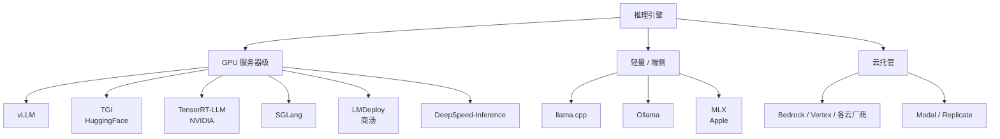
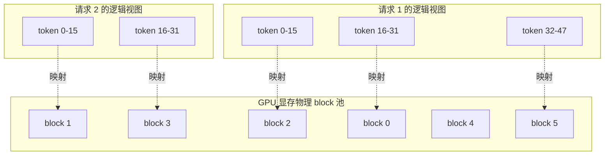
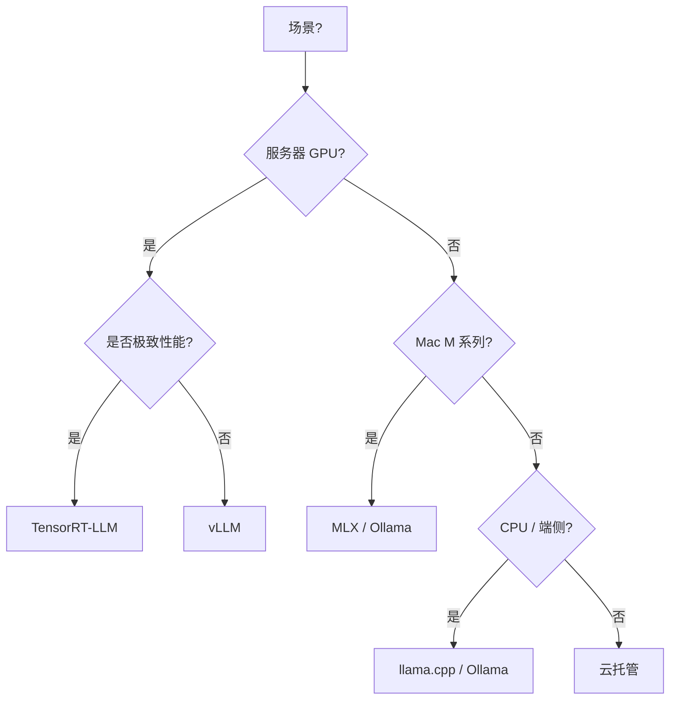

# 第 09 篇：推理与部署

> 一句话导读：这篇要讲透——为什么 vLLM 比 transformers `model.generate()` 快几十倍；Prefill 和 Decode 是两种本质不同的计算阶段；PagedAttention 是怎么把"操作系统的虚拟内存"搬到 GPU 上的；Continuous Batching 凭什么能让 GPU 利用率从 30% 涨到 90%；Speculative Decoding 用什么"赌"出来 2~3 倍加速；INT4 量化为啥精度不太掉；TTFT 和 TPOT 又分别由什么决定。读完你能从工程层面理解推理引擎的每个旋钮在调什么、生产部署时该看什么指标。

**前置阅读**：[第 01 篇：大模型基础](./01-llm-basics.md)（KV Cache、注意力、参数量与精度）

**适合读者**：要做开源模型私有化部署的工程师；面对"为什么 vLLM 这么快"想理解原理的人；负责模型推理成本优化的人。

**篇幅说明**：约 1.4 万字，含原理拆解 + GPU 物理含义。

---

## 一、为什么不用 `model.generate()` 直接上线

`transformers` 库的 `model.generate()` 是入门最常见写法，但生产用会撞到墙：

- **吞吐低**：单请求顺序处理，GPU 大部分时间空转
- **批处理弱**：动态请求长度差异大，padding 浪费严重
- **没有 KV Cache 跨请求复用**：相同 system prompt 每次都重算
- **显存碎片**：长短不一的 KV Cache 把显存切碎

要理解为什么这些问题严重，先得理解 LLM 推理的两个本质阶段。

### 1.1 Prefill vs Decode：两种本质不同的计算

LLM 推理一次请求分两个阶段，**它们的计算特性完全不同**：

| 阶段 | 干的事 | 计算特点 | 瓶颈 | 一次输入多少 |
|---|---|---|---|---|
| **Prefill** | 处理用户 prompt（一次性） | 矩阵-矩阵乘 | **算力** | 整个 prompt 的所有 token |
| **Decode** | 生成第 1, 2, ..., N 个 token | 矩阵-向量乘 | **显存带宽** | 每次只 1 个 token |

#### 1.1.1 为什么 Prefill 是算力瓶颈

Prefill 阶段把整个 prompt（比如 1000 token）一次性喂进模型，每层 Attention 都要算：

```
Q (1000 × d) × K^T (d × 1000) → 1000 × 1000 的注意力矩阵
```

这是个**大矩阵乘大矩阵**——GPU 的 Tensor Core 最擅长的工作。计算密度高，**算力（FLOPS）成为瓶颈**。

GPU 利用率在 prefill 阶段往往能拉到 60~90%。

#### 1.1.2 为什么 Decode 是显存带宽瓶颈

Decode 阶段每次只生成 1 个 token：

```
Q (1 × d) × K^T (d × N) → 1 × N 的注意力分数
```

这是**小向量乘大矩阵**——计算量小，但每生成一个 token 都要把整个模型权重和所有 KV Cache 从显存读到 GPU 计算单元里。

举数字：72B 模型 FP16 大约 144GB 权重 + 几 GB KV Cache。生成每个 token 都要把这 150GB+ 数据"过一遍"。

A100 显存带宽 2TB/s，理论上限是 `2000 / 150 ≈ 13 token/s`——**这就是单请求 decode 速度的物理上限**，跟算力关系不大。

GPU 算力（Tensor Core）在 decode 阶段大量空转——这就是为什么"提高吞吐"的核心是**让 decode 阶段并行化**，下面 Continuous Batching 解决的就是这个。

> 这两个阶段的差异是后续所有优化的出发点：Prefill 优化看算力（FlashAttention），Decode 优化看显存带宽（量化）和并行度（Continuous Batching）。

---

## 二、主流推理引擎全景



**图 1：推理引擎版图**

### 2.1 主流引擎横向对比

**表 1：推理引擎对比**

| 引擎 | 主语言 | 强项 | 短板 | 适合 |
|---|---|---|---|---|
| **vLLM** | Python / CUDA | PagedAttention、社区活跃、开箱即用 | 个别新模型适配慢一点 | **服务器部署首选** |
| TGI | Python / Rust | HuggingFace 出品、生产稳 | 生态不如 vLLM | HF 生态用户 |
| TensorRT-LLM | C++ / Python | 极致性能、深度 NVIDIA 优化 | 编译慢、上手难 | 极致延迟 / 吞吐 |
| SGLang | Python | 长 prompt / 复杂结构化场景强 | 较新 | RAG / Agent 重 KV 复用 |
| LMDeploy | C++ / Python | 国产、量化好（Turbomind 引擎） | 社区比 vLLM 小 | 国产模型 / 量化 |
| DeepSpeed-Inference | Python | 与 DeepSpeed 训练一体 | 不再是首选推理 | 已经在用 DeepSpeed |
| llama.cpp | C/C++ | CPU / 端侧、GGUF 生态 | GPU 性能不及 vLLM | 个人 / 端侧 |
| Ollama | Go | 极简一键、本地体验好 | 不适合多用户高并发 | 个人 / 开发本机 |
| MLX | Swift / Python | Apple Silicon 专用 | 仅 Mac | Mac 开发 / 推理 |

> 重点：**99% 的服务器场景从 vLLM 开始**。极致性能再考虑 TensorRT-LLM；端侧选 llama.cpp / Ollama；Mac 用 MLX。

---

## 三、推理优化的"四大件"

### 3.1 PagedAttention：把虚拟内存搬到 GPU

PagedAttention 是 vLLM 的招牌发明（论文 2023.9 SOSP），**核心想法是把操作系统的"分页虚拟内存"机制搬到 KV Cache 管理上**。

#### 3.1.1 没有 PagedAttention 之前的痛点

LLM 推理时每个请求都要存 KV Cache（详见第 01 篇）。一个请求的 KV Cache 大小：

```
KV Cache 大小 = 2 (K和V) × 层数 × 序列长 × 隐藏维 × 数据类型字节数
```

举例：72B 模型层数 80、隐藏维 8192、FP16，序列长 1000 token：

```
2 × 80 × 1000 × 8192 × 2 bytes ≈ 2.5 GB
```

**痛点 1：预分配浪费**

传统做法：请求一来就**按最大可能长度（比如 32K）预分配**连续显存。但实际请求平均只用 1K——**31/32 的显存被白占**。

```
预分配 32K | xxxx[实际用 1K]xxxxxxxxxxxxxxxxxxxxxxxxxxxxxx |
            ↑                                              ↑
            实际用                                          浪费
```

**痛点 2：外部碎片**

不同请求结束时间不同，释放的显存"洞"大小不一，新请求要找"足够大的连续空间"——很快显存被切碎，明明还有几 GB 空闲但没有大块连续区可用。这和操作系统物理内存碎片完全是同一个问题。

**痛点 3：批内长度差异浪费**

批处理多个请求时，按最长请求 padding 到同一长度——短请求大量 token 是 padding，浪费计算和显存。

#### 3.1.2 PagedAttention 怎么解决

**类比：操作系统虚拟内存**

OS 用"虚拟地址 + 页表 + 物理页"机制：进程看到连续虚拟地址，物理内存按 4KB 页分配，不必连续。

PagedAttention 完全照搬：

- 把 KV Cache 切成固定大小的 **block**（vLLM 默认 16 个 token 一块）
- 每个请求维护一个 **block table**（页表），记录"我的第 N 段 token 存在哪个物理 block 里"
- 显存上 block 是固定大小、可任意分配的"物理页"



**图 2：PagedAttention 的"页表 + 物理 block"模型**

#### 3.1.3 收益：三个一起拿

- **没有外部碎片**：所有 block 等大，可任意挑空闲块用，**显存利用率从 20~40% 拉到 90%+**
- **按需分配**：请求长就分配多个 block，短就少分配，无浪费
- **共享前缀几乎免费**：多个请求共享相同 system prompt 的 block——同一物理 block 映射到多个请求的页表（**Prefix Caching** 由此实现）

#### 3.1.4 副作用：内核层面要改

注意力算子要从"算连续 KV"改成"按 block 跳着算"。vLLM 自己写了 CUDA kernel 实现这种"分散读写的注意力"，这是它的核心壁垒之一。

> 重点：**PagedAttention 是 vLLM 比传统推理快的最大单点贡献**——把显存利用率提了一倍以上，意味着同样显卡能跑两倍并发。

### 3.2 Continuous Batching：让 GPU 永远在干活

#### 3.2.1 传统 Static Batching 为什么浪费

```mermaid
gantt
    title Static Batching 时间线
    dateFormat  X
    axisFormat %s
    section 请求 A 短
    生成     :a1, 0, 3
    等待批结束 :crit, 3, 10
    section 请求 B 长
    生成     :a2, 0, 10
    section 请求 C 中
    生成     :a3, 0, 6
    等待批结束 :crit, 6, 10
    section 下一批
    新请求等待 :crit, 0, 10
```



**图 3：Static Batching 的浪费**

传统批处理：

- 凑够 N 个请求才开始批
- 所有请求一起做 prefill，一起做 decode
- **任何一个请求结束都不能立刻让位**——必须等批里最长的请求结束
- 短请求被长请求拖死，新请求要等整批结束才能进

GPU 利用率取决于"批里最长那个还在跑没跑完"——典型 30~50%。

#### 3.2.2 Continuous Batching 工作机制

vLLM / TGI 用**逐 token 步长调度**：

```
每生成一个 token 步长（比如 50ms）后：
  1. 检查批里哪些请求已生成完
  2. 完成的请求出队，把结果返回
  3. 等待队列里的新请求进来填补空位
  4. 下一步长继续
```



```mermaid
gantt
    title Continuous Batching 时间线
    dateFormat  X
    axisFormat %s
    section 请求 A 短
    生成     :a1, 0, 3
    立刻返回 :3, 4
    section 请求 B 长
    生成     :a2, 0, 10
    section 请求 C 中
    生成     :a3, 0, 6
    立刻返回 :6, 7
    section 新请求 D
    立刻进入 :a4, 3, 8
    section 新请求 E
    立刻进入 :a5, 6, 11
```

**图 4：Continuous Batching 的高利用**

效果：GPU 永远满负荷干活，**利用率 70~90%**。

#### 3.2.3 Chunked Prefill：解决 prefill 阻塞 decode

光有 Continuous Batching 还有一个问题：**Prefill 是大计算，decode 是小计算**——如果某个请求 prefill 阶段需要 200ms，那 200ms 内其他正在 decode 的请求都被卡住。

Chunked Prefill 把长 prefill 切成多个小块（比如每块 512 token），和 decode 步长交错执行：

```
步长 1: [请求 A prefill 块 1] + [请求 B decode] + [请求 C decode]
步长 2: [请求 A prefill 块 2] + [请求 B decode] + [请求 C decode]
...
```

收益：

- TTFT（首 token 时间）和 TPOT（每 token 时间）都受控
- 长 prompt 不再阻塞短请求

> 提示：vLLM 0.6+ 默认开启 Chunked Prefill；不同版本默认值会变，**部署前看一下当前版本默认配置**。

### 3.3 Speculative Decoding：用"草稿模型"赌出加速

#### 3.3.1 基本想法

Decode 是显存带宽瓶颈——每生成 1 个 token 都要把 150GB 模型权重过一遍。**那如果一次能"验证"K 个 token，等于 K 个 token 共享一次权重读取**。

Speculative Decoding 的做法：

1. 用一个**小草稿模型**（比如同家族的 0.5B / 1.5B，比大模型快 10 倍以上）快速"赌"出未来 K 个 token（典型 4~8 个）
2. 把这 K 个 token 拼到当前序列里，**用大模型一次 forward 验证**——这一次 forward 同时算出 K 个位置的概率分布
3. 从前到后看：
   - 第 i 个 token 草稿模型的输出和大模型一致 → 接受
   - 一旦不一致 → 截断，第 i 个 token 用大模型的输出，丢弃后面草稿
4. 一次 forward 可能产出 1~K 个被接受的 token

#### 3.3.2 数学原理（粗略）

- 一次大模型 forward 时间约等于 1 个 token 的 decode 时间
- 草稿模型生成 K 个 token 的总时间 << 1 次大模型 forward
- 假设每次平均接受 α·K 个 token（α 是接受率，常见 0.5~0.7）
- 加速比 ≈ α·K（去掉常数项）

实测在 vLLM / TensorRT-LLM 上，72B + 0.5B 草稿能达到 **2~3 倍加速**，质量与原大模型完全一致（因为最终用的是大模型分布）。

#### 3.3.3 限制

- **草稿模型必须同 tokenizer**——不然没法拼接
- **接受率影响巨大**——草稿模型质量越接近大模型加速越多，但太大就失去速度优势；典型选大模型同家族的最小尺寸
- **显存多占一份**——草稿模型也要常驻显存，对显存紧的部署是负担
- **decoding 场景才有效**——纯 prefill 场景没用

变体：

- **Medusa**：在大模型上加几个"head"直接出多个候选 token，省掉草稿模型
- **EAGLE**：用大模型自身的 hidden state 蒸出预测器
- **Lookahead**：缓存历史 n-gram 当作"草稿"

### 3.4 Prefix Caching：长 system prompt 的免费午餐

详细原理基于 PagedAttention（前面 3.1.3 已讲）。这里讲应用价值：

```
[长 system prompt 5000 token + 工具描述 2000 token]
                ↑ 多个请求共享这段
[+ 用户问题 50 token]
                ↑ 每个请求独有
```

第二次请求来时，前 7000 token 的 KV Cache 直接复用，**只需 prefill 用户那 50 token**。

实测收益：典型 RAG / Agent 场景 TTFT 降低 5~10 倍，吞吐提升 2~3 倍。

**Prompt 设计原则**（重要）：

- **稳定的部分放最前**：system → 工具 schema → 检索结果 → 历史轮次 → 当前问题
- 千万不要把"当前时间"、"用户 ID"等变量放最前——破坏前缀
- 多租户场景：相同租户的请求让前缀一致，不同租户分别命中各自的前缀

> 提示：vLLM 通过 `--enable-prefix-caching` 启用。0.6 之后部分场景默认开启，看版本文档。

---

## 四、模型量化：让大模型塞进小卡

### 4.1 量化是什么——从信息论看

模型权重原本是 FP16（每个参数 2 字节）。量化是把这些数值用更少的位数表示：

| 精度 | 每参数字节 | 表达范围 | 典型损失 |
|---|---|---|---|
| FP32 | 4 | 极大 | 0（基线） |
| FP16 / BF16 | 2 | 大 | 微（生产基线） |
| INT8 | 1 | -128~127 | 小 |
| INT4 | 0.5 | -8~7 | 中 |
| INT2 | 0.25 | -2~1 | 大（实验性） |

#### 4.1.1 为什么 INT4 还能用

直觉上 INT4 只有 16 种取值，一个权重就这么粗的精度，效果应该惨不忍睹。但实际 INT4 量化模型在很多任务上和 FP16 差距很小。**关键原因有几个**：

**原因 1：分组量化（Group-wise）**

不是所有权重共用一个 scale，而是**每 64 或 128 个权重一组，每组独立 scale**：

```
组 1: [w1, w2, ..., w128] → scale_1, [int4, int4, ...]
组 2: [w129, ..., w256] → scale_2, [int4, int4, ...]
```

每组的 scale 适配本组的数值分布——大值小值都能很好表达。

**原因 2：权重分布天然集中**

LLM 训练后的权重大多数在 0 附近，远离 0 的极端值很少。INT4 的非线性映射（甚至 NF4）针对这种"高斯分布"做了优化，少数极端值损失大但绝大多数权重表达精度足够。

**原因 3：Outlier 单独处理**

少数"离群值"权重（比例 < 1%）单独保留高精度（FP16），其余量化到 INT4。代表方案：LLM.int8()、SmoothQuant 的思路。

**原因 4：激活值不量化**

GPTQ / AWQ 这类**只量化权重**，激活值保持 FP16——保留了关键的动态范围。FP8 / W8A8 等需要把激活也量化的方案才会损失更多。

#### 4.1.2 显存收益线性，速度收益还要看带宽

显存：FP16 → INT4 减少 75%。72B 模型从 144GB 降到 36GB，单卡 A100 80GB 就能塞下。

速度：**Decode 阶段速度也几乎线性提升**——因为 decode 是显存带宽瓶颈，权重小了一半，每 token 读权重时间也减半。

> 这就是为什么生产环境默认 INT4 量化几乎是 LLM 服务化的标配——显存和延迟双收益。

### 4.2 主流量化方案对比

**表 2：量化方案对比**

| 方案 | 类型 | 是否需校准 | 速度 | 精度损失 | 兼容性 |
|---|---|---|---|---|---|
| FP16 / BF16 | 基线 | 否 | 标杆 | 0 | 全场景 |
| INT8（bitsandbytes） | 简易 PTQ | 否 | 一般 | 小 | 兼容性好 |
| GPTQ | PTQ + 二阶信息校准 | 是 | 快 | 小 | 主流，工具多 |
| AWQ | PTQ + 激活感知 | 是 | 快 | 小 | 与 GPTQ 并列首选 |
| GGUF | llama.cpp 多种精度 | 是 | 快 | 小到中 | CPU / 端侧最佳 |
| FP8 | H100 起 | 否 | 极快 | 极小 | 新硬件，主流引擎逐步支持 |
| W4A16 / W4A8 | 权重 INT4 + 激活 INT8 | 是 | 极快 | 中 | 极致性能 |

#### 4.2.1 GPTQ vs AWQ 选哪个

- **GPTQ**：用海森矩阵（二阶信息）校准，精度高但量化时间长（72B 模型量化要几小时）
- **AWQ**：发现"激活值大的权重对精度影响大"，对这部分权重保留高精度，量化更快、推理更快
- **实测差距**：在多数任务上 AWQ ≥ GPTQ（精度），且 AWQ 在 vLLM 上 kernel 优化更好（速度）

> 推荐：**新部署优先选 AWQ**；已有 GPTQ 模型也能用，无需改换。

### 4.3 量化的代价

- **极少数任务量化后显著掉点**——数学、代码、长链推理对精度敏感，量化后 GSM8K / HumanEval 可能掉 5~10 个百分点
- **量化模型需对应推理引擎支持**（不是所有引擎都吃所有量化）
- **量化前后必须跑评测对比**，别想当然
- **极致精度场景考虑保留 FP16 兜底**——主流量化版本，关键链路用 FP16 双跑做对照

---

## 五、解码策略：从 Greedy 到约束生成

### 5.1 基础采样策略

| 策略 | 干啥 | 适用 |
|---|---|---|
| Greedy | 每步选概率最大 token | 确定性任务（代码、SQL） |
| Beam Search | 维护 K 条候选束 | 翻译、摘要 |
| Top-K 采样 | 从 Top K 个里随机 | 创意生成 |
| Top-P（Nucleus） | 从累计概率 P 的子集随机 | 创意生成首选 |
| Temperature | 控制概率分布"扁平程度" | 调创意度 |

#### 5.1.1 Temperature 物理含义（呼应第 02 篇）

Temperature 改变 softmax 前的 logit 缩放：

- T < 1：logit 拉大，分布尖锐 → 模型更"自信"，几乎只选最高
- T = 1：原始分布
- T > 1：logit 压缩，分布平坦 → 模型更"激进"，可能选到罕见 token
- T = 0：等价 Greedy

经验值：

- 严格 / 代码：`temperature=0`、`top_p=1`
- 一般问答：`temperature=0.3~0.7`
- 创意写作：`temperature=0.7~1.0`、`top_p=0.9`

#### 5.1.2 Top-P vs Top-K

- **Top-K**：固定取前 K 个，K=50 在常见词分布尖锐时合适，分布平坦时不够
- **Top-P (Nucleus)**：动态——按累计概率截断，分布尖锐时只取 1~2 个，平坦时取多个

**通常 Top-P 优于 Top-K**——自适应。常用 `top_p=0.9~0.95`。

### 5.2 惩罚项

| 参数 | 作用 | 物理含义 |
|---|---|---|
| repetition_penalty | 抑制重复（开源模型常用，OpenAI 不支持） | 已出现过的 token 概率打折 |
| frequency_penalty | 出现越多越压（OpenAI 风格） | 按出现次数线性扣 logit |
| presence_penalty | 只要出现过就压 | 二值——出现过就扣固定值 |
| logit_bias | 直接改某些 token 的 logit | 强行偏好/避免特定 token |

### 5.3 受约束生成（Constrained Decoding）

让输出严格符合某个结构（JSON Schema、正则、CFG）。**这是工业场景的刚需**——纯靠 prompt 让模型"输出 JSON" 总有几个百分比的格式错乱。

#### 5.3.1 工作原理

每生成一个 token，检查"如果选这个 token，后续是否还能产生合法输出"。不合法的 token 直接屏蔽（logit 设 -inf）。

实现层面是把"目标语法"编译成一个**状态机**（FSA / FSM），每个状态有"允许的 token 集合"，解码时按当前状态过滤。

```
目标 JSON 状态：
  state_init → '{' 允许
  state_after_brace → '"' 允许
  state_in_key → 字符串 token 允许，'"' 关闭后去 state_after_key
  state_after_key → ':' 允许
  ...
```

vLLM 的 `guided_json` 用 outlines 或 lm-format-enforcer 实现这套。

#### 5.3.2 主要实现

- **Outlines**（Python，规则 / EBNF / Pydantic 模型）
- **Guidance**（微软，模板 + 控制流）
- **vLLM 的 guided_decoding**（内置支持 Outlines / lm-format-enforcer）
- **OpenAI Structured Outputs**（API 内置 `response_format`）

> 重点：**比"在 prompt 里讲格式"可靠 100 倍**。要求 100% 合法 JSON 时务必用约束生成。

### 5.4 Stop / max_tokens / Seed

- `max_tokens`：最大生成长度，**必设**，防止无限输出
- `stop`：碰到指定字符串停止生成
- `seed`：可复现的随机种子（部分模型 / 引擎支持，闭源模型不保证完全可复现）

---

## 六、部署形态与多模型路由

### 6.1 部署形态对比

**表 3：部署形态对比**

| 形态 | 代表 | 优点 | 缺点 | 适合 |
|---|---|---|---|---|
| 闭源 API | OpenAI / Claude | 零运维 | 数据出域、贵、限流 | POC / 通用业务 |
| 公有云托管 | Bedrock / Vertex / 阿里百炼 | 减运维 | 选择有限、相对贵 | 已用某云的企业 |
| 自部署（私有云 / IDC） | vLLM + K8s | 数据可控、长期成本低 | 运维重 | 中大企业 |
| 单机 / 工作站 | Ollama | 简单 | 不稳、并发弱 | 个人 / demo |
| 边缘 / 端侧 | llama.cpp / 手机 NPU | 离线、低延迟 | 模型小、能力有限 | 离线场景、隐私敏感 |

### 6.2 多模型路由（Model Router）

详见第 08 篇第五节"AI 网关"。这里强调**推理层关心的事**：

- **任务路由**：分类用小模型，复杂推理用大模型
- **可用性路由**：主用 OpenAI，限流 / 故障时切 Azure / Anthropic / 自部署
- **流量染色**：能让推理引擎知道"这是金丝雀流量"，便于隔离监控

### 6.3 GPU 调度、热加载、扩缩容

#### 6.3.1 GPU 调度

K8s + GPU Operator（NVIDIA）/ Volcano。考虑：

- **MIG（Multi-Instance GPU）**：A100 / H100 可切成多个虚拟 GPU，给小模型用
- **MPS（Multi-Process Service）**：多进程共享一个 GPU 的算力
- **vGPU 商业方案**：NVIDIA AI Enterprise / 阿里 cGPU 等

#### 6.3.2 模型加载与热切换

模型加载慢（72B 从硬盘加载到 GPU 几十秒到几分钟）——意味着：

- **冷启动慢**——扩容时新副本起来需要分钟级
- **热切换难**——白天用 A 模型晚上用 B 模型，切换期间有空窗

实践：

- 至少保持 N 个常驻副本，避免完全冷启动
- 用 **快照启动**（vLLM 的 `--load-format=npcache` / `tensorizer`）加速
- 模型放在本地 NVMe（不要 NFS）

#### 6.3.3 扩缩容指标

不是看 CPU，而是看：

- **GPU 利用率**：低于 50% 缩容，高于 80% 扩容
- **TTFT P99**：超阈值扩容
- **请求队列长度**：积压超阈值扩容
- **KV Cache 使用率**：vLLM 的 `kv_cache_usage` 接近 100% 说明该扩

---

## 七、性能指标：怎么算"快不快"

| 指标 | 含义 | 物理决定因素 |
|---|---|---|
| **TTFT**（Time To First Token） | 用户提交到第一个字 | Prefill 时间 + 队列等待 |
| **TPOT**（Time Per Output Token） | 生成每个 token 的平均时间 | 显存带宽 / batch 大小 |
| **端到端延迟** | 总耗时 = TTFT + TPOT × 输出长度 | 综合 |
| **吞吐 / QPS / TPS** | 系统每秒处理多少请求 / token | GPU 利用率 |
| **GPU 利用率 / 显存占用** | 资源效率 | 调优重点 |
| **并发数** | 同时进行的请求 | 容量规划 |

### 7.1 TTFT 与 TPOT 是用户体验直接指标

**TTFT 直接决定"等待感"**——超过 1 秒用户开始焦虑，超过 3 秒明显流失。

**TPOT 决定"流畅度"**——和人类阅读速度对比：
- 中文阅读速度约 5~8 字/秒
- 单 token ≈ 1.5 中文字
- TPOT 需要 < 250ms 才能"赶得上看"
- TPOT < 50ms 几乎是"瞬间出"

### 7.2 优化方向对照

| 想优化 | 该看哪里 |
|---|---|
| TTFT 高 | 缩短 prompt、Prefix Caching、Chunked Prefill、prefill 算力优化 |
| TPOT 高 | 量化、Continuous Batching、Speculative Decoding、batch 内吞吐 |
| 吞吐低 | Continuous Batching、KV Cache 利用率、并发数上限 |
| GPU 闲 | 检查批大小、Continuous Batching 是否生效、长 prefill 阻塞 |

详见 [第 11 篇：评测与可观测](./11-evaluation-and-observability.md)。

---

## 八、踩坑提醒

### 坑 1：vLLM 默认配置 OOM

- **现象**：vLLM 启动时报显存不够，或者跑几分钟突然 OOM。
- **原因**：vLLM 默认 `gpu_memory_utilization=0.9`——会"吃光"显存做 KV Cache 池；`max_model_len` 默认拉满（常常是 32K~128K），实际你根本用不上还吃显存；并发上来后某些请求超长，块不够。
- **规避方法**：明确设 `--gpu-memory-utilization 0.85`、`--max-model-len`（按业务真实最大长度设，比如 8K）；监控 KV Cache 使用率（`/metrics` 接口）；超长请求做应用层截断或分流。

### 坑 2：量化模型效果"看着差不多，实际严重掉点"

- **现象**：4bit 量化模型在测试集上准确率掉了 5%，但用户问几个简单问题"看起来还行"，就上线了，结果业务投诉激增。
- **原因**：抽样测试样本偏简单；量化对**长上下文、复杂推理**影响大；GSM8K / 代码任务最敏感。
- **规避方法**：上线前用**真实业务评测集**对比 FP16 vs 量化版本；尤其测复杂 / 长 / 边界样例；关键链路考虑保留 FP16 兜底；不同量化方案（GPTQ / AWQ）实测对比再选。

### 坑 3：Continuous Batching 配置错误，长请求拖死短请求

- **现象**：高峰期 P99 TTFT 突然飙高。
- **原因**：早期 vLLM 没启用 Chunked Prefill，长 prompt prefill 时间占用过长；或者 `max-num-batched-tokens` 设太小，prefill 总要等批空。
- **规避方法**：升级到带 Chunked Prefill 的版本（vLLM 0.6+）；调 `--max-num-batched-tokens`（默认与 max-model-len 相关）和 `--max-num-seqs`（并发上限）；监控 prefill / decode 时间分布。

### 坑 4：Prefix Caching 显存被吃满

- **现象**：长期运行后吞吐缓慢下降。
- **原因**：Prefix Cache 没设上限，碎片越来越多；某些长但低频的前缀长期占着位置。
- **规避方法**：监控 prefix cache 命中率与占用；定期清理 / 设 LRU 上限；Prompt 设计上把"稳定部分"放最前（system / 工具描述），变量放后面，最大化命中。

### 坑 5：Ollama / llama.cpp 直接上生产

- **现象**：5 个用户同时聊天就开始变慢、偶发 502。
- **原因**：Ollama 的并发模型不是为高并发设计；没有真正的 Continuous Batching；硬件资源调度简陋。
- **规避方法**：内部团队工具用 Ollama 没问题，**生产服务上 vLLM / TGI**；并发预估清楚；做容量规划与压测。

### 坑 6：Speculative Decoding 草稿率太低反而变慢

- **现象**：开了 SD 之后吞吐反而降了。
- **原因**：草稿模型太弱（接受率 < 0.3），每次大模型 forward 只接受 1~2 个 token，**反而比不开 SD 多了草稿模型的开销**。
- **规避方法**：选同家族最小尺寸的草稿（Qwen 72B 配 Qwen 0.5B 而不是别家小模型）；实测接受率 > 0.5 才值得开；可以先小流量试，看吞吐是否真升。

### 坑 7：模型从对象存储加载，扩容慢得离谱

- **现象**：扩容触发后新副本要 5~10 分钟才能服务。
- **原因**：模型放 NFS / 对象存储，加载时网络成为瓶颈（72B 模型 144GB 走千兆网卡要 20 分钟）。
- **规避方法**：模型存本地 NVMe SSD；K8s 用 initContainer 预拉镜像 + 模型；考虑 vLLM tensorizer 加速；保持最小副本数避免完全冷启动。

---

## 九、选型建议与实践要点

### 9.1 推理引擎决策



**图 5：推理引擎决策树**

### 9.2 上线前 Checklist

- [ ] 选定模型 + 量化方案，跑过业务评测集（FP16 vs 量化对照）
- [ ] 推理引擎参数（`max-model-len`、`gpu-memory-utilization`、`max-num-seqs`、`max-num-batched-tokens`）按真实负载调
- [ ] Prefix Caching / Continuous Batching / Chunked Prefill 启用并验证
- [ ] 解码参数（temperature、top_p、max_tokens、stop）按业务调
- [ ] 模型路由 / 限流 / 熔断 / Fallback 在 AI 网关层就位（详见第 08 篇）
- [ ] TTFT P99 / TPOT P99 / GPU 利用率 / KV Cache 使用率监控接入
- [ ] 容量压测：拿真实长度分布跑（不是统一长度），看 P99
- [ ] 故障演练：单卡挂、单实例挂、模型切换、限流触发
- [ ] 模型加载用本地 NVMe，避免冷启动慢

> 参考数据：vLLM 在 A100 80GB 上跑 Qwen2.5-7B FP16，单卡 100~200 QPS、千 token/s 量级吞吐是合理基线（参考数值，业务请求长度差异大，实际以压测为准）。

---

## 十、延伸阅读

- 系列内：
  - [第 01 篇：大模型基础](./01-llm-basics.md)（KV Cache、Flash Attention、注意力）
  - [第 11 篇：评测与可观测](./11-evaluation-and-observability.md)（TTFT / TPOT / 成本监控）
  - [第 08 篇：应用框架与工程化](./08-frameworks-and-engineering.md)（模型抽象层、AI 网关）
- 外部参考（注明发表时间）：
  - 论文《Efficient Memory Management for Large Language Model Serving with PagedAttention》（Kwon et al., SOSP 2023）
  - vLLM 官方文档（最后访问 2025）
  - 论文《FlashAttention》（Dao et al., 2022）
  - 论文《Speculative Decoding》（Leviathan et al., 2022）
  - 论文《Medusa》（Cai et al., 2024）
  - 论文《GPTQ》（Frantar et al., 2022）/《AWQ》（Lin et al., 2023）
  - NVIDIA TensorRT-LLM 官方教程

---

## 附：本篇覆盖的知识点清单

来自原清单第 6 章 + 第 7.1 节流式部分 + 第 12.3 节性能部分，每条扩展了原理：

- [x] Prefill vs Decode 的本质差异（算力 vs 显存带宽）
- [x] vLLM / TGI / TensorRT-LLM / llama.cpp / Ollama / LMDeploy / SGLang / DeepSpeed-Inference / MLX
- [x] PagedAttention（虚拟内存类比 / 分块原理 / 收益分析）
- [x] Continuous Batching（逐步长调度 / 解决 GPU 利用率）
- [x] Chunked Prefill（解决 prefill 阻塞 decode）
- [x] Speculative Decoding（草稿模型原理 / 数学推导 / Medusa / EAGLE / Lookahead）
- [x] Prefix Caching（基于 PagedAttention 的 block 共享）
- [x] Tensor / Pipeline / 模型 / 数据并行（推理视角）
- [x] Greedy / Beam Search / Top-K / Top-P / Temperature 物理含义
- [x] Repetition / Frequency / Presence Penalty / Logit Bias 物理含义
- [x] 受约束生成（FSA 状态机原理 / Outlines / Guidance / Structured Outputs）
- [x] 最大生成长度与停止词 / Seed 与可复现性
- [x] 单机 / 分布式 / 本地 vs 云端 / 边缘 / 移动端部署
- [x] GPU 调度（MIG / MPS / vGPU）/ 模型热加载（tensorizer）/ 多模型路由 / Model Serving
- [x] LiteLLM / One API / 模型负载均衡 / 自动扩缩容（按 GPU 利用率 / TTFT / 队列）
- [x] TTFT / TPOT / QPS / TPS / 延迟 P99 / GPU 利用率 / 显存占用 / KV Cache 使用率
- [x] 模型量化（INT8 / INT4 / GPTQ / AWQ / GGUF / bitsandbytes / FP8 / W4A16）— 含分组量化 / outlier / 激活感知原理
