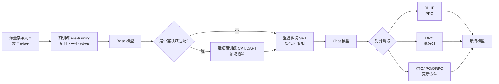
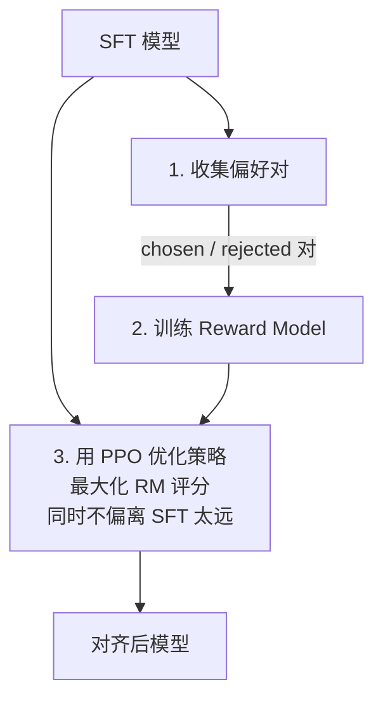
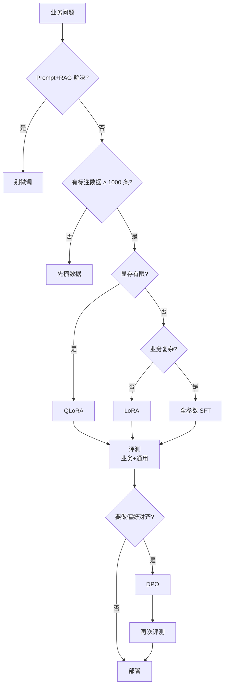

# 第 10 篇：训练与微调

> 一句话导读：这篇要讲透——预训练 / SFT / RLHF / DPO 各自训练目标的数学差异；为什么 LoRA "低秩"假设居然有效；catastrophic forgetting 是怎么发生的、怎么止血；什么时候该微调、什么时候 RAG / Prompt 就够了；数据配比、长上下文继续训练、量化感知训练 QAT 这些工程细节。读完你能判断自己业务到底要不要微调，并知道微调失败时该看哪些指标。

**前置阅读**：[第 01 篇：大模型基础](./01-llm-basics.md)（Transformer / 参数量 / 精度）

**适合读者**：在考虑"微调还是 RAG"的同学；正在做或要做 SFT / LoRA 的工程师；希望理解 RLHF / DPO 原理而不是只会调 API 的人。

**篇幅说明**：约 1.2 万字，重原理，工程细节挑必要的讲。

---

## 一、先回答一个问题：你真的需要微调吗？

90% 的"想微调"的项目，**RAG + 好的 Prompt 就够了**。微调成本（数据 + 算力 + 维护）非常高，决策前先过下面这张表。

**表 1：微调 vs RAG vs Prompt 决策表**

| 需求 | 首选方案 | 理由 |
|---|---|---|
| 让模型知道"我们公司的文档" | **RAG** | 知识更新快、可溯源、不用动模型 |
| 让模型按特定格式输出 | **Prompt + 约束生成** | 改 prompt 即可 |
| 让模型用"我们公司说话风格" | **Prompt + Few-shot** | 几个例子就能学到风格 |
| 让模型严格遵守某些规则（合规、安全） | **Prompt + 后处理 + 微调（次选）** | Prompt 优先，遵守不到位再微调 |
| 让模型在某专业领域显著强于通用模型 | **微调（领域 SFT / DAPT）** | 通用模型缺乏领域语料 |
| 把大模型能力蒸馏到小模型 | **SFT 蒸馏** | 用大模型生成数据训小模型 |
| 让模型学会调用我们 100+ 个内部工具 | **微调（Tool SFT）** | 工具描述太多塞不进上下文 |
| 让模型偏好某种风格而非另一种 | **DPO / RLHF** | 偏好对齐场景的标准做法 |

> 重点：**先用 Prompt + RAG 把效果做到 80%**，剩下 20% 再考虑微调。直接上微调常常是用大成本解决本可以小成本解决的问题。

---

## 二、训练流程全景



**图 1：从预训练到对齐的完整流程**

每一阶段在解决不同问题：

| 阶段 | 训练目标 | 数据 | 解决什么 |
|---|---|---|---|
| 预训练 | 预测下一 token（CLM） | 海量无监督文本 | 学世界知识 + 语言能力 |
| CPT / DAPT | 同 CLM | 领域语料（医疗 / 法律 / 代码） | 注入领域知识 |
| SFT | 在指令-回答对上做 CLM | 高质量指令数据 | 学会"听指令做事" |
| RLHF / DPO | 偏好对齐目标 | 偏好对（A 比 B 好） | 学会"按人类偏好回答" |

---

## 三、预训练：现在你大概率不会做，但要懂

### 3.1 为什么个人 / 中小公司基本做不了预训练

- 数据：清洗、去重、过滤后需要 几 T 到 几十 T tokens 高质量数据
- 算力：训 7B 模型需 几千 ~ 上万张 H100 跑数周；训 70B 是数月
- 工程：分布式训练（数据并行 + 张量并行 + 流水并行 + ZeRO）的工程复杂度极高
- 钱：单次 70B 预训练成本千万美元起

**绝大多数项目从开源 base 模型开始**：Qwen、Llama、Mistral、Yi、DeepSeek 等都开放了 base 权重。

### 3.2 但你要懂 base 模型 vs chat 模型的本质差异

很多人混淆这两类：

| 类型 | 输入风格 | 训练 | 何时用 |
|---|---|---|---|
| **Base 模型**（pretrain） | 续写："今天天气..." → "晴朗，适合出门" | 仅 CLM 预训练 | 做继续预训练 / SFT 的起点 |
| **Chat 模型**（instruct） | 对话："今天天气如何？" → "今天晴朗。" | 经 SFT + RLHF/DPO | 直接给用户用 |

**自己做微调时几乎都从 Base 起，而不是 Chat 起**——因为 Chat 模型已经被对齐过，再 SFT 容易破坏其已有的对齐效果（catastrophic forgetting，下面会讲）。

### 3.3 Continue Pre-Training（CPT / DAPT）

如果你的领域语料和通用语料分布差距大（医疗、法律、生物、特定语言），**继续预训练**能显著提升下游任务表现。

要点：

- 数据量：从几亿到几十亿 token 都常见（远小于初始预训练）
- 学习率：比预训练低一个数量级（初始预训练用 ~3e-4，CPT 用 ~3e-5）防止模型"忘记"已有知识
- 数据配比：领域数据 30%~50% + 通用数据 50%~70% 混合（防 catastrophic forgetting）
- 训练目标：还是 CLM（下一 token 预测），不需要任何标注

---

## 四、SFT：监督微调

### 4.1 SFT 的训练目标是什么

SFT 数据形如：

```json
{"instruction": "把下面文字翻译成英文：今天天气真好",
 "output": "The weather is wonderful today."}
```

训练时把 instruction + output 拼起来当一个序列，**训练目标是预测 output 部分的每个 token**（instruction 部分一般用 mask 屏蔽不计入 loss）：

```
input:  [BOS] 把下面...真好 [SEP] The weather is wonderful today [EOS]
labels: [-100][-100]...[-100][-100] The weather is wonderful today [EOS]
              ↑ instruction 不算 loss     ↑ 这部分算 loss
```

本质还是 CLM——只不过让模型学会"看到指令该输出什么"。

### 4.2 SFT 数据是关键中的关键

经验：**1000 条高质量数据 > 10 万条低质量数据**。微软的 LIMA 论文证明仅 1000 条精挑数据就能在多数任务上接近 GPT-4 风格。

数据来源：

- 人工写（最贵但最优）
- 大模型蒸馏（GPT-4 / Claude 生成 → 人工审）
- 真实业务对话（脱敏 + 标注）
- 开源数据集（Alpaca、Dolly、ShareGPT 等）

数据质量审核维度：

- 指令是否清晰（有歧义的指令直接丢）
- 答案是否准确（幻觉、事实错误必删）
- 风格是否一致（不一致会让模型学糊）
- 长度分布是否合理（极端长 / 短样本要少量）
- 是否覆盖业务真实分布（用户真问什么）

> 现实：很多项目微调失败的根因就一句——**数据质量不行**。算法再花哨也救不回来。

### 4.3 SFT 的几个工程细节

#### 4.3.1 训练参数

- 轮数（Epochs）：1~3 轮最常见，超过 3 轮容易过拟合
- 学习率：base 模型 SFT 用 1e-5 ~ 5e-5；LoRA 微调用 1e-4 ~ 5e-4（LoRA 学习率比全参数大）
- Batch size：global batch 通常 64~256（用梯度累积凑）
- 序列长度：按数据 99% 分位定，太长浪费 GPU
- Warmup：通常前 3% 步骤线性 warmup

#### 4.3.2 多轮对话怎么训

多轮对话数据：

```json
{"messages": [
  {"role": "user", "content": "Q1"}, {"role": "assistant", "content": "A1"},
  {"role": "user", "content": "Q2"}, {"role": "assistant", "content": "A2"},
]}
```

训练有两种做法：

- **只算最后一轮 assistant 的 loss**：保守，浪费数据
- **算所有 assistant 轮的 loss**（推荐）：更高效，需要 mask 所有非 assistant 部分

主流框架（LLaMA-Factory、Axolotl）默认支持后者。

---

## 五、参数高效微调（PEFT）：LoRA 凭什么这么火

### 5.1 全参数微调的痛点

72B 模型全参数微调显存需求（FP16 + Adam optimizer）：

```
模型权重: 144GB (FP16)
梯度: 144GB
Adam 状态（m, v）: 2 × 144GB = 288GB
激活值（重计算后）: 几十 GB
合计: 600GB+
```

需要 **8 张 H100 80GB 起步** + DeepSpeed ZeRO-3，工程复杂度高。

### 5.2 LoRA 的核心想法：低秩假设

LoRA（Low-Rank Adaptation）核心观察：

> 微调前后模型权重的"变化量"ΔW 具有低秩性——即 ΔW 可以用两个小矩阵的乘积近似。

数学上：

```
原权重: W ∈ R^(d×k)，维度大（比如 d=k=8192）
微调后: W' = W + ΔW
LoRA 假设: ΔW ≈ B × A，其中 A ∈ R^(r×k), B ∈ R^(d×r), r << min(d, k)
```

举例：d=k=8192，全参数 ΔW 是 8192×8192 = 6700 万参数；LoRA r=8 时 A + B 共 8192×8 + 8×8192 ≈ **13 万参数**——参数量减少 500 倍。

#### 5.2.1 为什么"低秩"假设有效

这是 LoRA 论文（Hu et al., 2021）和后续研究的核心洞察：

- **预训练已经学到了通用表示**——下游任务通常只是对这个表示做"小幅调整"
- **小幅调整在高维空间中往往集中在少数方向**——这就是低秩
- **过参数化的好处**：原始 W 维度高，微调时朝某些"主方向"调整，秩很低也能表达

直觉类比：就像你已经学会了开车（W），现在学开卡车——大部分操作都通用，只需要"在原有基础上调整某几个维度的肌肉记忆"，而不是从零学。

#### 5.2.2 LoRA 前向传播

训练时：
```
h = W·x + (B·A)·x = W·x + B·A·x
       ↑ 冻结        ↑ 只训练 A、B
```

推理时（合并）：
```
W_merged = W + B·A   # 一次性合并
h = W_merged · x     # 推理零开销，等同原模型
```

这点很重要：**LoRA 训完合并后推理零开销**，不像 Adapter 那样需要额外前向传播。

### 5.3 LoRA 关键超参

| 参数 | 含义 | 经验值 |
|---|---|---|
| **r**（秩） | 低秩矩阵的秩 | 8~64（任务越复杂越大） |
| **alpha** | 缩放因子（实际 ΔW = (alpha/r) × BA） | 通常 = 2r 或 = r |
| **target_modules** | 哪些层加 LoRA | q_proj, v_proj 必加；k_proj, o_proj, mlp 视情况 |
| **dropout** | LoRA 内部 dropout | 0.05~0.1 |

> 经验：**先从 r=8, alpha=16, target=[q, v]** 开始；效果不够再加 r 和 target_modules，不要一开始就堆。

### 5.4 LoRA 的变体家族

**表 2：PEFT 方法对比**

| 方法 | 想法 | 参数量 | 适用 |
|---|---|---|---|
| **LoRA** | 低秩 ΔW = BA | 很小 | 通用首选 |
| **QLoRA** | 模型 INT4 量化 + LoRA | 显存极省 | **单卡微调 70B 的关键** |
| **DoRA** | 解耦权重的方向和大小 | 略大于 LoRA | 精度更高一点 |
| **AdaLoRA** | 自适应分配秩 | 类似 | 不同层动态调 |
| **Prefix Tuning** | 在每层注意力前加可训练 prefix | 小 | 早期方法，少用 |
| **P-Tuning v2** | 类似 prefix，仅 embedding 层 | 小 | 同上 |
| **Adapter（Houlsby）** | 在每层中间插入小网络 | 略大 | 有推理开销 |
| **IA³** | 用向量缩放激活 | 极小 | 实验性 |
| **全参数 SFT** | 训所有参数 | 巨大 | 数据多 + 算力够时上限最高 |

#### 5.4.1 QLoRA：单卡微调 70B 的钥匙

QLoRA 的工程贡献是把"模型量化到 4bit + LoRA 训练"组合，大幅降低显存：

```
70B 模型: 全参数 SFT 约需 800GB 显存
70B 模型: QLoRA (NF4 量化) 约需 48GB 显存 → 单卡 A100 80GB 就能跑
```

技术细节：

- **NF4（NormalFloat 4-bit）**：针对正态分布权重设计的 4bit 数据类型
- **Double Quantization**：连量化 scale 也量化一次，再省点显存
- **Paged Optimizer**：训练中显存不够时自动 offload 到 CPU 内存

> 经验：**70B 以上模型微调，QLoRA 几乎是默认选择**。精度损失相对全参数 SFT 在多数任务上很小（< 1 个百分点）。

### 5.5 LoRA 多任务部署

LoRA 训完只有几十 MB 的 adapter 文件，可以**多个 LoRA 共存于同一基座**——推理时按需加载：

```
基座: Qwen2.5-72B (一份在显存)
LoRA A (客服): 100MB → 加载
LoRA B (法务): 80MB → 加载
LoRA C (代码): 90MB → 加载

请求来时按 user / 任务路由到对应的 LoRA
```

vLLM、TGI 都支持 LoRA 多任务热加载（`--enable-lora`）。这是 LoRA 在生产的另一大价值——**一个基座支持 N 个业务**。

---

## 六、对齐：从 RLHF 到 DPO 的演化

### 6.1 为什么 SFT 不够，要再做对齐

SFT 让模型"会做事"，但不一定"做得好"。问题：

- SFT 数据里的"标准答案"未必是用户最喜欢的
- 模型可能学到表面模式（输出长就给高分）
- 安全 / 风格 / 价值观这些"偏好"很难写成单一标准答案

对齐阶段的目标：**让模型学会"在多个候选答案中，输出人类偏好的那个"**。

### 6.2 RLHF（PPO）：原始方案

RLHF（Reinforcement Learning from Human Feedback）三步：



**图 2：RLHF 三步**

详细：

1. **收集偏好对**：让人对同一 prompt 的多个回答排序，得到 (prompt, chosen, rejected) 三元组
2. **训练 Reward Model**：让 RM 学会给"好答案"高分、"坏答案"低分。RM 通常用基座的小一号或同号模型初始化
3. **PPO 强化学习**：把 LLM 当 policy，每次生成后由 RM 打分作为 reward；用 PPO 算法更新 policy；同时加 KL 散度约束防止偏离 SFT 模型太远

#### 6.2.1 PPO 训练目标（直观版）

```
maximize: E[ R(x, y) - β·KL(π_θ || π_ref) ]
              ↑ RM 给的分    ↑ 不要偏离 SFT 模型太远
```

`β` 是 KL 惩罚系数，平衡"提分"和"不要乱跑"。

#### 6.2.2 PPO 工程难点

- **训练不稳定**：reward hacking（模型钻 RM 漏洞）、KL 爆炸、reward 塌缩等
- **资源贵**：训练时同时存四份模型（policy、ref、reward、value），显存爆炸
- **超参敏感**：β、学习率、PPO clip 比例都很敏感
- **耗时长**：PPO 一轮训练时间是 SFT 的几倍

> 真实情况：除了大公司基础团队，**很少有项目能稳定跑出比 SFT 显著好的 PPO 结果**。

### 6.3 DPO：为什么变成了主流

DPO（Direct Preference Optimization, Rafailov et al., 2023）的洞察：

> RLHF 数学上等价于一个简单的分类损失——可以**绕过 RM 和 PPO**，直接在偏好对上训练。

DPO 的损失（直观版）：

```
L_DPO = -log σ( β · [log π_θ(chosen)/π_ref(chosen) - log π_θ(rejected)/π_ref(rejected)] )
```

意思是：让 chosen 的概率比比 rejected 高（相对 ref 模型）。

**对比 RLHF**：

| 维度 | RLHF (PPO) | DPO |
|---|---|---|
| 流程 | SFT → RM → PPO | SFT → DPO（一步） |
| 显存 | 4 份模型 | 2 份（policy + ref） |
| 稳定性 | 不稳 | 稳很多 |
| 调参难度 | 高 | 低 |
| 代码复杂度 | 高 | 低（基本就是分类 loss） |
| 上限 | 理论略高 | 实际接近 |

> 业界现状（2024-2025）：**新项目几乎一律用 DPO 起步**；只有顶级实验室追求极致效果时还跑 PPO。

### 6.4 DPO 之后的更新方法

DPO 也不是终点，后续方法解决 DPO 的某些问题：

| 方法 | 解决什么 |
|---|---|
| **IPO** | DPO 容易过拟合 chosen 概率比 |
| **KTO** | 不需要成对数据，单条标"好/坏"即可 |
| **ORPO** | 把 SFT 和偏好对齐合成一步训 |
| **SimPO** | 不需要 ref 模型，进一步省显存 |

> 实战推荐：**先 DPO**，效果不达标再试 KTO（数据形态不一样）或 ORPO。

### 6.5 一句话总结对齐

**SFT 教会"做什么"，对齐教会"怎么做更好"**。两者缺一不可，但优先级 SFT > 对齐——SFT 数据没做好，再多对齐也救不回。

---

## 七、Catastrophic Forgetting：微调最大的隐形坑

### 7.1 现象：微调一个能力，丢了另一个

真实案例：某团队用 SFT 让模型学会"按公司话术回答客服问题"，训完发现：

- 客服问答效果好了
- **但模型的代码能力、数学能力、英文能力全部退化**
- 综合评测分数比基座掉了 20%

这就是 catastrophic forgetting（灾难性遗忘）——**学新的同时忘了旧的**。

### 7.2 为什么会发生

神经网络参数是"共享的"——同一组权重既存了"代码能力"也存了"客服话术"。SFT 时只用客服数据训，梯度只往"客服方向"更新，**其他方向的"知识"被覆盖**。

### 7.3 怎么缓解

#### 7.3.1 数据混合（最常用）

SFT 数据里**混入通用数据**，比例 1:1 到 1:5（业务数据：通用数据）：

```
业务客服数据: 5万条
通用 SFT 数据（Alpaca / OpenHermes 等）: 10万条
混合训练
```

这样模型在学新能力时，通用能力的梯度也在反复"激活"，不容易忘。

#### 7.3.2 LoRA 而非全参数

LoRA 只训一小部分参数（adapter），**基座权重完全不动**——天然抗遗忘。这是 LoRA 在生产微调里被偏爱的另一个理由。

#### 7.3.3 小学习率 + 少 epoch

学习率小、epoch 少 → 参数变化幅度小 → 遗忘少。
代价：业务能力可能也学得没那么"狠"。需要平衡。

#### 7.3.4 经验回放（Replay）

CPT / 持续学习场景：每次新训练混入过去的"经验数据"维持旧能力。

#### 7.3.5 评测兜底

**永远在通用评测集上跑回归**——MMLU、GSM8K、HumanEval、C-Eval 等。微调后通用能力不能掉太多（典型容忍 < 3 个百分点）。

> 重点：**微调后只跑业务评测就上线，是事故的高发场景**。

---

## 八、长上下文继续训练 / 工具调用 SFT 等专项

### 8.1 长上下文继续训练

很多基座模型原始训练在 4K~32K 上下文，要做到 128K+ 需要继续训：

- **位置编码扩展**：RoPE base 调整（NTK-aware / Dynamic NTK / YaRN）
- **训练数据**：长文档（书、长 PDF、长代码库）
- **训练目标**：还是 CLM
- **PI（Position Interpolation）/ YaRN**：把短上下文模型平滑外推到长上下文的方法

工程：训练显存按平方关系增长（O(N²)），128K 长度训练对显存压力极大。一般用 ring attention / sequence parallelism 等并行技术分散计算。

### 8.2 工具调用 SFT

如果你想让模型学会调 100+ 个内部工具：

- 数据：(用户请求, 工具调用 JSON) 对，覆盖各种参数填法和组合
- 数据多样性：成功 case + 失败 case + 多步骤 case
- ReAct 格式 / OpenAI Function Calling 格式两种主流模板
- 必须在评测集上验证 schema 准确率

### 8.3 量化感知训练（QAT）

PTQ（Post-Training Quantization）训完再量化，简单但有精度损失。
QAT（Quantization-Aware Training）在训练时模拟量化噪声，让模型"主动适应"量化：

```
正常训练: forward(W) → 算 loss
QAT:     fake_quantize(W) → forward → 算 loss
        ↑ 模拟 INT4 的精度损失
```

代价：训练慢、复杂度高。
收益：极端量化（INT2 / INT3）下精度比 PTQ 好一个量级。

> 实战：**生产先 PTQ（GPTQ / AWQ）跑通；评测掉点严重再考虑 QAT**。

---

## 九、训练框架与基础设施

### 9.1 训练框架对比

**表 3：训练框架对比**

| 框架 | 强项 | 适合 |
|---|---|---|
| **LLaMA-Factory** | 一站式 SFT/DPO/QLoRA，国产中文友好 | **新手 / 中小项目首选** |
| **Axolotl** | YAML 配置，社区活跃 | 中级用户 |
| **TRL**（HuggingFace） | DPO/PPO 实现规范 | 想读源码 / 自定义 |
| **DeepSpeed**（微软） | ZeRO 全套，分布式训练强 | 大规模训练 |
| **Megatron-LM** / Megatron-DeepSpeed | 张量并行 + 流水并行 | 千亿模型训练 |
| **PyTorch Lightning / FSDP** | 原生 PyTorch 路线 | 自研深度定制 |
| **Unsloth** | 单卡 LoRA 速度优化 | 个人开发 |

### 9.2 分布式训练核心概念（推理 / 训练通用，但训练用得更重）

| 并行方式 | 切什么 | 通信开销 | 适用 |
|---|---|---|---|
| 数据并行（DP） | 每卡复制全部模型，分数据 | All-Reduce 梯度 | 小模型 |
| 张量并行（TP） | 切单层算子内的矩阵 | 每层 All-Reduce | 大模型，单机内（NVLink） |
| 流水并行（PP） | 按层切 | 跨阶段激活传输 | 极大模型，跨机 |
| ZeRO（Stage 1/2/3） | 切优化器状态/梯度/参数 | 按需 All-Gather | 数据并行的显存优化 |
| FSDP | PyTorch 版 ZeRO-3 | 类似 | 原生 PyTorch |

实战配方：

- 7B 模型：单卡 LoRA / QLoRA 即可
- 70B 模型：8 卡 ZeRO-3 + LoRA / QLoRA；或 8 卡 TP=8 全参数
- 几百 B 模型：多机 TP+PP+DP 三维并行 + ZeRO

### 9.3 数据 / 评测 pipeline

完整训练 pipeline 包含：

```
原始数据 → 清洗去重 → 质量过滤 → 格式化 → tokenize → 训练 → 评测 → 部署
```

- 清洗：去重（MinHash）、去毒（黑词、PII）、语言检测
- 质量过滤：用小模型打分 / 规则过滤
- tokenize：用基座的 tokenizer，防止漂移
- 评测：通用集（MMLU 等）+ 业务集，**两者都要看**

---

## 十、踩坑提醒

### 坑 1：用业务数据"狠训"，丢了通用能力

- **现象**：客服 SFT 后，让模型解释代码或做数学题时表现暴跌。
- **原因**：纯业务数据 + 多 epoch + 全参数微调 = 灾难性遗忘。
- **规避方法**：业务数据混 1:1 ~ 1:5 通用数据；优先 LoRA 而非全参数；epoch 控制在 1~3；微调后跑通用评测兜底。

### 坑 2：SFT 数据 1 万条，模型还不如基座

- **现象**：精心做了 1 万条 SFT 数据，训完模型在业务上反而掉点。
- **原因**：数据质量不行（指令模糊、答案错误、风格不一），算法层无能为力。
- **规避方法**：数据宁少勿滥（LIMA 论文证明 1000 条好数据 > 10 万条噪声数据）；小批量人工抽审；训练前做"质量分布"统计（长度、覆盖、重复）。

### 坑 3：LoRA r 设太大，效果反而差

- **现象**：r=8 效果好，r=128 反而过拟合。
- **原因**：r 越大可训参数越多，小数据下容易过拟合 + 抗遗忘能力下降。
- **规避方法**：从 r=8 起步，根据验证集逐步调；数据量小（< 1万）尤其不要堆 r。

### 坑 4：DPO 直接用线上日志做偏好数据，全是噪声

- **现象**：DPO 训完模型反而变差。
- **原因**：用户反馈数据噪声大（点踩可能是手滑、点赞可能是凑活）；偏好对的"chosen / rejected" 区分度不够。
- **规避方法**：偏好数据严格质检 / 人工抽审；偏好对要"明显有偏好差距"（比如 GPT-4 vs 弱模型生成），同模型小差异的对噪声大；先小批量试再放量。

### 坑 5：QLoRA 训完合并精度暴跌

- **现象**：QLoRA 训练时验证集表现好，合并量化模型后部署，效果掉一截。
- **原因**：QLoRA 训练时基座是 4bit 量化的（NF4），合并 LoRA 时如果合到 FP16 的基座上，会有数值不一致。
- **规避方法**：要么部署也用 4bit 量化基座 + LoRA；要么训练时就用 FP16 基座（显存够的话）；别两边量化方案不一致。

### 坑 6：直接在 chat 模型上 SFT

- **现象**：从 Qwen-Chat 做 SFT 后，模型对话能力退化（变得机械、不再问反问、丢失礼貌）。
- **原因**：Chat 模型已经过对齐，再 SFT 容易破坏对齐。
- **规避方法**：从 Base 模型开始 SFT；如果一定要从 Chat 起，混入大量通用 chat 数据 + 用 LoRA + 小学习率。

### 坑 7：训练 / 推理 tokenizer 不一致

- **现象**：训练效果好，部署后输出乱码或截断。
- **原因**：训练用的 tokenizer 和部署框架的 tokenizer 不完全一致（特殊 token、chat template 不同）。
- **规避方法**：训练和部署用同一份 tokenizer；明确 chat template（模型卡片标明的 ChatML / Qwen / Llama 格式）；部署前真实链路冒烟。

---

## 十一、选型建议与实践要点

### 11.1 微调路径决策



**图 3：微调决策树**

### 11.2 上线 Checklist

- [ ] 数据：抽审 100+ 条，质量过关
- [ ] 数据：业务数据 + 通用数据混合（典型 1:2）
- [ ] 框架：LLaMA-Factory / Axolotl / TRL 选定，配置 review
- [ ] 起点：从 Base 而非 Chat 模型起（特殊情况另说）
- [ ] 方法：先 LoRA / QLoRA，效果不够再考虑全参数
- [ ] 超参：r=8, alpha=16, lr=1e-4, epoch=2 起跑，逐步调
- [ ] 评测：业务集 + 通用集（MMLU、C-Eval、GSM8K）
- [ ] 灰度：5% 流量开始，看指标
- [ ] 兜底：base 模型保留可随时回切
- [ ] 监控：通用能力是否退化、业务效果是否提升、用户反馈

> 参考数据：行业经验 70% 的"想微调"项目，最后会发现**Prompt + RAG + 工具调用 + 少量 Few-shot** 已经够用；剩下 30% 真需要微调的，**LoRA / QLoRA 解决了 90%**，全参数微调和 RLHF 是头部公司才长期投入。

---

## 十二、延伸阅读

- 系列内：
  - [第 01 篇：大模型基础](./01-llm-basics.md)（参数 / 精度 / Transformer）
  - [第 11 篇：评测与可观测](./11-evaluation-and-observability.md)（评测体系）
  - [第 09 篇：推理与部署](./09-inference-and-deployment.md)（量化、PTQ vs QAT）
- 外部参考（注明发表时间）：
  - 论文《LoRA: Low-Rank Adaptation of Large Language Models》（Hu et al., 2021）
  - 论文《QLoRA: Efficient Finetuning of Quantized LLMs》（Dettmers et al., 2023）
  - 论文《Direct Preference Optimization》（Rafailov et al., 2023）
  - 论文《LIMA: Less Is More for Alignment》（Zhou et al., 2023）
  - 论文《YaRN: Efficient Context Window Extension》（Peng et al., 2023）
  - LLaMA-Factory 项目文档（最后访问 2025）
  - HuggingFace TRL 文档（最后访问 2025）

---

## 附：本篇覆盖的知识点清单

来自原清单第 9 章 + 微调相关章节，每条扩展了原理：

- [x] 预训练（CLM 目标 / 数据规模 / 工程门槛）/ Base vs Chat 模型本质差异
- [x] 继续预训练 CPT / DAPT（学习率 / 数据配比 / 防遗忘）
- [x] SFT（训练目标 / 数据是关键 / 多轮对话 mask 策略）
- [x] LoRA 原理（低秩假设 / 数学推导 / 推理零开销）+ 关键超参（r / alpha / target）
- [x] PEFT 家族对比：LoRA / QLoRA(NF4) / DoRA / AdaLoRA / Prefix / P-Tuning / Adapter / IA³
- [x] LoRA 多任务热加载（一基座 N 业务）
- [x] RLHF 三步（SFT → RM → PPO）+ PPO 训练目标 + 工程难点
- [x] DPO 原理（绕过 RM / 直接偏好对训练 / 对比 PPO 优势）
- [x] DPO 后续方法 IPO / KTO / ORPO / SimPO
- [x] Catastrophic Forgetting 机制 + 5 种缓解方法
- [x] 长上下文继续训练（RoPE 扩展 / YaRN / 训练显存挑战）
- [x] 工具调用 SFT / 数据多样性
- [x] 量化感知训练 QAT vs PTQ 选型
- [x] 训练框架横向对比 + 分布式策略（DP / TP / PP / ZeRO / FSDP）
- [x] 数据 pipeline（清洗 / 去重 / 质量过滤 / tokenize / 评测）
