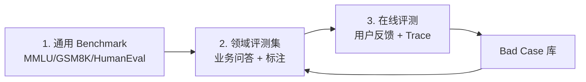
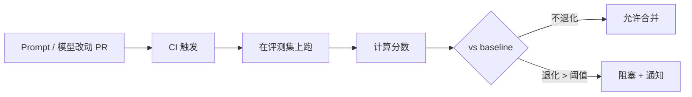
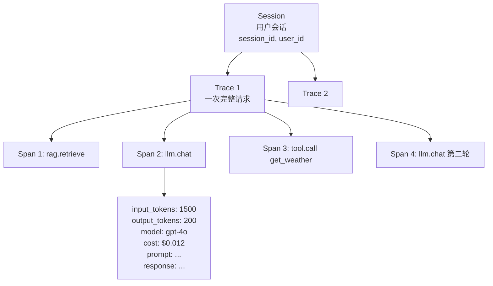
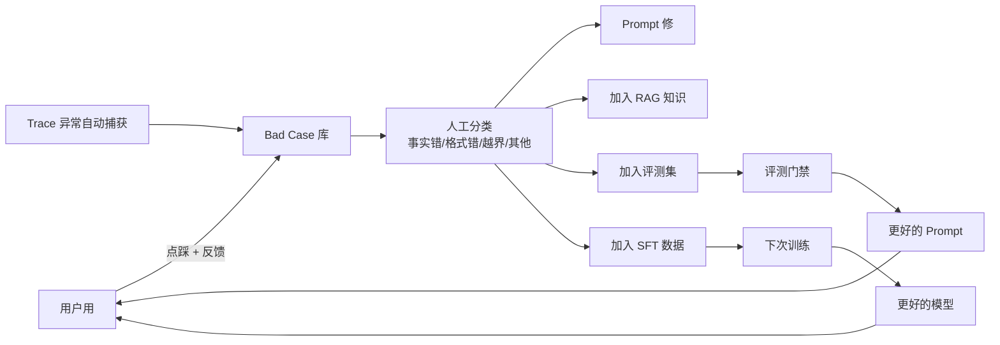
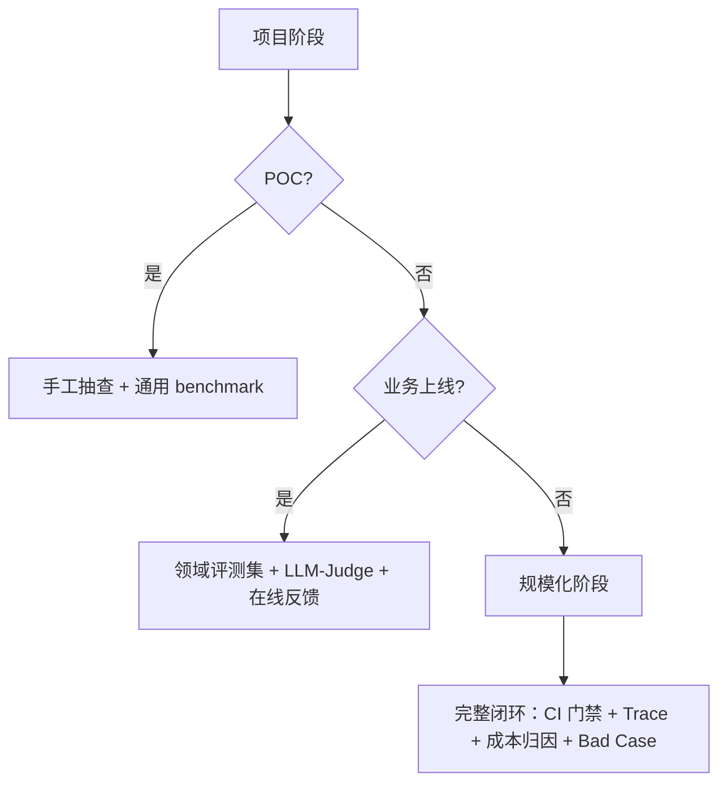

# 第 11 篇：评测与可观测

> 一句话导读：这篇要讲透——为什么 LLM 评测比传统软件难一个数量级（"正确答案"这件事都不一定存在）；LLM-as-Judge 的偏见类型与缓解；离线 / 在线评测各自能解决什么；Trace / Span 数据模型和传统 APM 的区别；Bad Case 收集到回流训练的完整闭环；TTFT / TPOT / Token 成本怎么归因到具体业务。读完你能落地一套"能撑生产"的评测+可观测方案，而不是只跑跑 benchmark 数字。

**前置阅读**：[第 02 篇：Prompt 工程](./02-prompt-engineering.md)、[第 09 篇：推理与部署](./09-inference-and-deployment.md)（性能指标）

**适合读者**：负责 LLM 应用质量的同学；要建评测体系 / 可观测体系的工程师；做 LLMOps 的人。

**篇幅说明**：约 1.2 万字，重原理 + 落地模板。

---

## 一、评测的根本难题：为什么 LLM 评测比传统测试难得多

### 1.1 传统软件测试的"幸福"

写个排序函数，测试就是：

```python
assert sort([3, 1, 2]) == [1, 2, 3]
```

输入和输出都是**确定的**。pass / fail 一刀切，CI 红绿一目了然。

### 1.2 LLM 测试的"地狱"

让模型"总结一篇文章"——同一个输入：

- 答案 A："文章讲了 X 和 Y"
- 答案 B："文章主要观点是 X，并以 Y 为例"
- 答案 C："这是一篇关于 X 的文章"

**三个都对**，可能用户偏好程度还不一样。**没有唯一正确答案**。

更糟糕：

- 同一模型同一输入两次输出不同（temperature > 0）
- 改一个 prompt 字符可能让效果天差地别
- 模型升级一版，部分场景变好部分变差，整体怎么衡量？
- 用户说"不好"——具体哪里不好？

这就是 LLM 评测的根本难题：**"质量"是一个主观、连续、多维的东西，没法 pass/fail**。

### 1.3 评测体系的三个层次



**图 1：评测体系三层级**

三个层次互补：

- **通用 Benchmark**：选模型、看通用能力是否退化
- **领域评测集**：业务场景质量打分、CI 门禁
- **在线评测**：真实用户行为数据，发现 benchmark 看不到的问题

> 重点：**只看 benchmark 上线的项目，几乎都会在生产翻车**。Benchmark 和真实业务分布差距大。

---

## 二、通用 Benchmark：选模型用，别迷信

### 2.1 主流 Benchmark 速览

**表 1：主流通用 Benchmark**

| Benchmark | 测什么 | 形式 | 备注 |
|---|---|---|---|
| **MMLU** | 57 学科多选题 | 选 A/B/C/D | 通用知识 |
| **C-Eval / CMMLU** | 中文学科 | 选项题 | 中文通用知识 |
| **GSM8K** | 小学数学 | 数值答案 | 推理能力入门 |
| **MATH** | 竞赛数学 | 文本答案 | 高阶推理 |
| **HumanEval** | Python 编程 | 函数补全 + 单元测试 | 代码能力 |
| **MBPP / BigCodeBench** | 编程 | 类似 | 代码 |
| **HellaSwag / ARC** | 常识推理 | 选项 | 常识 |
| **TruthfulQA** | 真实性 | 开放 | 抗幻觉 |
| **MT-Bench** | 多轮对话 | LLM-as-Judge | 综合对话能力 |
| **AlpacaEval / Arena-Hard** | 指令遵循 | 对比 | 综合 |
| **LMSYS Chatbot Arena** | 真人盲测 | Elo 评分 | **公认最权威的综合榜** |
| **LongBench / Needle in Haystack** | 长上下文 | 多种 | 长 context 能力 |

### 2.2 Benchmark 的四大坑

#### 坑 1：数据污染（Data Contamination）

模型训练数据里**已经包含**了 benchmark 的题目和答案——分数虚高。

举例：MMLU 在网上公开多年，新模型训练数据来自 Common Crawl，几乎一定包含 MMLU 题面。

判断方法：

- 看新出 benchmark（污染概率小）：MixEval、Live-CodeBench、Arena-Hard
- 用 Chatbot Arena 这种"真人盲测"——污染没用
- 自己出私有评测集

#### 坑 2：和业务分布脱节

MMLU 高 95 分的模型，未必能回答好你公司的客服问题。**Benchmark 只能筛掉"明显不行"的模型，不能选出"对你最好"的**。

#### 坑 3：单点指标误导

只看 MMLU 选模型，可能漏掉：

- 长上下文能力（LongBench 才能测）
- 工具调用准确率（BFCL 才测）
- 多语言（特别是中文要看 C-Eval / CMMLU / SuperCLUE）
- 安全性 / 价值观（要专门评测）

#### 坑 4：版本和实现差异

同一个 benchmark，不同实现（few-shot 数、prompt 格式、采样参数）跑出来分数能差 5~10 分。看分数时要看**同一份实现**的横向对比，别跨实现比。

> 经验：选模型时**至少看 3 个 benchmark + 1 个 Arena 类盲测榜 + 自己业务样本试用**。

---

## 三、领域评测集：业务质量的核心

### 3.1 怎么建

#### 步骤 1：构造覆盖真实分布的样本

| 来源 | 比例 | 备注 |
|---|---|---|
| 真实历史问题（脱敏） | 50%~70% | 反映真实分布，但容易缺边界 case |
| 业务专家手动构造 | 20%~30% | 专门覆盖边界 / 难 case |
| 反向 / 对抗 case | 10% | 攻击性、误导性输入 |

数量：**最低 200 条起步，1000~3000 条比较扎实**。

#### 步骤 2：标注"参考答案"或"评分维度"

两种思路：

- **有参考答案**（标准 QA、SQL 生成、信息抽取）：直接对比
- **无参考答案**（开放问答、写作、对话）：定义打分维度

打分维度示例（客服场景）：

| 维度 | 1 分 | 3 分 | 5 分 |
|---|---|---|---|
| 正确性 | 完全错 | 基本对 | 完全准确 |
| 完整性 | 缺重要信息 | 主要信息有 | 全面 |
| 风格 | 生硬 / 不专业 | 一般 | 专业 + 友好 |
| 安全 | 含违规 | - | 合规 |

#### 步骤 3：评分方式

- **人工评分**（金标准但贵）
- **规则匹配**（精确 / 包含 / 正则）
- **LLM-as-Judge**（用强模型打分）—— 下面专门讲

### 3.2 LLM-as-Judge：让 GPT-4 当裁判

#### 3.2.1 基本做法

把 (prompt, candidate, [reference]) 喂给一个强模型（GPT-4o / Claude 3.7），让它按维度打分：

```
你是评测员，按以下维度对回答打分（1~5）：
- 正确性
- 完整性
- 风格

问题：{prompt}
回答：{candidate}
参考答案：{reference}

输出 JSON：{"correctness": ?, "completeness": ?, "style": ?, "comment": "..."}
```

收益：可大规模、自动化、便宜（相对人工）。

#### 3.2.2 LLM-as-Judge 的偏见类型（必懂）

裁判模型本身有系统性偏见，**忽视这些偏见会让评分结果不可靠**：

**偏见 1：位置偏见（Position Bias）**

并排对比两个答案时，**哪个放前面就更容易被选**（GPT-4 略偏好第一个，部分模型偏好第二个）。

缓解：交换 A/B 位置各跑一次，结果一致才算数；或两次平均。

**偏见 2：长度偏见（Length Bias）**

裁判倾向给**更长的答案**更高分——即使长答案在重复或废话。

缓解：在 prompt 里明确"长度不应影响评分"；统计两边长度差异，差距过大单独审。

**偏见 3：风格偏见（Style Bias）**

裁判偏好和自己风格相似的回答（GPT-4 当裁判时更喜欢 GPT-4 风格的回答）。

缓解：用多个不同家族模型当裁判（GPT-4 + Claude + Gemini）取平均。

**偏见 4：自我偏好（Self-Preference）**

模型评自家产物时打分偏高。**不要用 GPT-4 给 GPT-4 评分**。

**偏见 5：数字偏见**

让裁判打 1~10 分，常常集中在 7~8——区分度差。

缓解：用更细的维度 + 强制差异化 prompt（"必须给出能区分两者的判断"）。

#### 3.2.3 LLM-as-Judge 的可靠性怎么验

LLM-as-Judge **不是天然可信的**，要验证它和人工评分的一致性：

```
1. 抽样 200~500 条
2. 同时让人工和 LLM-Judge 打分
3. 算 Spearman / Pearson 相关系数
4. 相关系数 > 0.7 才可大规模使用，否则调整 prompt 或换裁判
```

> 重点：**直接信 LLM-as-Judge 等于赌运气**。先验过相关性，再用它替代人工。

### 3.3 评测指标体系（按任务类型）

#### 3.3.1 RAG 评测

详见 [第 04 篇](./04-rag-part1-fundamentals.md)。核心是 **RAGAS** 四维：

- Faithfulness（答案是否扎根检索）
- Answer Relevance（答案相关性）
- Context Precision（检索精度）
- Context Recall（检索召回）

#### 3.3.2 Agent 评测

详见 [第 06 篇](./06-agent-part1-foundations.md)：

- 任务成功率
- 平均步骤数 / 成本
- 工具选择准确率（BFCL：Berkeley Function-Calling Leaderboard）
- 工具参数准确率
- 失败模式分布（卡死 / 工具错 / 幻觉）

#### 3.3.3 文本生成评测

| 类型 | 指标 |
|---|---|
| 翻译 | BLEU / chrF / COMET |
| 摘要 | ROUGE-1/2/L / BERTScore |
| 开放问答 | LLM-as-Judge / 人工 |
| 代码 | pass@k（生成 k 个候选，至少 1 个通过单元测试的概率） |

> 注：BLEU / ROUGE 这类**基于 n-gram 重合**的指标，对 LLM 时代生成评测越来越力不从心——好答案不一定字面重合。**优先用 BERTScore（语义相似）或 LLM-as-Judge**。

### 3.4 CI 评测门禁：让评测变成红绿灯



**图 2：CI 评测门禁**

要点：

- 每次 prompt / 模型 / 检索改动都跑评测
- 设定退化阈值（如关键指标不允许下降 > 2%）
- 报告对比表（哪些 case 改善 / 哪些退化）
- 评测集本身要版本管理（Git 管理 YAML/JSON）

---

## 四、在线评测：真实用户的反馈

### 4.1 显式反馈

| 形式 | 收集率 | 噪声 |
|---|---|---|
| 点赞 / 点踩 | < 5% | 中 |
| 5 星评分 | < 1% | 中 |
| 修改建议 | < 0.5% | 低（高质量） |
| 文字反馈 | < 1% | 低 |
| 举报 / 投诉 | < 0.1% | 低 |

设计要点：

- 按钮要明显但不打扰
- 点踩后弹"原因选项"（事实错 / 风格差 / 跑题 / 其他）
- 修改建议要鼓励（"帮我们改进"）

### 4.2 隐式反馈（往往更有价值）

| 信号 | 含义 |
|---|---|
| 用户立刻追问"你说错了" | 强负反馈 |
| 用户复制了答案 | 强正反馈 |
| 用户停留时长 | 中等信号 |
| 用户提早终止流式 | 负信号 |
| 用户切人工客服 | 强负反馈 |
| 用户重复问同一问题 | 负信号 |
| 多轮深入追问 | 正信号（在帮上忙） |

实施：

- 前端埋点（复制、停留、终止流式、切人工）
- 服务端会话分析（重复问、轮数）
- 离线归因（这次 LLM 输出导致了什么用户行为）

> 经验：**隐式反馈数据量是显式的 100 倍以上**，价值往往更大。设计阶段就该埋好。

---

## 五、Trace / 可观测：和传统 APM 不一样在哪

### 5.1 为什么传统 APM 不够

传统 APM（New Relic、Datadog APM、SkyWalking）追踪 HTTP / RPC / DB 调用——LLM 应用的"内部"是它看不到的：

- Prompt 长什么样？输入了多少 token？
- 模型选了哪个 token？为什么选这个？
- Agent 走了几步循环？哪一步用了多少时间？
- 工具调用参数怎么填的？返回了多少 token？

**LLM 应用需要"特化的 APM"——LLM 可观测平台**。

### 5.2 LLM Trace 数据模型

OpenTelemetry GenAI / OpenLLMetry 等正在推标准化。核心数据模型：



**图 3：LLM Trace 三级数据模型**

每层关注点：

- **Session（会话）**：跨 trace 的用户级行为分析、会话时长、轮数
- **Trace（请求）**：一次完整请求的完整链路、总成本、总耗时
- **Span（步骤）**：单步细节（LLM 调用 / 工具 / 检索），含完整 prompt / response

### 5.3 主流 LLM 可观测平台

**表 2：LLM 可观测平台对比**

| 平台 | 类型 | 特色 | 适合 |
|---|---|---|---|
| **LangSmith** | 商业 | LangChain 原生集成 | 用 LangChain 的项目 |
| **Langfuse** | 开源 | 自部署、功能全 | 大多数自部署项目 |
| **Helicone** | 开源 + 商业 | 网关 + 监控一体 | OpenAI 兼容场景 |
| **Phoenix** | 开源 | Arize AI 出品，重评测 | 评测 + 监控一体 |
| **Honeycomb / Datadog LLM Observability** | 商业 | APM 厂商扩展 | 已用其平台的企业 |
| **OpenTelemetry GenAI** | 标准 | 厂商无关 | 不绑定厂商 |
| **自研** | - | 完全可控 | 大厂 / 强定制 |

> 推荐：**中小项目从 Langfuse 自部署起步**，成熟后看是否需要更专业平台。

### 5.4 必须采集的字段

| 类别 | 字段 |
|---|---|
| 请求标识 | trace_id, span_id, parent_span_id, session_id, user_id, tenant_id |
| 模型 | model, version, provider |
| 内容 | system_prompt, messages, response, tool_calls |
| Token | input_tokens, output_tokens, cached_tokens |
| 成本 | cost_usd（按 model 价格表算） |
| 性能 | ttft_ms, tpot_ms, total_ms, queue_ms |
| 状态 | status, error_code, error_msg |
| 反馈 | thumbs_up, comment, copied, abandoned |

### 5.5 PII 与采样

完整 prompt / response 留痕的两个矛盾：

**矛盾 1：合规**——含 PII 的 prompt 不能明文存
**矛盾 2：成本**——全量采集存储贵

策略：

- **PII 脱敏后存原文**（电话、身份证、邮箱等替换 / 哈希）
- **分级采样**：错误请求 100% 采、慢请求 100% 采、其余按比例（10~30%）
- **反馈相关请求 100% 采**：用户点踩的请求必留全量
- **日志生命周期**：30 天热存 + 1 年冷存 + 之后只留指标

---

## 六、成本可观测：钱去哪了

### 6.1 Token 不等于钱：成本归因模型

每次 LLM 调用的成本：

```
cost = input_tokens × price_in + output_tokens × price_out
       (cached_tokens × price_cached  # 部分模型有缓存价)
```

不同模型差几十倍：

| 模型 | 输入 $/1M | 输出 $/1M | 备注 |
|---|---|---|---|
| GPT-4o-mini | 0.15 | 0.6 | 便宜小模型 |
| GPT-4o | 2.5 | 10 | 主力 |
| Claude 3.5 Sonnet | 3 | 15 | 高质量 |
| Claude 3 Opus | 15 | 75 | 旗舰旧版 |
| 自部署 Qwen 72B | ~ 0.05 等效 | ~ 0.1 等效 | 算电+折旧 |

> 价格参考为 2025 中数量级，实际以官网为准。

### 6.2 多维度归因

光知道总成本没用，要能归因到：

| 维度 | 用途 |
|---|---|
| 按用户 / 租户 | 计费、识别滥用 |
| 按业务 / 接口 | 哪个产品花钱多 |
| 按模型 | 评估贵模型 ROI |
| 按 prompt 模板 | 哪个 prompt 浪费 token |
| 按 Agent 步骤 | 哪个工具消耗大 |
| 按时段 | 高峰 / 异常 |

### 6.3 异常检测和告警

- **个体异常**：某用户 1 小时消耗 = 平均的 100 倍 → 限流或封
- **整体异常**：某日成本 = 7 日均值的 3 倍 → 排查
- **prompt 异常**：某 prompt 模板平均 token 数翻倍 → 检查最近改动
- **Agent 异常**：单次 trace 步数 > 30 → 死循环风险

### 6.4 成本优化抓手（按 ROI 排序）

| 抓手 | 节省幅度 | 实施成本 |
|---|---|---|
| 模型分级路由（小模型先试） | 30~70% | 中 |
| 精确 / 语义缓存 | 20~50% | 低 |
| Prefix Caching（推理引擎层） | 10~40% | 低 |
| Prompt 精简（删冗余） | 10~30% | 低 |
| Batch API（离线场景） | 50% | 低 |
| 自部署量化模型 | 70~90% | 高 |
| 工具描述精简（少塞 schema） | 5~20% | 低 |

> 实战：**先做 Prompt 精简 + 缓存 + 模型分级**，这三件事 ROI 最高。

---

## 七、Bad Case 闭环：评测的"飞轮"



**图 4：Bad Case 闭环**

实施要点：

- **入库门槛低**：用户反馈 / Trace 自动识别异常都能入
- **分类标准化**：事实错、格式错、风格差、安全问题、性能问题（每个对应不同修复路径）
- **修复跟踪**：每条 Bad Case 关联一个修复 PR / Issue，关闭前必须通过验证
- **回归保护**：修过的 Case 进评测集，下次回归

> 经验：**长期投入 Bad Case 闭环的项目，3 个月后效果提升远超"频繁换模型"的项目**。

---

## 八、A/B 测试与影子流量

### 8.1 A/B 测试

```
新 prompt v2 上线：
  分流 10% 流量到 v2，90% 留 v1
  跑 7 天，看：
    - 任务成功率（业务定义）
    - 用户满意度（点赞率 / 投诉率）
    - 成本（token 用量）
    - 性能（TTFT、TPOT）
  v2 显著好 → 放量 50% → 100%
  v2 没差 → 撤回 / 继续优化
```

设计要点：

- **分流要稳定**（同一用户始终在一个桶里，不要切换桶）
- **样本量足够**（小流量看不出差异，至少几千次会话）
- **多指标评估**（成功率涨了但成本翻倍可能不值得）

### 8.2 影子流量（Shadow Traffic）

新模型 / 新 prompt 上线前，先用**真实流量影子跑**：

```
用户请求 → 主链路（v1）→ 返回用户
        ↘ 影子链路（v2）→ 不返回，仅记录
```

收益：

- 真实分布下评估，比离线评测集更准
- 不影响用户
- 能跑量大（全量影子）

代价：

- 多花一份 token 钱
- 影子链路如果调用工具要小心副作用（写工具不能影子！）

> 重点：**影子流量是模型升级前的最佳验证手段**，比 A/B 更早暴露问题。

---

## 九、踩坑提醒

### 坑 1：只跑 benchmark 上线，业务翻车

- **现象**：选了 MMLU 90 分的模型，业务上线发现用户投诉激增。
- **原因**：MMLU 测试分布和业务完全不同。
- **规避方法**：选模型至少跑 3 个 benchmark + Arena 盲测榜 + 200 条业务样本试用；上线前做影子流量。

### 坑 2：LLM-as-Judge 直接信，结果不可靠

- **现象**：用 GPT-4o 给自家答案打分，分数都很高，但用户实际满意度低。
- **原因**：自我偏好 + 没验过和人工的相关性。
- **规避方法**：抽样 200 条人工 vs LLM-Judge 对比，相关系数 > 0.7 才用；多裁判（不同家族）取平均；明确禁止用同家族当裁判。

### 坑 3：Trace 全量采集 PII 上线被合规叫停

- **现象**：Langfuse 接入后被法务发现存了用户身份证号。
- **原因**：没在采集层做脱敏。
- **规避方法**：采集 SDK 层做 PII 检测和脱敏；定义敏感字段白名单 / 黑名单；定期合规审查；和法务 / 安全提前沟通方案。

### 坑 4：评测集和真实分布脱节

- **现象**：评测集分数提升了 5%，但用户反馈没变化。
- **原因**：评测集都是"简单 case"，真实流量难度更高。
- **规避方法**：评测集中真实历史问题占大头（≥ 50%）；定期用最新流量补充评测集；分层评测（简单 / 中等 / 困难分别看）。

### 坑 5：成本异常没监控，月底炸账单

- **现象**：开发同学接了一个 Agent 死循环，跑了 10 万次 GPT-4o，月底多账单 5 万美元。
- **原因**：没有 token 用量异常告警。
- **规避方法**：分多维度（用户 / 接口 / 模型）的实时成本监控；设硬上限（单用户 / 单接口日预算）；超过自动熔断；告警先行（达到 50%、80%、100% 阈值分级）。

### 坑 6：A/B 分流没做稳定，数据全乱

- **现象**：跑了一周 A/B，结论模糊，因为同一用户在 A 和 B 之间反复跳。
- **原因**：分流用了随机数，没用稳定哈希（user_id）。
- **规避方法**：分流键用 hash(user_id) % 100，保证同用户始终在一个桶；分流配置要版本化，避免中途调整影响数据。

### 坑 7：影子流量误调写工具

- **现象**：影子跑 v2 时居然真的发了邮件。
- **原因**：影子链路忘记屏蔽副作用工具。
- **规避方法**：影子模式下所有写工具自动 Mock；专门 Code Review 检查副作用工具；用专门的"dry run"标志区分。

---

## 十、选型建议与实践要点

### 10.1 评测体系建设决策



**图 5：评测体系建设阶段**

### 10.2 上线 Checklist

- [ ] 领域评测集：≥ 200 条，覆盖真实分布
- [ ] LLM-as-Judge 已验证与人工相关性
- [ ] Trace 接入：全量采（带采样策略）
- [ ] PII 脱敏：在采集层完成
- [ ] 反馈按钮：UI 上明显，记录原因选项
- [ ] 隐式反馈埋点：复制 / 停留 / 终止流 / 切人工
- [ ] 成本归因：按用户 / 接口 / 模型至少三维
- [ ] 异常告警：成本 / 错误率 / 步骤数死循环
- [ ] CI 评测门禁：prompt / 模型改动必跑
- [ ] Bad Case 库：闭环流程定义清楚

> 参考数据：投入 1 个工程师月把"评测 + 可观测"基础盘做扎实，**长期效果优化效率会提升 3~5 倍**——因为每次改动都能"看见"效果，而不是凭直觉。

---

## 十一、延伸阅读

- 系列内：
  - [第 04 篇：RAG 上篇](./04-rag-part1-fundamentals.md)（RAGAS 评测）
  - [第 06 篇：Agent 上篇](./06-agent-part1-foundations.md)（Agent 评测）
  - [第 08 篇：应用框架](./08-frameworks-and-engineering.md)（AI 网关 + Bad Case 接入）
- 外部参考（注明发表时间）：
  - LMSYS Chatbot Arena 论文与排行榜（持续更新）
  - 论文《Judging LLM-as-a-Judge with MT-Bench and Chatbot Arena》（Zheng et al., 2023）
  - OpenTelemetry GenAI Semantic Conventions（持续演进）
  - Langfuse 官方文档（最后访问 2025）
  - LangSmith 官方文档（最后访问 2025）
  - 论文《Holistic Evaluation of Language Models (HELM)》（Liang et al., 2022）

---

## 附：本篇覆盖的知识点清单

来自原清单第 11 章 + 第 16.4 节，每条扩展原理：

- [x] 评测的根本难题（开放性 / 主观 / 多维 / 不可重复）
- [x] 三层评测体系（通用 benchmark / 领域评测 / 在线评测）
- [x] 主流 benchmark：MMLU / C-Eval / GSM8K / MATH / HumanEval / MT-Bench / Arena / LongBench / TruthfulQA / BFCL
- [x] Benchmark 四大坑（污染 / 脱节 / 单点 / 实现差异）
- [x] 领域评测集构建（采样 / 标注 / 评分维度）
- [x] LLM-as-Judge 五种偏见（位置 / 长度 / 风格 / 自我 / 数字）+ 可靠性验证
- [x] BLEU / ROUGE / BERTScore / pass@k 等任务专属指标的适用与局限
- [x] CI 评测门禁流程
- [x] 显式 vs 隐式用户反馈
- [x] LLM Trace 三级数据模型（Session / Trace / Span）
- [x] OpenTelemetry GenAI / Langfuse / LangSmith / Helicone / Phoenix / Datadog
- [x] PII 脱敏 + 采样策略
- [x] 成本归因（六维：用户 / 业务 / 模型 / Prompt / 步骤 / 时段）
- [x] 成本异常检测 + 优化抓手 ROI 排序
- [x] Bad Case 闭环（采集 → 分类 → 修复 → 回归）
- [x] A/B 测试与影子流量（含写工具屏蔽）
