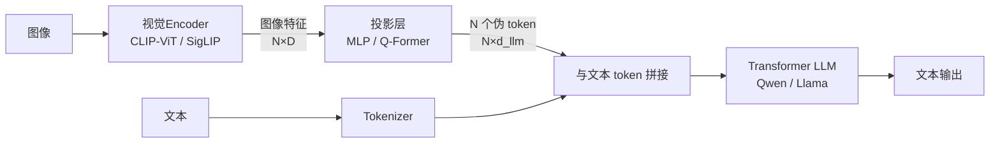
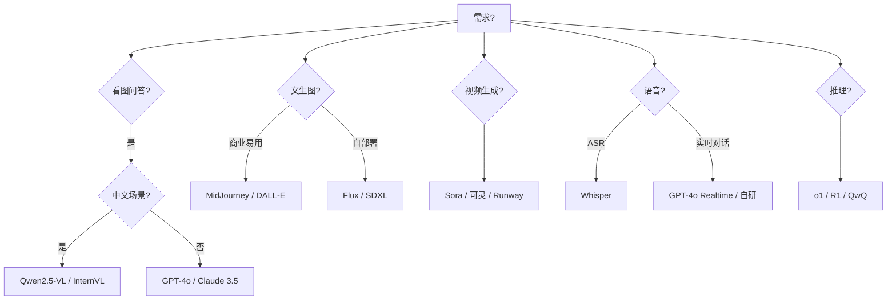

# 第 13 篇：多模态与前沿

> 一句话导读：这篇要讲透——多模态怎么"塞"进 Transformer（视觉 encoder + 投影层 + LLM 拼接的真实结构）；早 / 中 / 晚融合的本质差异；扩散模型与自回归生成在数学目标上的根本分别；OpenAI o1 / DeepSeek-R1 这类"推理模型"靠什么 RL 训练范式产生的；世界模型 / AGI / Embodied AI 这些前沿名词到底意味着什么。读完你能从架构层面看明白多模态模型在做什么、前沿研究的脉络，而不只是看报告吹牛。

**前置阅读**：[第 01 篇：大模型基础](./01-llm-basics.md)（Transformer / 注意力）

**适合读者**：要做多模态应用的工程师；想理解 o1 / R1 这类推理模型背后机制的人；关注 LLM 之外前沿方向的人。

**篇幅说明**：约 1.1 万字，重原理直觉，不拘泥具体公式。

---

## 一、多模态：把"非文本"塞进 LLM

### 1.1 核心问题：模态之间没有通用语言

文本 LLM 的世界很简单——输入输出都是 token 流。多模态要解决的根本问题：

> **图像 / 音频 / 视频和文本 token 不是同一种东西，怎么让 Transformer 处理它们？**

主流答案：**用专门的 encoder 把非文本转成"伪 token"，再拼到文本 token 流里**。所有现代多模态模型几乎都是这一路。

### 1.2 视觉 LLM 的典型架构

以 LLaVA / Qwen-VL / GPT-4V 这类视觉 LLM 为例：



**图 1：视觉 LLM 的"三段式"架构**

三个核心组件：

#### 组件 1：视觉 Encoder

把图像转成特征向量。最常用：

- **CLIP ViT**（OpenAI）：用 4 亿图文对训练的 ViT，特征空间天然和文本"对齐"
- **SigLIP**（Google）：CLIP 的改进，用 sigmoid loss 替代 softmax，效果更好
- **EVA-CLIP / DFN-CLIP** 等改进版

为什么用 CLIP 类 Encoder：因为它在训练时**已经学过把图像和文本特征对齐**——LLaVA 接上 LLM 时不用从零学跨模态对齐。

#### 组件 2：投影层（连接器）

把 ViT 输出的特征（比如 576×1024）投影到 LLM 的 embedding 维度（比如 4096）。两种主流做法：

- **MLP（最简单）**：两层 MLP，简单粗暴，LLaVA 用这个
- **Q-Former（BLIP-2 提出）**：用一组可学习的"query" 注意力压缩图像特征到固定数量 token

实证：训练数据足够时**简单 MLP 就够**，Q-Former 收益不明显。LLaVA 系列、Qwen-VL 用 MLP 系，BLIP-2 系用 Q-Former。

#### 组件 3：LLM 主体

照常的文本 Transformer。**接收图像伪 token + 文本 token 的拼接序列**，注意力机制统一处理。

输入序列示意：

```
[图像伪token1][图像伪token2]...[图像伪tokenN][用户问题token1][用户问题token2]... → [回答]
```

### 1.3 早 / 中 / 晚融合：本质差异

多模态融合按"模态什么时候相互看"划分：

| 类型 | 怎么融 | 特点 | 例子 |
|---|---|---|---|
| **晚融合（Late Fusion）** | 各模态分别处理出特征向量，最后一层拼接做决策 | 简单、模态独立性强、效果有限 | 早期检索系统 |
| **中融合（Middle Fusion）** | 共享 Transformer 处理"伪 token 化"后的多模态序列 | **目前主流**，效果好 | LLaVA / Qwen-VL / GPT-4V |
| **早融合（Early Fusion）** | 在原始输入层就把模态混合（统一 tokenizer） | 上限高、训练难、需大规模重新训练 | Gemini / 4o（部分原生多模态） |

#### 为什么从晚融合到早融合是"上限提升"

- 晚融合：模态间只能浅层交互，复杂跨模态推理（比如"图里第二个红色物体右边那个是什么"）难
- 中融合：注意力机制让每层都能跨模态交互，能力强很多
- 早融合：从最底层就是统一表示，**理论上限最高**——但需要从头训练一个原生多模态模型，成本巨大

GPT-4o、Gemini 1.5 这类"原生多模态"模型走的是早融合方向——它们能直接接受图像 / 音频 / 视频混合输入并直接输出多模态。

### 1.4 多模态训练的几个阶段

LLaVA 风格训练通常分两步：

**阶段 1：预训练投影层（冻结其他）**

- 数据：海量图文对
- 训练：仅投影层
- 目标：让 ViT 输出能"翻译"成 LLM 能理解的伪 token
- 不动 ViT 和 LLM——它们已经各自训练好

**阶段 2：指令微调（端到端 SFT）**

- 数据：图文指令对（"看这张图，描述..."）
- 训练：投影层 + LLM（ViT 仍冻结或小学习率微调）
- 目标：让模型学会"看图说话""看图回答问题""看图执行指令"

> 训练量级：阶段 1 几百万对，阶段 2 几十万到一百万指令对，**比从头训练 LLM 便宜几个数量级**。这就是为什么 LLaVA 风格能让小团队做出可用的多模态模型。

### 1.5 视觉 LLM 的能力边界

**能做得好**：

- 看图描述
- 看图问答（VQA）
- OCR + 文档理解
- 图表理解
- 看 UI 截图操作（GUI Agent 基础）

**还困难**：

- 精准计数（数图里有几个人）
- 精确空间位置（坐标级）
- 高分辨率细节（小字、远处物体）—— 部分模型用"切图"策略缓解
- 多帧时序推理（视频理解，依赖切帧 + 上下文长度）

#### 高分辨率切图策略

原生 ViT 输入分辨率有限（CLIP 224×224 / SigLIP 384×384）。看高分辨率图片需要切图：

```
4K 图片 → 切成 16 个 ~448×448 sub-image
每个 sub-image 过 ViT → 各自得到一组伪 token
全部拼到序列里给 LLM
```

代价：上下文 token 数线性增长。看一张 4K 图可能消耗几千 token。

主流模型的切图策略：

- LLaVA-1.5/Next：2×2 切图
- Qwen2-VL：动态分辨率（按图比例切）
- GPT-4V：详细模式 vs 低细节模式（控制切图数量）

---

## 二、其他模态：语音 / 视频 / 3D

### 2.1 语音

ASR（Automatic Speech Recognition，语音转文字）和 TTS（Text-to-Speech，文字转语音）传统是独立模型，现在正在和 LLM 融合：

#### 2.1.1 语音输入

- **Whisper（OpenAI）**：通用 ASR 模型，多语言强，开源
- **GPT-4o / Gemini 原生语音**：直接把音频 token 化输入 LLM，不需要先转文字
  - 收益：保留语调 / 情绪 / 停顿信息
  - 难点：音频 token 化方案（VQ-VAE / 离散编码）

#### 2.1.2 语音输出

- **传统 TTS**：Tacotron / FastSpeech / VITS
- **神经声码器**：HiFi-GAN / WaveNet
- **LLM 一体化**：直接生成音频 token

#### 2.1.3 实时语音对话

GPT-4o 的实时语音模式让端到端延迟降到 ~300ms（人类对话级）。技术关键：

- 端到端建模（不再 ASR → LLM → TTS 三段）
- 流式 token 化与生成
- 双工（同时听 + 说）支持打断

### 2.2 视频

视频理解 = 多帧图像 + 时序：

- **抽帧法**（最常见）：每秒抽 1~4 帧，每帧当图像处理；时序用 LLM 上下文承载
- **视频 Encoder**：VideoMAE / TimeSformer 等专门处理时序
- **流式视频**：实时处理直播流的研究还在早期

挑战：长视频上下文爆炸（1 小时视频抽帧 ≈ 几万 token）。**长上下文 + 切片处理**是实用路径。

### 2.3 3D / 点云 / 机器人

- **3D 视觉**：Point-LLM、3D-LLaVA 等把点云作为输入
- **Vision-Language-Action（VLA）模型**：RT-1/RT-2/Open-X，把机器人动作也当 token 学
- **世界模型**：从视觉输入预测未来帧（预测下一帧 = 机器人版"下一 token 预测"）

详见后面"前沿"章节。

### 2.4 主流多模态模型一览

**表 1：主流多模态模型（2025）**

| 模型 | 模态 | 特色 | 开源 |
|---|---|---|---|
| GPT-4o / GPT-4V | 文 / 图 / 音 | 综合最强 | 否 |
| Gemini 1.5/2.0 | 文 / 图 / 音 / 视频 | 长上下文（1M+） | 否 |
| Claude 3.5/3.7 Sonnet | 文 / 图 | 视觉推理强 | 否 |
| Qwen2-VL / Qwen2.5-VL | 文 / 图 / 视频 | 国产开源最强 | 是 |
| LLaVA-Next | 文 / 图 | 学术开源主流 | 是 |
| InternVL 2/3 | 文 / 图 | 商汤系，性能强 | 是 |
| Pixtral | 文 / 图 | Mistral 多模态 | 是 |
| Whisper（v3） | 语音 → 文 | ASR 业界标杆 | 是 |
| SAM 2 | 图 / 视频分割 | 视觉基础模型 | 是 |

---

## 三、生成模型：扩散 vs 自回归的根本差异

文本 LLM 是**自回归（AR）**——一个 token 一个 token 生成。但图像 / 视频生成主流是**扩散模型（Diffusion）**。两者数学目标不同。

### 3.1 自回归生成（AR）

```
P(x_1, x_2, ..., x_n) = ∏ P(x_i | x_<i)
```

逐个生成，每个新 token 依赖之前所有 token。**适合离散序列**（文本、代码）。

### 3.2 扩散生成

#### 3.2.1 直觉

```
正向：清晰图像 →[加噪声]→ 越来越糊 →[加噪]→ 完全噪声
反向：完全噪声 →[去噪]→ 模糊 →[去噪]→ 清晰图像
```

训练目标：让模型学会**"给定一个糊掉的图，预测原图（或噪声）"**。

生成时：从纯随机噪声出发，反复迭代去噪 N 步（典型 20~100 步），最终得到一张图。

#### 3.2.2 为什么图像生成扩散模型胜出

- 图像是**连续值**，每个像素 0~255 的浮点——扩散模型天然处理连续空间
- 全局结构 vs 局部细节——扩散每步都看整张图，不会像自回归那样"前面错后面跟着错"
- 质量上限更高（FID 等指标长期 SOTA）

#### 3.2.3 主流扩散架构

- **DDPM** → **Stable Diffusion (Latent Diffusion)** → **SDXL / SD3** → **Flux**
- **DiT（Diffusion Transformer）**：用 Transformer 替代 U-Net 当骨干（Sora、SD3、Flux 都用）
- **Latent Diffusion**：先把图压到 latent 空间（VAE）再扩散，省算力

### 3.3 视频生成

视频 = 图像 + 时序，主流也是扩散：

- **Sora（OpenAI）**：DiT 骨干，把视频切成 spacetime patches 当 token，扩散去噪
- **可灵（快手）/ Runway Gen-3 / Pika / Luma / Kling**：商业产品
- **Wan / HunyuanVideo / 混元**：国产开源

**世界模型方向**：把视频生成看作"对物理世界的模拟"——给定开头几秒，预测后续。这是通向 AGI / 机器人的潜在路径。

### 3.4 自回归图像生成的回归

最近（2024-2025）自回归图像生成又被关注：

- **Parti / Chameleon（Meta）/ 4o 原生图像**：把图像 token 化（VQ-VAE），用自回归生成
- **LlamaGen / Emu3**：开源版本

收益：**和文本统一架构**——同一个 Transformer 既生成文本又生成图像。
代价：**速度慢**（自回归一个 token 一个 token），质量目前不如顶级扩散模型。

> 长期方向：早期融合 + 自回归图像生成统一架构是大势所趋；扩散模型在专门领域仍有优势。

---

## 四、推理模型：o1 / R1 范式

2024-2025 一个重要新方向：**推理模型（Reasoning Models）**——OpenAI o1、DeepSeek-R1、Qwen QwQ 等。

### 4.1 它和普通 Chat 模型有啥区别

普通 Chat 模型：

```
用户问 → 模型立刻回答
```

推理模型：

```
用户问 → 模型先内部"思考"（生成大量推理 token）→ 给出最终答案
```

效果上：在数学（AIME）、编程（Codeforces）、科学（GPQA）等需要严谨推理的任务上**显著优于同尺寸普通模型**。

### 4.2 关键技术：RL 训练 + 长 CoT

#### 4.2.1 训练范式（DeepSeek-R1 论文揭示的核心）

传统 SFT + DPO：教模型"模仿好答案"。
o1 / R1 风格：用 RL 让模型**自己摸索"怎么推理"**。

简化流程：

```
1. 给一批可验证答案的题（数学题/代码题）
2. 模型生成完整 CoT + 最终答案
3. 用规则验证答案对错（数学：答案 == 标答；代码：单元测试通过）
4. 答对的样本 reward 高，答错低
5. 用 GRPO（DeepSeek 提出，类似 PPO 简化版）更新模型
6. 重复
```

关键点：**没有 reward model，用确定性规则给 reward**——避免 reward hacking。

训练过程中**模型的 CoT 长度会自发增长**——从几百 token 涨到几千上万 token，且会出现"反思"、"验证"、"换思路"等行为。这不是被人工标注教的，是 RL 自己学出来的。

#### 4.2.2 为什么 RL + 可验证 reward 这么有效

- 数学 / 代码题有**客观对错**——reward 信号干净
- 模型尝试不同 CoT 路径，**对的路径被强化**
- 长 CoT 给了模型"思考空间"——比一步出答案有更多机会改正

#### 4.2.3 R1-Zero 的特殊价值

DeepSeek-R1-Zero 直接从 base 模型纯 RL 训练（没经过 SFT），证明了：

- **不需要 CoT 数据标注**——RL 能让模型自己学会推理
- **基础能力 + 验证机制 = 推理能力涌现**

但 R1-Zero 输出可读性差（语言混乱、跳步），实用版本（R1）在 RL 之外加了少量 SFT 修语言。

### 4.3 推理模型的代价和适用

代价：

- **推理时延极长**（一次回答可能 10s~5min）
- **token 成本高**（思考 token 都要算钱）
- **不适合所有任务**——闲聊、客服等不需要深度推理的场景反而拖累体验

适用：

- 数学 / 科学问题
- 编程难题
- 复杂规划（多步骤策略）
- 严谨论证 / 法律 / 学术

### 4.4 工程上怎么用

OpenAI 把 o1 系列定位为"难题专家"，常见实践：

- **路由**：简单问题走 GPT-4o，难题路由到 o1
- **Agent 中作为"规划器"**：复杂规划用 o1，工具调用用 GPT-4o
- **隐藏思考过程**：UI 上只展示最终答案（OpenAI 默认隐藏 CoT）
- **预算控制**：限制最大思考 token 数

---

## 五、Agent 与 Embodied AI：从聊天到行动

### 5.1 GUI Agent / Computer Use

让模型直接操作电脑界面（看屏幕截图 + 控制鼠标键盘）：

- **Anthropic Computer Use**（2024.10）：Claude 3.5 看屏幕 + 操作
- **OpenAI Operator**（2025）：浏览器内 agent
- **Browser Use** / **AutoGLM** / **CogAgent** 等开源方向

技术关键：

- 视觉 LLM 看 UI 截图理解界面
- 输出鼠标点击坐标 / 键盘输入
- 多步骤循环（每步看屏幕、做动作、再看反馈）

挑战：

- 精确坐标（高分辨率屏 + 视觉模型分辨率限制）
- 复杂操作（拖拽、双击、键盘组合）
- 错误恢复（误点了怎么办）
- 安全（避免 Indirect Injection 通过网页诱导误操作——详见第 12 篇）

### 5.2 机器人 / Embodied AI

把 LLM / VLM 能力延伸到物理世界：

- **VLA 模型（Vision-Language-Action）**：Google RT-2、Open-X、Figure 01/02 等
- 输入：相机图像 + 自然语言指令
- 输出：机械臂 / 移动底盘的动作 token

### 5.3 世界模型 / Embodied 路径

"世界模型"是 LeCun、OpenAI 等人提的方向：

> AGI 需要一个能"模拟物理世界"的内部模型——给定当前状态和动作，预测下一状态。

流派：

- **生成式世界模型**：Sora 类视频生成模型当作世界模拟器
- **JEPA（LeCun）**：联合嵌入预测架构，不在像素空间预测，在 latent 空间预测
- **DreamerV3**：模型基础的强化学习

进展和争议：

- 视频生成模型的"物理一致性"还远不够（手指错位、物体穿透等）
- 仍是研究方向，距离生产应用有距离

---

## 六、其他前沿方向

### 6.1 混合专家（MoE）

详见第 01 篇。MoE 已经成为主流大模型的常见架构（DeepSeek-V3、Mixtral、Qwen2.5-MoE、GPT-4 传闻）：

- 同等"激活参数"成本，参数总量更大
- 推理时只激活部分 expert
- 训练与负载均衡技巧成熟（auxiliary loss-free 等新方法）

### 6.2 Mamba / State Space Models（SSM）

挑战 Transformer 的方向：

- **Mamba / Mamba 2**：选择性状态空间模型，训练 O(n)、推理 O(1) 状态
- 优势：线性复杂度，长序列优势
- 现状：在中等规模下能匹敌 Transformer，超大规模下不如 Transformer
- **混合架构**：Jamba（Mamba + Transformer）等是实用折中

### 6.3 长上下文 / 无限上下文

技术演化：

- 2023：4K 主流
- 2024：128K~1M（Gemini 1.5 Pro 1M / 2M）
- 2025：原生 10M+ 上下文出现

技术：

- 位置编码扩展（RoPE 系列、YaRN）
- 稀疏注意力（Sliding Window、Strided）
- 分层 / 检索增强（用 RAG 模拟无限上下文）

但**长上下文不等于长上下文用得好**——典型 NIAH（Needle in a Haystack）测试中，长上下文模型在中段位置经常"遗忘"细节。生产用法仍需 RAG 配合。

### 6.4 模型小型化与本地化

- **小语言模型（SLM）**：Phi-3.5（Microsoft）、Qwen2.5-3B、Llama 3.2-1B/3B
- 端侧推理：手机 NPU / Apple Silicon 直跑 7B 模型
- 应用：隐私敏感场景、离线、超低延迟

### 6.5 Test-Time Compute Scaling

新 Scaling Law：**推理时多花算力也能提升效果**——不只是训练时 scaling。

具体方法：

- 多次采样投票（self-consistency）
- 思维树搜索（ToT）
- 推理模型的长 CoT
- Best-of-N 采样

意义：**模型大小不再是唯一变量**——同一个模型，多花推理算力可以达到更好效果。

### 6.6 自我改进与递归迭代

- **Self-Reward 训练**：模型自己给自己当 reward model
- **Self-Play**：模型对抗自身生成更难数据
- **持续自学习**：在线增量学习

这些方向把"训练 - 推理"的边界打破，是通往更通用 AI 的潜在路径。

### 6.7 AGI / 通用人工智能

行业大致共识：

- **当前不是 AGI**——LLM 在某些任务超人类，在某些任务不如儿童
- **路径不清楚**——纯 scaling、推理模型、世界模型、Embodied 哪条对，没定论
- **时间表分歧大**——从"几年内"到"几十年"都有专家持有

工程角度：**别等 AGI**，就用现有模型把业务做好。AGI 真到了，再调整也来得及。

---

## 七、踩坑提醒

### 坑 1：直接给视觉 LLM 4K 图当输入，token 爆炸

- **现象**：调 GPT-4V 看一张高分辨率截图，单次请求消耗几千 token，成本和延迟都炸。
- **原因**：高分辨率切图策略默认开，token 数线性涨。
- **规避方法**：图像预处理（压缩 / 裁剪到必要区域）；用"低细节"模式（GPT-4V 的 `detail: low`）做粗判，需要细节再上 high；OCR + 文本传递替代直接看图（数据 / 表格类）。

### 坑 2：视频用整段交给 LLM

- **现象**：一段 30 分钟视频按 4 fps 抽帧后塞进 LLM 上下文，单次请求 10w+ token。
- **原因**：没做合理的关键帧 / 切片处理。
- **规避方法**：先做关键帧检测（场景切换 / 内容变化）；分段总结再合并；用专门的视频理解模型（Qwen2-VL / Gemini）而非通用 LLM。

### 坑 3：用推理模型做闲聊场景

- **现象**：客服系统接了 o1，用户问"你好"也要等 30 秒。
- **原因**：推理模型不分任务难度都"深度思考"。
- **规避方法**：路由层先分类——简单 → GPT-4o-mini；难题 → o1；用 system prompt "只对复杂问题深度思考" 部分有效但不可靠；预算上限。

### 坑 4：自训多模态模型只训投影层就上线

- **现象**：训了 LLaVA 阶段 1 投影层就上，发现效果远不如 SFT 后版本。
- **原因**：投影层预训练只是让 ViT 和 LLM"能对话"，没学具体任务能力，必须阶段 2 指令微调。
- **规避方法**：完整两阶段训练；指令数据要覆盖业务场景；评测分项查（描述 / 问答 / OCR / 推理各自打分）。

### 坑 5：扩散模型生成图含 NSFW 上线被举报

- **现象**：用 SDXL 部署给用户用，没装内容过滤，生成违规内容。
- **原因**：开源扩散模型默认无内容过滤；用户 prompt 可能引导生成 NSFW。
- **规避方法**：必装 SafeDiffusion-style 过滤器；输入 prompt 审核 + 输出图像审核（NSFW 分类器）；国内服务必接合规审核（详见第 12 篇）。

### 坑 6：Computer Use Agent 真的把电脑搞坏了

- **现象**：让 Computer Use Agent 帮忙清理桌面，它把重要文件删了；或被网页 Indirect Injection 引到下载恶意程序。
- **原因**：Agent 直接操作真实环境，没有沙箱隔离。
- **规避方法**：跑在虚拟机 / 容器里；危险操作（删除 / 下载 / 提交表单）HITL；URL 白名单；详见第 12 篇 Agent 安全。

### 坑 7：长上下文模型实际"中段失忆"

- **现象**：1M 上下文模型在文档中段的信息常常被遗忘。
- **原因**：长上下文位置编码外推效果不均匀，中段注意力弱。
- **规避方法**：重要信息放头尾（U 型分布优于中段）；超长文档仍用 RAG 切片检索；NIAH 测试自家场景的真实表现。

---

## 八、选型建议与实践要点

### 8.1 多模态选型决策



**图 2：多模态 / 前沿选型**

### 8.2 关注前沿但别盲从

每年都有新模型 / 新方法，但生产级应用要稳健。建议：

- **Benchmark 之外做自家场景测试**——前沿模型在通用 bench 强，业务上不一定
- **量化收益和代价**——推理模型贵 5~10 倍 token，值不值得场景看
- **保持架构灵活**——模型抽象层 + 网关让你随时切换（详见第 08 篇）
- **关注开源跟进**——开源社区追赶速度极快（往往新闭源能力 6~12 个月内被开源跟上）

---

## 九、延伸阅读

- 系列内：
  - [第 01 篇：大模型基础](./01-llm-basics.md)（Transformer / MoE）
  - [第 06-07 篇：Agent](./06-agent-part1-foundations.md)（GUI Agent / Computer Use）
  - [第 12 篇：安全与合规](./12-safety-and-compliance.md)（多模态注入 / NSFW）
- 外部参考（注明发表时间）：
  - 论文《Visual Instruction Tuning (LLaVA)》（Liu et al., 2023）
  - 论文《CLIP: Learning Transferable Visual Models》（Radford et al., 2021）
  - 论文《SigLIP: Sigmoid Loss for Language-Image Pre-training》（Zhai et al., 2023）
  - 论文《Denoising Diffusion Probabilistic Models》（Ho et al., 2020）
  - 论文《Sora: Video generation models as world simulators》（OpenAI 技术报告，2024）
  - 论文《DeepSeek-R1: Incentivizing Reasoning Capability in LLMs via Reinforcement Learning》（DeepSeek-AI, 2025）
  - 论文《OpenAI o1 System Card》（OpenAI, 2024）
  - 论文《Mamba: Linear-Time Sequence Modeling》（Gu et al., 2023）
  - LeCun 关于 World Models / JEPA 的演讲与论文系列

---

## 附：本篇覆盖的知识点清单

来自原清单第 14 章 + 部分前沿章节：

- [x] 多模态架构三段式（视觉 Encoder + 投影层 + LLM）
- [x] CLIP / SigLIP / EVA-CLIP 视觉 Encoder 原理
- [x] MLP vs Q-Former 连接器
- [x] 早 / 中 / 晚融合本质差异
- [x] 视觉 LLM 两阶段训练流程
- [x] 高分辨率切图策略
- [x] 主流多模态模型：GPT-4o / Gemini / Claude / Qwen-VL / LLaVA / InternVL / Pixtral / Whisper / SAM
- [x] 语音模态：Whisper / 端到端语音 LLM / 实时双工
- [x] 视频理解：抽帧 / 视频 Encoder / 长视频
- [x] 3D / 点云 / VLA 模型
- [x] 扩散模型原理（前向加噪 / 反向去噪 / 训练目标）
- [x] DDPM → Stable Diffusion → DiT → Flux 演化
- [x] Latent Diffusion / VAE 压缩
- [x] 视频扩散：Sora / 可灵 / Wan
- [x] 自回归图像生成回归（Chameleon / 4o）
- [x] 推理模型 o1 / R1 范式（RL + 可验证 reward + GRPO）
- [x] R1-Zero 的"无 SFT 涌现推理"价值
- [x] 推理模型工程使用（路由 / 隐藏 CoT / 预算）
- [x] GUI Agent / Computer Use / Operator
- [x] Embodied AI / VLA / 世界模型 / JEPA
- [x] MoE 架构现状
- [x] Mamba / SSM
- [x] 长上下文（1M+ / NIAH 中段失忆）
- [x] 小语言模型 SLM / 端侧推理
- [x] Test-Time Compute Scaling
- [x] 自我改进与递归迭代
- [x] AGI 路径与时间表共识
